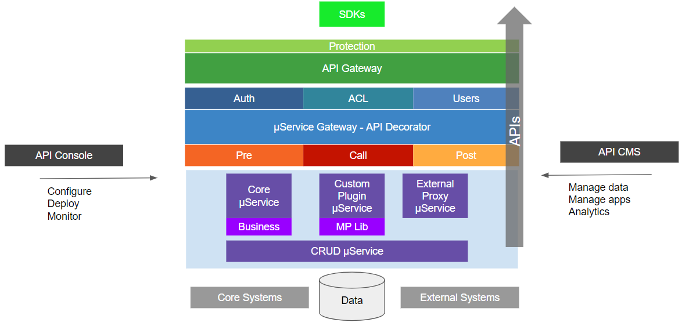
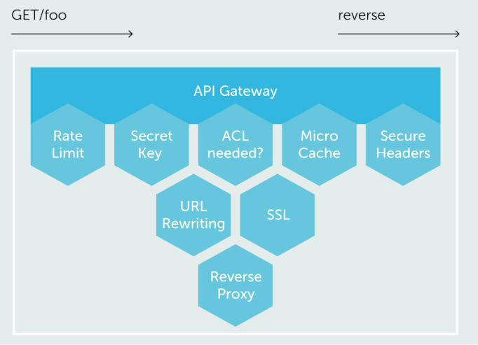
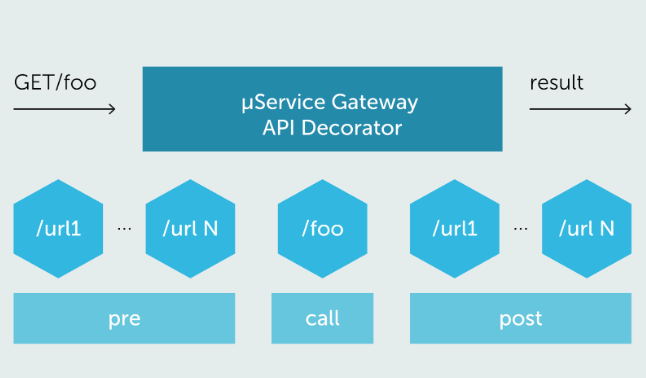
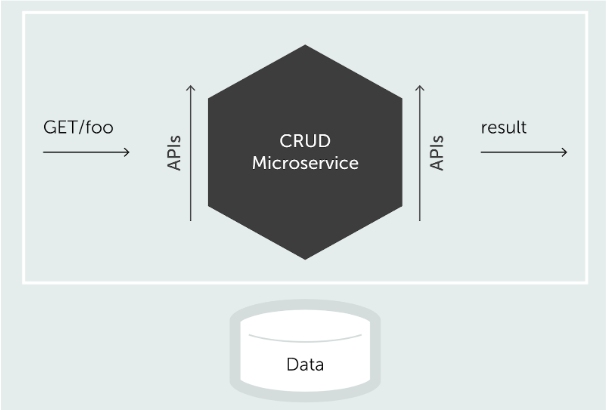

## Componenti Development Suite ##
Qui potrai trovare l'elenco dettagliato dei componenti che costituiscono Mia-Platform.

## Architettura

### API Gateway ###

L'API Gateway è il microservizio responsabile del routing delle richieste verso il servizio corretto.
Inoltre gestisce l'autenticazione, esegue il controllo di accesso e il rate limiting.

Il servizio è composto a default da server nginx multipli, 2 in ascolto sulle porte 80 ed 8080, 4 in ascolto su socket unix per ritornare i messaggi di errore.

La porta 80 è utilizzata per il routing applicativo, mentre quello di backoffice è esposto alla 8080.

### Microservice Gateway ###

Questo microservizio fornisce la possibilità di specificare degli hook http da chiamare prima e dopo ogni richiesta, per decorarla con servizi aggiuntivi.
Tali servizi possono modificare la richiesta (hook di `PRE`), ad esempio per aggiungere funzionalità di ACL, oppure agire dopo che la richiesta al servizio è stata effettuata (hook di `POST`), ad esempio per aggiungere ulteriori dati alla risposta.

Il Microservice Gateway si occupa di eseguire le chiamate a questi servizi di hook specificati da configurazione allo startup, e modificare (o interrompere) la richiesta secondo quanto indicato dai servizi.

I microservizi di hook devono soddisfare una precisa interfaccia http per essere interrogati con successo dal Microservice Gateway.

### CRUD Service ###

Il CRUD Service è un microservizio che serve ad esporre una API HTTP per eseguire operazioni di CRUD (Create, Read, Update, Delete) su collezioni mongodb.
Esso è configurato allo startup tramite la definizione di collezioni (una o più), per fornire una interfaccia HTTP coerente ed effettuare la validazione delle operazioni prima di eseguirle sul database.

La definizione di una collezione prevede di indicare l'elenco e la tipologia dei campi e di opzionalmente specificare indici.

### ACL ###

Il microservizio di ACL è un hook di `PRE` il cui scopo è applicare regole di ACL per ogni richiesta per indicare al CRUD Service quali righe o colonne filtrare.
Queste regole di ACL si basano sull'utente corrente e sui suoi gruppi di appartenenza.

Attualmente due tipologie di ACL sono previste dal servizio:

- *ACL per righe*: prepara una query che filtrerà i documenti sulla base dell'utente corrente (ad esempio per mostrare soltanto i documenti creati dall'utente).
- *ACL per colonne in lettura*: permette di limitare i campi che l'utente può vedere nella risposta sulla base della sua appartenenza a gruppi e del tipo di cliente.

Questo servizio agisce tramite la lettura e scrittura di header http. Infatti le informazioni su utente e gruppi sono recuperate da header, ed il risultato della applicazione delle regole è la scrittura di header di ACL che il CRUD Service è in grado di interpretare per eseguire effettivamente i filtri.

### Session Manager ###

Il microservizio di Session Manager **gestisce l'autenticazione dell'utente**, risolvendo la sessione e comunicandola all'API Gateway.

Il controllo che questo microservizio fa attualmente è piuttosto sofisticato e l'espressione logica valuta più parametri.

Nello specifico, i parametri valutati sono:

1. il **gruppo**, una variabile che identifica il gruppo a cui appartiene chi fa la chiamata. Il gruppo deve essere scritto come “groups.nomegruppo”. Per maggiori informazioni vedi il seguente [link](https://docs.mia-platform.eu/configurator/conf_cms/#5-controllo-accessi-sui-gruppi-acl-sui-gruppi).

2. **isBackOffice**, una variabile booleana che valuta se la chiamata viene dal Back-Office oppure no.

3. **clientType**, che identifica da dove arriva la chiamata (ex. CMS, sito, ...).

Grazie a questo check  il session manager gestisce in modo accurato l’autenticazione dell’utente.

### v1Adapter ###

Questo microservizio permette di utilizzare il CMS con il nuovo servizio di CRUD Service, traducendo le richieste dal CMS in chiamate HTTP adattate alla nuova interfaccia.
Oltre al mapping delle rotte http, si occupa anche della conversione dei tipi (ad esempio date e coordinate geografiche), e della trasformazione da sync e trash al nuovo stato e vice versa.

### CMS Backend ###

Microservizio che serve per configurare il CMS per mostrare sia collezioni sul BAAS 3 che collezioni gestite dal nuovo CRUD Service.

### Files Service ###

Questo microservizio offre la funzionalità di caricamento e scaricamento di files utilizzando servizi di terzi (es S3 o MongoDB). L'interfaccia http del microservizio è indipendente dallo specifico servizio di storage utilizzato, che è configurato allo startup. I files caricati vengono anche censiti in una collezione gestita dal CRUD.
Attualmente sono supportati S3 e MongoDB come servizi di storage.

### Pingator ###

Pingator è un servizio che monitora lo stato dei servizi per controllare che siano attivi.

### Client Proxy ###

### Static Files ###

### Certificate Service ###

### Auth Service ###
