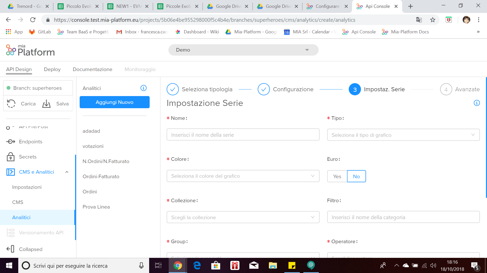
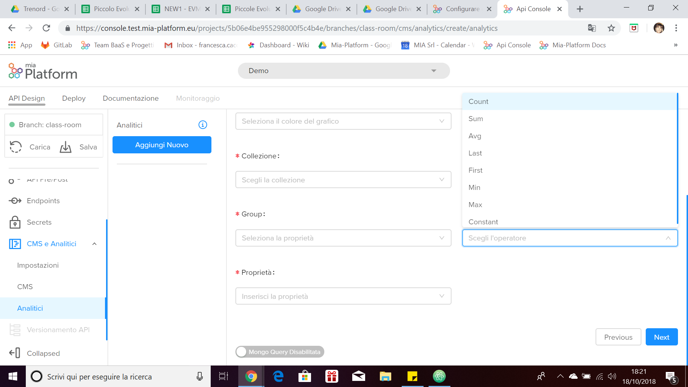
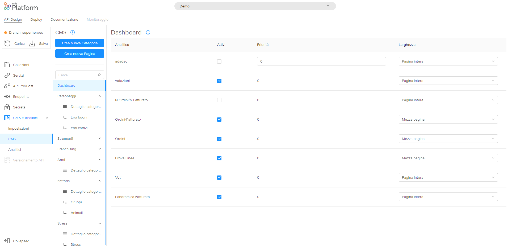

# How to Configure Analytics from API Console

From the Api Console you can easily configure and manage your analytics.

!!! notes
    Before you start with analytics configuration you must create your collections in the Collections area and expose the related Endpoints..

In the drop down list you will find the **"Analytics"** section: there you'll be able to create analytics and monitor KPIs. Click on the button **"Add new"** to start configuring.

When you're in, we'll guide you step-by-step through the analytics configuration. You can also configure Two Serie and One Serie analytics (only for *custom stock* graphics), for the latter the procedure is more complicated.

## **Step 1: Select type**

In this phase you have to decide the type of analytic you want to configure. At the moment can choose between three types:

* type **custom-stock**, i.e. a graph with a time series on the x-axis;

* type **chart**, i.e. a time independent graph;

* type **chart-summary**, i.e. a graph showing statistics related to one or more time independent data collections.

!!! notes
    Multi-serie graphs are available only for *custom-stock* type graphs.

Click on "next" to go further.

## **Step 2: Configution**

In this section you can define:

* graph **title**, that is mandatory. It can diplay white spaces;

* graph **legend**, that is also mandatory and can be visible or not. The legend automatically shows some extra information about the analytic: the maximum graph value (*max*), the minimum graph value (*min*), the sum of all graph values (*sum*), the average of graph values (*avg*).

In this phase, if you have chosen a *chart* type graph, you can choose an **order**. The alternatives are:

* *label-asc*, to order from A to Z;

* *label-desc*, to order from Z to A;

* *value-asc*, to order from the smallest to the largest;

* *value-desc*, to order from the largest to the smallest.

Click on "next" to go further.

## **Step 3: Serie setting**

In this section, you can configure most of the properties of the analytic:

* **Name of the serie**, that is mandatory. It can diplay white spaces;

* **Graphic type**. Available visualizations are: line, spline, area and column.

* **Color** of the graph;

* The **Euro** field, which allows you to set the unit of measurement of the chart automatically in euros;

* **Collection**, where you choose which collection to go to take the data that will be shown in the series, eg. eroi_buoni;

* **Filter**, where you can choose to apply a filter to the data you want to view from the collection. For example, the order collection does not want to display all orders, but only those with a turnover of more than € 30. This field is not mandatory and is a query, so you must write in json format.

* **Group**, where you can select the property on which to group the data. This field is mandatory for charts of type **chart** and **chart-summary**, and you can select all the properties of a collection (eg name);

* **GroupDate**,  where you can select the data type property on which to group data. This field is mandatory for the **custom-stock** graphs and only the data type (es.createdAt) can be selected. In the case of custom-stock charts, in this phase it is also possible to modify the **data format** field, to choose the time unit on which to group and then display the data. The time grouping period can be the year, month, week, day, hour or minute.

* **Operator**, where you can choose the operation to be performed on the grouped data. The possible operations are:

    * *count*: counts the number of elements in a group;

    * *sum*: sums the elements of a group (eg if I grouped the orders by customer name, the operator will return the total orders of each customer)

    * avg: averages the elements of a group (eg if I grouped the orders by customer name, the operator will return the average of the orders of each customer)

    * *last | first | min | max*: respectively returns the last, the first, the minimum and the maximum of each group;

    * *constant*: returns in a group the specific string or numeric constant (default 1). Only one operation per path / series can be set.

* **Property**. In this field you will find all the properties of the selected collection and you can choose the property you want to show and set up the operation. The field is mandatory for all operators, with the exception of the * count * operator that automatically counts the unique identifier of the group elements.

In this phase it is also possible to enable a mongoquery by clicking on the **mongoquery switch enabled / disabled**. This field allows you to write a query on mongo to be able to do more complex operations related to the chosen operator (eg you want to make a sum on the orders of two customers, but only if the order is between € 50 and € 100 ). The field is activated for all operators, with the exception of the count operator. When this switch is activated, the **Type** field appears, where the query is written in json format.

Once a series has been configured, a second series can be inserted in the same graph via the **"Add a series"** button.

!!! warning
    The second set that you set will have all the fields listed above again, but the **data format** will have to be the same as the first series.

Click on "next" to go further.

## **Step 4: Configure Y-axis**

The phase of configuration of the Y-axis occurs only in the case of analytics with more series. It is possible to choose to share the Y axis between the two graphs: this choice is made when the two series have the same scale (numerical, ...). In the case where the unit of measurement of the graph is euro, it can be selected automatically from the respective switch. Finally you can enter the title of the Y-axis.  

Click on "next" to go further.

## **Step 5: Avanvanced**

In advanced you can choose the time frame of the data that you want to show in the configured analytic. In the case of a *custom-stock chart* under the heading **Zoom**, the following formats can be chosen: day, week, month, quarter, half year, year, all the time available.

In the case of a *chart* chart, a **custom interval** of data visualization is possible: through a calendar view you can choose the start and end date.

Throughout the configuration process via the **Previous** button you can go back to the previous step to change the fields. When you have finished configuring the analytic you need to click on **Done**. At this point, save the configuration on the API Console and deploy the branch in the desired environment. At this point, by accessing the CMS in the environment in which it is deployed, it will be possible to see its analytic.

## View the analytics in the dashboard

When you have finished the configuration, saved and deployed, the analytic will be automatically visible in the CMS in the **Dashboard**.

To manage the visibility of the individual analytic, follow the following path:

` > CMS and Analytics > CMS > Dashboard `

On this page you can see all the configured analytics in the table. All fields in the table, with the exception of the analytic name, are editable. In particular you can modify:

* the **Active** field, which if selected allows you to show the analytics in dashboard, but if deselected the analytic will be hidden;

* the **Priority** field, which allows you to choose the order in which the analytics are displayed in dashboards, ordering them in an increasing way;

* the **Width**, which allows you to choose whether to view the analytic in full screen by selecting * Full Page *, or half-page by selecting * Half-page *.

## View the analytics on the Collection page

It is also possible to view the analytics on the page of a single collection in the CMS. To do this, the path to follow is the following:

` > CMS and Analytics > CMS > Collection Name > Analytics page `

On this page you can manage the visibility of the analytics configured on the selected collection page.

If some visibility has already been set for some analytics on the page, then they will be visible in the table. If you want to add visibility in an analytic, click the **"Add row"** button. At this point you can fill in three fields:

1. **"Analytic"**, that allows you to choose from the drop-down menu the analytic that you want to display on the page of that collection;

2. **"Priority""**, which allows you to choose the order in which you want to view the analytic in the collection page in the CMS (if you enter 1 it will be the first one, and so on);

3. **"Width"**, which allows you to choose whether to display the analytic in the middle of the screen by selecting the value *Half page*, or in full screen, selecting the value *Full page*.

By clicking on **Create** the updated row will appear in the table.

!!! notes
    Remember that you can always delete the line by selecting it in the box on the left by clicking on **Delete**.

