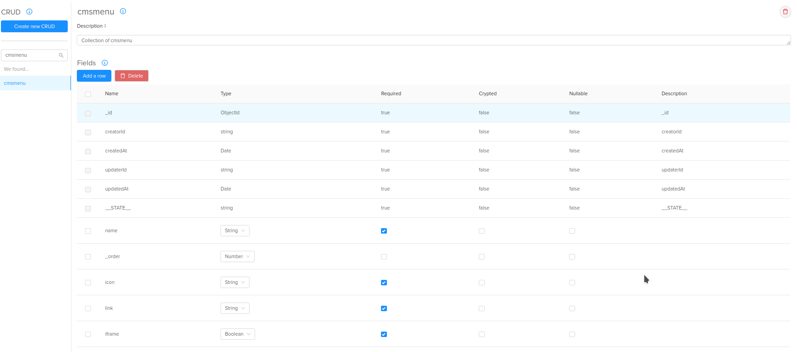
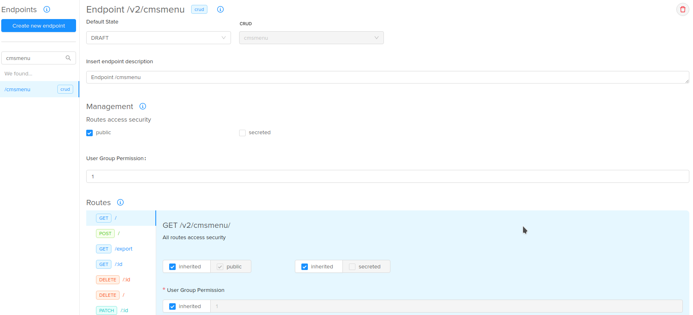
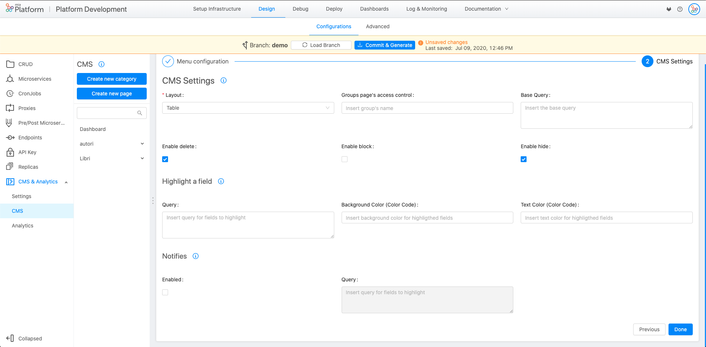
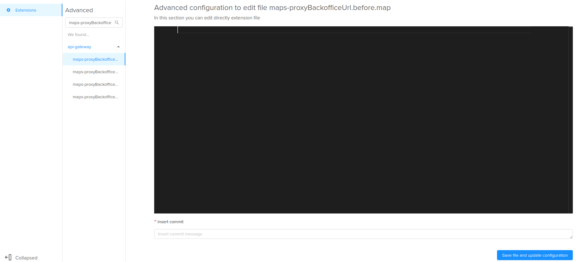

# Integrate custom frontends into the CMS
The CMS provides a way to dynamically integrate external custom frontends into a dedicated side menu' voice.

To integrate this functionality there are steps to follow, all through the API Console.

## Integration requirements
Following the requirements to integrate this  functionality:

 * access to the API Console into the desired project;
 * a custom frontend already Dockerized;
 * basic knowledge about the Console [backoffice proxy name](/development_suite/api-gateway-config-map/#how-to-proxy-a-request-through-a-service) and [backoffice proxy url](/development_suite/api-gateway-config-map/#how-to-forward-a-request-to-another-url) customizations.

Note that this guideline is base on the Console version 5 and CMS version 7.x.x

## Integration steps
Following the steps to integrate this functionality into the desired CMS.

> All the steps to do are on the Console

#### 1. CRUD - __cmsmenu__ creation
First of all you need a collection named __cmsmenu__ where to insert the menu voices you want to create: 

 1. Click on CRUD
 2. Click on __Create new CRUD__
 3. Create the CRUD with the following data:
    * **name**: cmsmenu
    * **description**: insert a custom description
    * **rows**:
        - `name`: String (Required)
        - `_oder`: Number
        - `icon`: String (Required)
        - `link`: String (Required)
        - `iframe`: Boolean (Required)
    <br> 

#### 2. Service - create the custom service for your frontends
You also need to add the custom service of the frontends that you want to integrate into the CMS; note that
the service must be already Dockerized.

 1. Click on Services
 2. Click on __Create new service__
 3. Select __Create from an existing Docker image__
 3. Create the service with the following data:
    * **name**: the name of your service
    * **Docker image**: the url of your docker image
    * **description**: insert a custom description
    * the result will be something like this <br> 

#### 3. Endpoints - create the endpoints
The CRUD and the service are not reachable until you create the corresponding endpoints through the 
following steps:

 * **cmsmenu endpoint**:
    1. Click on endpoints
    2. Click on __Create new endpoint__
    3. Create the endpoint with the following data:
        * **base path**: cmsmenu
        * **type**: CRUD
        * **description**: insert a custom description
        * the result will be something like this <br> 

 * **custom service endpoint**:
    1. Click on endpoints
    2. Click on __Create new endpoint__
    3. Create the endpoint with the following data:
        * **base path**: /custom-service-path
        * **type**: Custom Microservices
        * **description**: insert a custom description
        * **Remember to unflag the two fields** `Support JSON format on request` **and** `Support JSON format on response`
        * the result will be something like this <br> 


#### 4. CMS configurations (optional)
If you want to manage the custom menu configuration through the CMS you can create a page linked to the CRUD __cmsmenu__ collection.
This step is optional and not needed for the integration but useful to manage the configuration.

 1. Click on CMS and Analytics
 2. In the submenu, click on CMS
 3. Click on __Create new page__
 4. Create the page with the following data:
    * **name**: the label that you want to visualize 
    * **endpoint**: /cmsmenu
    * **category**: the category in which you want the page
    * **icon**: insert the name of a [Fontawesom Icon](https://fontawesome.com/), **without** the __fa__ prefix (e.g. __bell__ for the notification bell)
 5. Click on the __Next__ button
 6. Select the __table__ Layout and eventually the group expression for the accesses
 7. Finish, the result will be like this 

#### 5. Collection __cmsmenu__ - insert data
It's time to insert the menu data in the __cmsmenu__ collection to make the voice of the menu visible.

`name`: the name you want to visualize in the menu

`_order`: the order of the page inside the category

`icon`: the name of the icon visible in the menu

`link`: the endpoint created for the service (and the path you want to reach in your frontend)

`iframe`: true if you want to open the frontend in the iFrame, false if you want to open in another tab

To do this you have two ways: 

* insert the data in the CMS in the __cmsmenu__ collection: insert a new object specifying the fields.
        
    Example of the __Push Manager__ service:
    
     - `name`: Push Manager
     - `_order`: 1
     - `icon`: bell
     - `link`: /v2/push-manager-fe/
     - `iframe`: true
     
    In this case the frontend is called in the path `/`. If we wanted to reach the path home you need to put this path 
    in the link: /v2/push-manager-fe/home.
    
    Publish your content  with the publish button. 
    
* make a POST to the __cmsmenu__ endpoint with the following body: 

    Example of the __Push Manager__ service):

    ```json
    {
        "name": "Push Manager",
        "_order": 1,
        "icon": "bell",
        "link": "/v2/push-manager-fe/",
        "iframe": true,
        "__STATE__": "PUBLIC"               
    }
    ```

#### 6. Backoffice proxy - Advanced configuration
The last step is to configure the route to go in the correct service. To do this you need to go in the advanced section 
of the console and manage the Api Gateway backoffice files.
The extensions to customize are:

 * __maps-proxyBackofficeName.before.map__ to map an endpoint to a service name.
 
    Example for the Push Manager service: 
    
    ```
    "~^secreted-1-GET-/v2/push-manager-fe/" "push-manager-fe";
    "~^(secreted|unsecreted)-(0|1)-\w+-/v2/push-manager-fe/" "unauthorized";
    ```
   
 * __maps-proxyBackofficeUrl.before.map__ to proxy an endpoint to another url.
    
    Example for the Push Manager service: 
    
    ```
    "~^GET-/v2/push-manager-fe/(?<path>.*|$)$" "$path";
    ```
 
 According to your use case you can put the customization in both `before` or `after` file.

To customize these files:

 1. Click on Advanced
 2. Click on api-gateway
 3. Search __maps-proxyBackoffice__
 4. Customize the configurations
 5. Save and commit<br> 
 
 It's time to deploy the configuration.

## Result
Once the configuration is deployed you will see the result in the CMS as follows <br> 