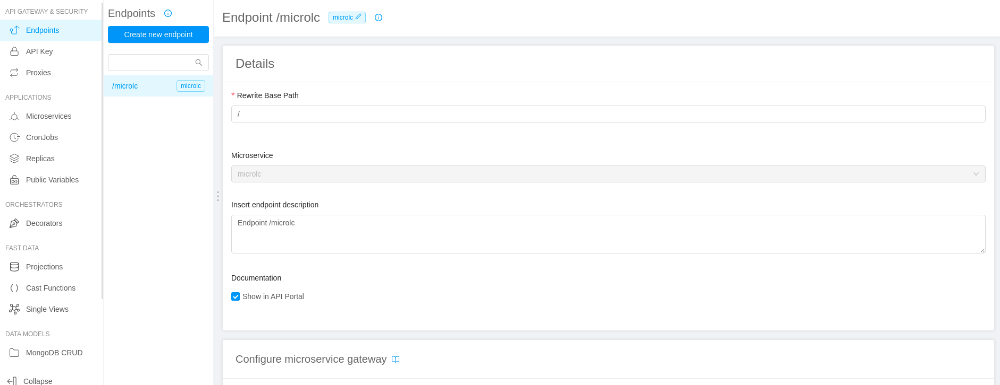

It is possible to integrate `microlc` inside the Mia-Platform Console with almost zero configurations.

## Integration requirements

Following the requirements to integrate this functionality:

- access to the Console into the desired project;
- add the [authentication configuration](authentication.md) and [core configuration](core_configuration.md) to expose;
- basic knowledge about the Console [backoffice proxy name](../../development_suite/api-console/advanced-section/api-gateway/how-to#request-from-the-frontend---port-8080).

## Integration steps

Following steps must be made on Console and will deploy a `microlc` configured instance.

### 1. Microservice creation for `fe-container`
 
Here you are going to create an instance of `fe-container`.

1. Go to the `Microservices` section;
2. Create a new microservice using the `Microlc frontend` in the `Microfrontend` section.
3. Configure the microservice with a custom name and description;
4. Complete the creation to deploy an instance of the `fe-container`.

#### 2. Microservice creation for `be-config`

Here you are going to create an instance of `be-config`.

1. Go to the `Microservices` section;
2. Create a new microservice using the `Microlc backend` in the `Microfrontend` section;
3. Configure the microservice with a custom name and description;
4. Complete the creation to deploy an instance of the `be-container`;
5. After the deployment, you **must** configure its [environment variables](backend.md#configurations-loading) and the 
   `ConfigMap` used to store the exposed configurations.  
   **NOTE:** You **must** do this for both the configurations.
   
   
At the end of these 2 steps, the situation should be similar to the following:

#### 3. Endpoint configuration for `fe-container`

1. Create a new endpoint;
2. Define the `Base path` where you want to expose `fe-container`;
3. As type, use `Microservice`;
4. Select the microservice name used for `fe-container`;
5. Complete the creation.

After that, the situation should be similar to the following:

## Result

At the end of this, you should have a complete instance of `microlc` up and running!

