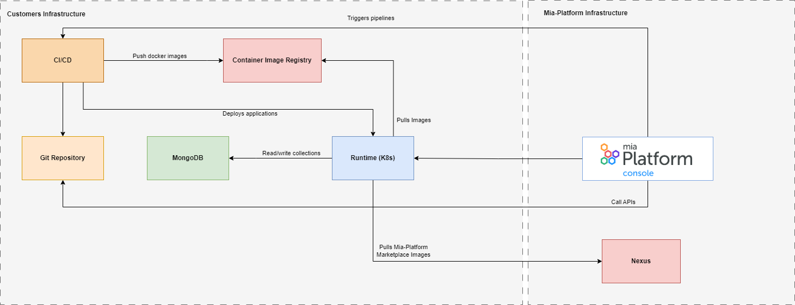

Bring Your Own Infrastructure (BYOI) is a revolutionary **cloud computing model** that allows organizations to utilize their existing hardware, software, and networking resources while integrating them into a third-party service or platform. This innovative approach empowers companies to retain control over their infrastructure while benefiting from the services and capabilities offered by an external provider. BYOI has gained popularity as a flexible and cost-efficient solution, enabling seamless integration with a wide range of services and applications.

The above schema, shows the tipical infrastructure architecture and the main elements that are involved in the Mia-Platform BYOI configuration.

- **Mia-Platform Console**: Mia-Platform console is the first element completely managed by Mia-Platform. It is [connected to the Runtime](../development_suite/clusters-management/add-edit-remove-cluster#step-1-runtime-service) in order to retrieve information about the runtime status.
Mia-Platform is [integrated with a CI/CD tool](../development_suite/set-up-infrastructure/providers-management) to streamline the software development process, automate the build and deployment procedures.
Each modification in the microservices architecture undergoes versioning and is subsequently released to the customer [Git Repository](../development_suite/set-up-infrastructure/add-environment#setup-git-provider).

- **Mia-Platform Nexus**: Mia-Platform Nexus is the second tool completely managed by Mia-Platform. It is fundamental to exploit Mia-Platform Marketplace. Indeed, it gives the access to the customer to a broad set of ready-to-use microservice that can be configured inside the console. To connect your runtime with Mia-Platform Nexus please ask to your Mia-Platform contact person.
  
- **CI/CD**: The customers can use any [supported tool](../development_suite/set-up-infrastructure/providers-management#edit-cicd-tool) by Mia-Platform Console.
  
- **Container image registry**: You can [configure](../development_suite/company/configuration#example-configuration-3) any container registry.
  
- **Runtime**: A k8s [runtime](../development_suite/clusters-management/vendors-runtime-services).
  
- **MongoDB**: Useful in case of [Fast Data](../fast_data/what_is_fast_data) application and [CRUD service](../development_suite/api-console/api-design/crud_advanced#what-is-a-crud).
  
- **Git Repository**: One of the Git repository provided by  Gitlab, Github, Bitbucket, Azure Repos. [Click here](../development_suite/set-up-infrastructure/add-environment#setup-git-provider) to see how to configure it

## Mia-Platform BYOI key Features

- **Flexibility and Customization**: Mia-Platform BYOI is the choice to suit specific business needs and requirements. Users have greater control over their resources, allowing them to tailor configurations according to their preferences.

- **Standardization**: Mia-Platform BYOI enables customers to establish standardized approaches and practices across their infrastructure, ensuring a coherent and harmonized operational environment. This alignment fosters enhanced efficiency, promotes uniformity, and diminishes the potential for discrepancies or inefficiencies that may arise from disparate infrastructure setups.

- **24/7 Support**: Mia-Platform BYOI provide 24/7 support on Mia-Platform Console.

