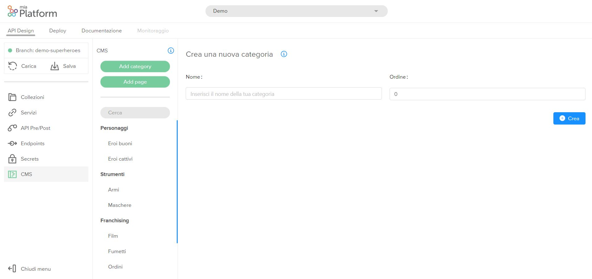
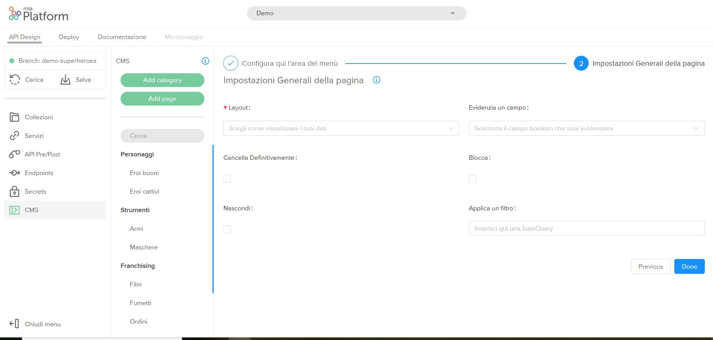
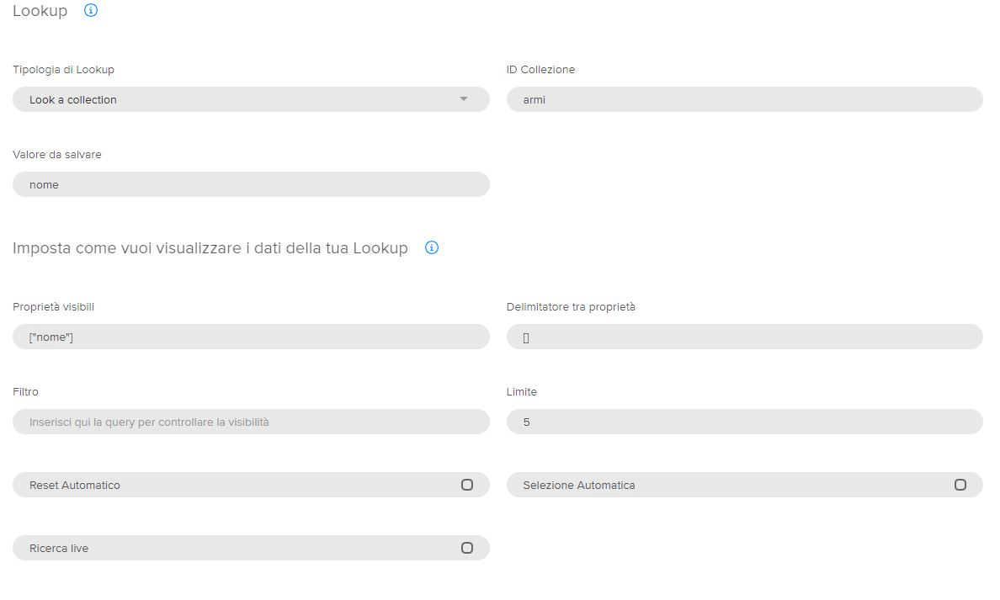

# Come Configurare il CMS dall'API Console

Dall'Api Console puoi comodamente configurare e gestire il tuo CMS.

!!! note
    Ricordati che prima di poter configurare il CMS devi avere già creato le tue collezioni nell'are Collezioni ed esposto i relativi Endpoint.

## Categorie e Pagine

Il CMS è composto da categorie e pagine. Pagine e categorie costituiscono la base della architettura informativa del CMS.

Le **Categorie** sono utili per raggruppare al loro interno pagine simili. Le categorie compaiono solamente nel menù del CMS e rappresentano una diversa sezione del menù.

Per fare un esempio: nel nostro cms degli eroi creeremo la collezione **Personaggi** e al suo interno collocheremo le diverse pagine di eroi: eroi buon, eroi cattivi, aiutanti ecc...

Le **Pagine** invece servono per rappresentare i dati di una collezione. All'interno delle pagine potrai gestire le tue collezioni e i dati in essa presenti.

!!! tip
    Prima di creare pagine o categoria prova a costruirti l'architettura informativa del tuo CMS. Sarà molto più semplice a quel punto sapere cosa creare.

## Come creare una categoria

Per creare una categoria ti basterà inserire il **Nome** della categoria che vuoi visualizzare sul CMS e l'ordine di visualizzazione.

!!! tip
    Ti consigliamo di ordinare sempre seguendo l'ordine delle decine. Se vogliamo che la nostra categoria sia la prima nel CMS scriveremo quindi 10. Questo ti facilità inseguito il cambio di ordine delle categorie.

Nel nostro caso, del CMS degli eroi, quindi scriveremo: Nome = Personaggi e Ordine = 10

## Come creare una pagina

La creazione di una pagina si compone di due step:

1. Configurare l'area del menù
2. Configurare le impostazioni generali

### Configurare l'area del menù

In questa sezione potrai scegliere come rappresentare la pagina nel menù laterale del CMS. Facciamo l'esempio della pagina Eroi Buoni

**Nome**: Dovrai inserire il nome da visualizzare nel menù per rappresentare la tua pagina. Nel nostro caso: Eroi Buoni

**Endpoint**: Dovrai scegliere a che endpoint agganciare la tua pagina. Nel nostro caso: /eroibuoni

**Categoria**: Dovrai scegliere la tua pagina in che Categoria dovrà essere inserita. Nel nostro caso agganceremo la categoria Personaggi

**Icona**: Potrai scegliere se attribuire alla tua pagina un icona che la rappresenti nel CMS. Per fare un esempio: se la tua è la pagina dei libri, potrai scegliere l'icona book per rappresentarla.
A questo [link](https://fontawesome.com/v3.2.1/icons/) potrai visualizzare e scegliere tutte le icone disponibili.

**Ordine**: Con Ordine potrai scegliere che ordine dare alla tua pagina all'interno di una categoria. Ti consigliamo di dare alle pagine un numero appartenente all'ordine delle decine (es: la pagina 1 avrà l'ordine 10)

### Configurare le Impostazioni generali

In questa sezione potrai scegliere le configurazioni generali della tua pagina.

**Layout**: puoi decidere il Layout che vorrai dare alla tua collezione. *Table* è la modalità di visualizzazione più classica a tabella. *TableUser* è la modalità di visualizzazione per gli utenti. Ha infatti un campo speciale Reset Password all'inizio della tabella. *TablePush* invece è la tabella perfetta per le push notification o per inviare notifiche ai clienti. A fianco della tabella troverai sempre un tasto Push per inivare il contenuto ai tuoi clienti. Se selezioni *Card* ogni oggetto sarà rappresentato simile a una Card. *Gallery* è invece la rappresentazione perfetta per le immagini.

**Evidenzia un campo**: questa select ti mostra le proprietà che nella tua pagina sono dei boolean. Puoi infatti scegliere di evidenziare una proprietà boolean nel CMS. Se la proprietà è true la vedrai evidenziata in grassetto.

**Cancella Definitivamente**: attivando questo check scegli di cancellare definitivamente dal database un elemento. Compare quando vuoi cancellare un elemento in Trash.

**Blocca**: attivando questo check scegli di bloccare definitivamente una pagina. In questo modo da CMS non si potranno creare nuovi elementi.

**Nascondi**: attivando questo check scegli di nascondere una pagina.

**Applica un filtro**: in questo campo potrai applicare un filtro di visibilità alla tua pagina.
Per scrivere una query ti consigliamo due link: 1) le diverse tipologie di [query](https://docs.mongodb.com/manual/tutorial/query-documents/) 2) tutti i tipi di [operatori](https://docs.mongodb.com/manual/reference/operator/query/#query-selectors) che puoi utilizzare.

!!! example
    Facciamo un esempio: nella mia collezione ho una proprietà che è uguale a state (indica lo stato). In questa pagina voglio vedere solo i dati che hanno come state= a working. In questa pagina voglio vedere solo i dati che hanno come state= a working.
    La query sarà: {"state": "working"}
    Un esempio di una query più complessa nella quale ad esempio voglio dire che lo proprietà stato deve essere uguale a quelli archiviati o rifiutati potrà essere scritta nel seguente modo: {"$or": [{"state": "archived"},{"state": "refused"}]}

## Customizzare le proprietà

Per rendere il tuo CMS perfettamente compatibile sui tuoi bisogni l'ultima sezione sulla quale ti troverai a lavorare sono le tue proprietà.

La sezione delle proprietà ti permette di customizzare ogni singola proprietà.
Possiamo dividere quest'area complessa in più parti:

1. le impostazioni generali di una prorpietà
2. i filtri di visibilità
3. l'area delle lookup

### 1. Le impostazioni generali di una proprietà

Per ogni proprietà puoi configurare diversi campi che ti permettono di migliorare l'eseprienza utente nel CMS:

 

* **Tipo di Interfaccia**: in base al tipo della proprietà definito nella collezione, puoi scegliere se migliorare la visibilità di quella proprietà. I tipi di Interfaccia possono essere di diversi tipi:
    * *string* se è una classica stringa di testo;
    * *number* se è un numero;
    * *datetime* è invece una data completa con anche ore, minuti e secondi;
    * *boolean* se può essere solo true o false; *text* se vogliamo che il contenuto venga letto come html;
    * *textArea* se è un campo di testo, quindi ad esempio una descrizione;
    * *Lookup* servono per poter selezionare alcuni valori o tra una gamma di valori scelti da me o tra una gamma di valori presi da un'altra collezione. Se ti interessa il tema delle Lookup più sotto troverai una sezione dedicata;
    * *Multilookup* se vuoi selezionare più valori;
    * *Array* se lo vuoi salvare come un insieme ordinato di proprietà;
    * *Oggetto* è un insieme di proprietà non ordinato;
    * *Geopoint* se vuoi che salvi un luogo preciso;
    * *Files* se è un file come ad esempio un immagine o un pdf. Nel nostro caso sceglieremo string volendo semplicemente scrivere il nome del titolo.

* **Etichetta**: è il nome che vuoi che venga visualizzato nel CMS.

* **Descrizione**: puoi inserire la descrzione della tua proprietà.

* **Ordine**: indica l'ordine della proprietà nella visualizzazione del CMS. RIcordati di usare il metro delle decine (la prima è il numero 10), in questo modo ti sarà più semplice gestire le modifiche successive.

* **Posizione nella card**: se hai scelto la modalità di visualizzazione a Card puoi scegliere in che posizione della card far comparire la tua proprietà. Per maggiori informazioni segui questo [link](https://docs.mia-platform.eu/user_guide_and_tools/api_console/guida_api_console/#card-position)

* **Modificabile**: se attivi questo check la proprietà è modificabile da chiunque, altrimenti non sarà modificabile da CMS

* **Visibilità**: indica a che livello del CMS vuoi mostrare una proprietà. I livelli possono essere: *Hidden* e non è visibile; *All* ed è visibile nella tabella principale; *Detail and Modal* ed è visibile quando clicci nella tabella, nella zona destra del tuo CMS, a questo livello tendenzialmente si mettono le informazioni non prioritarie, ma che portano valore, es: gli approfondimenti. Ultimo è solo nella modale: *Modal* ovvero quando clicco Expand dall'area di Edit laterale.

### 2. I filtri di visibilità

In questa sezione puoi controllare la visibilità di una proprietà.
Puoi ovvero decdere di far comparire la tu aproprietà solo a determinate condizioni.

La visibilità può essere controllata in due momenti:

1. in fase di creazione di un nuovo elemento nel CMS
2. in fase di modifica di un elemento

#### Controllo in fase di creazione

Per controllare la visibilità in fase di creazione devi scegliere quale altra proprietà condiziona la sua visibilità.

Cosa devo fare?

1. scegliere la **proprietà**, ho una select che mi mostra tutte le mie proprietà.
2. scegliere il **comparatore**.
3. scegli il **valore**.

!!! tip "Comparatori"
    I comparatori supportati sono i seguenti:

    valore | commento
    -------|---------
    `<` | minore
    `<=` | minore o uguale
    `>` | maggiore
    `>=` | maggiore o uguale
    `==` | uguale
    `!=` | diverso
    `===` | strettamente uguale
    `!==` | strettamente diverso

#### Controllo in fase di modifica di un elemento

Per controllare la visibilità in fase di modifica di un elemento devi seguire gli stessi passaggi per il controllo in fase di creazione.
La tua proprietà però questa volta comparirà solo quando vuoi modificare un elemento da CMS.

Dovrai sempre:

1. scegliere la **proprietà**.
2. scegliere il **comparatore**.
3. scegli il **valore**.

!!! example
    Per fare un esempio: ho un CMS che mi gestisce il magazzino di un supermercato, sono nella proprietà *data di scadenza*,
    voglio che questa proprietà compaia solamente quando la proprietà *deperibile* è uguale a true.

    1. scegliere la **proprietà**, scelgo deperibile.
    2. scegliere il **comparatore**, nel nostro caso **==**
    3. scegli il **valore**, nel nostro caso **true**

## 3. Le Lookup

Le Lookup ti permettono di mostrare in una proprietà o dei valori preimpostati da te scelti, o di mostrare i dati di un'altra collezione.

Esistono infatti due tipologie di Lookup:
* **Look a collection**: che ti permette di mostrare i dati di un'altra collezione
* **Inline Source**: che ti permette di impostare dei valori da mostrare.

A questo punto le opzioni divergono.

### Look a collection

Quando selezionerai Look a collection dovrai compilare due valori:

1. ID Collezione: vedrai una select e dovrai scegliere la collezione di cui vuoi mostrare i dati
2. Valore da salvare: vedrai una select e dovrai scegliere quale proprietà della collezione salvarti. Di buon norma è consigliabile salvarsi l'id.

### Inline Source

Quando selezionerai Inline Source dovrai compilare due valori:

*  **I dati che vuoi visualizzare**: in questo campo dovrai inserire un array di oggetti che vuoi visualizzare. Ricordati di differenziare il valore da salvare nel database con quello che vuoi mostrare al tuo utente finale.

!!! example
    Facciamo un esempio: ho una proprietà che è stato e voglio dal CMS potere selezionare solo degli stati precisi come Pending, In lavorazione ecc.
    Ecco come dovrò costruire l'array di oggetti:
    **[{"name":"In Lavorazione","value":"working"},{"name":"Pending","value":"pending"},{"name":"Archiviato","value":"archived"}]**

* **Valore da salvare**: dovrai scegliere quale valore salvare nel DB, in questo caso ti consigliamo di salvarti il value.

### Come visualizzare i dati di una Lookup
 Di una Look up puoi anche configurare delle ulteriori funzionalità che ti permettono di soddisfare qualsiasi esigenza di visualizzazione

 * **Proprietà visibili** : qui puoi scegliere che proprietà della tua collezione o dell'Inline Source creata mostrare. Le proprietà che vuoi mostrare vanno inserite come se fosse un array di stringhe.
Quindi se ad esempio volessimo mostrare solo il nome, l'array sarà: ["name"]. Se volessimo mostrare il nome e il cognome sarà invece: ["name", "surname"].

* **Delimitatore**: i delimitatori servono quando ho scelto di mostrare più di una proprietà e voglio inserire un delimitatore tra le due proprietà. Es: se prima ho scelto di
mostrare le proprietà nome e cognome e voglio che tra le due ci sia un trattino dovrò scrivere il trattino in un array di strighe. Il delimitatore verrà quindi: ["-"]

* **Filtro**: Posso anche scegliere di impostare un filtro alla visibilità. Per scrivere una query ti consigliamo due link: 1) le diverse tipologie di query 2) tutti i tipi di operatori che puoi utilizzare.
Facciamo un esempio: in questa lookup voglio vedere solo i dati che hanno come state= a working.
La query sarà: {"state": "working"}

* **Limite**: Posso impostare un numero massimo di elementi da far visualizzare nella mia Lookup

* **Reset Automatico**: se vogliamo che si resetti, ovvero dopo aver compilato la cella se vogliamo svuotarla

* **Selezione Automatica**: se vogliamo che selezioni automaticamente il primo valore

* **Ricerca live**: se vogliamo che mentre scriviamo ci compaiano i risultati (es: scrivo A e mi compaiono sotto le case editrici che cominciano per A)

!!! example "Un esempio di Lookup sulla collezione armi"
    
