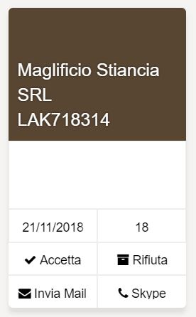
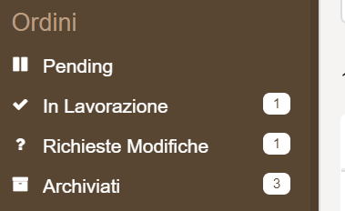

## Come configurare il CMS con Mia-Platform 3

Le collezioni che vengono mostrate nel CMS vengono configurate in due file .json differenti:

* 1) `cms_config.json` dove lo sviluppatore può configurare le impostazioni generali delle pagine nel CMS


* 2) `properties.json` dove lo sviluppatore può configurare ogni singola proprietà come può essere visualizzata e gestita.

Entrambi i file si trovano all'interno della specifica cartella all'interno della collezione che si vuole configurare.

### cms_config.json

 Ipotizziamo di essere all'interno della collezione **heroes** e vogliamo configurare al pagina eroi del nostro cms.

 Apriamo il file `cms_config.json` e costruiremo il seguente file:


 chiave | valore di esempio |  Commento
 -------| -------|-------
  `label` | Eroi | label è l'etichetta che ti permette di scegliere il nome della tua collezione nel menù del CMS. nel nostro caso scriveremo Eroi              
  `layoutType`| table | puoi decidere il Layout che vorrai dare alla tua collezione. **Table** è la modalità di visualizzazione più classica a tabella. **TableUser** è la modalità di visualizzazione per gli utenti. Ha infatti un campo speciale Reset Password all'inizio della tabella. **TablePush** invece è la tabella perfetta per le push notification o per inviare notifiche ai clienti. A fianco della tabella troverai sempre un tasto Push per inivare il contenuto ai tuoi clienti. Se selezioni **Card** ogni oggetto sarà rappresentato simile a una Card. **Gallery** è invece la rappresentazione perfetta per le immagini
  `defaultStatus`| draft | può invece essere o **draft** o **publish**. Se scrivi draft una volta che caricherai un elemento non verrà pubblicato automaticamente sui tuoi applicativi, ma dovrai dargli successivamente il comando pubblica. Se scrivi invece publish ogni volta che modifichi o che carichi un elemento verrà pubblicato automaticamente. Nel nostro caso metteremo draft.
  `defDelete`| false, | se è **true** gli elementi una volta eliminati da trash verranno eliminati definitivamente.se è **false** potrai recuperarli da Mongo, ma non compariranno sul CMS
  `category`|  | qui potrai configurare la categoria del menù nella quale far comparire la tua collezione.
    `category.name` | General | questo è il nome della categoria che comparirà nel CMS
    `category.order`| 10 | questo è l'ordine della categoria nel menù. Ti consigliamo di mettere sempre cifre dell'ordine delle decine. Ti capiterà infatti ti volere inserire in futuro altre collezioni o categorie. Se prima per esempio avremmo avuto già una categoria in ordine 3 per posizionare questa avremmo dovuto cambiare anche tutte le altre a cascata. Con le decine invece basta mettere un numero intermedio.
  `hidden` | false, | portando questo campo a **true** potrai scegliere di non far comparire la collezione nel CMS
  `blocked`| false | portando questo campo a **true** potrai scegliere di bloccare la collezione. Nessuno potrà più creare nuovi campi.
  `icon` | book | in questo [link](https://fontawesome.com/icons) potrai visualizzare tutte le icone disponibili da far visualizzare nel tuo menù
  `order` | 10 | indica l'ordine di una collezione all'interno di una categoria. Con 10 sarà la prima a comparire. Si consiglia di seguire anche qui la regola delle decine.
  `baseQuery` | " " | base query ti permette di applicare un filtro generale di visibilità - Deve seguire delle regole di espressioni logiche. Un esempio può essere: nascondere la proprietà Circolo Acli dalle associazioni e servizi. sarà scritta così: { "idAssocServ": { "$ne": "CIRCOLO ACLI"} }
  `highlight` | " " | in questa stringa potrai inserire il nome di una proprietà della collezione (solo boolean) che quando è true verrà evidenziata nel CMS.

  Il .json finale sarà quindi:

```
  {

  "label": "heroes",

  "layoutType": "table",

  "cardType": "",

  "defaultStatus": "draft",

  "defDelete": false,

  "category": {

    "name": "General",

    "order": 0

  },

  "hidden": false,

  "blocked": false,

  "icon": "book",

  "order": 0

}
```


### properties.json

  Il file properties.json è il file che contiene tutti i campi della collezione. Ogni campo ha una struttura simile.

  Di default ci saranno i campi: id, creatorId, createdAt, uptaterId, updatedAt, STATE,

  vediamo nel dettaglio le specifiche di una singola proprietà: es proprietà **nome**

  chiave | valore di esempio |  Commento
  -------| -------|-------
   `id`| nome | id della proprietà
   `type` | "string", | i tipi possono essere: string, number, boolean, geopoint, date, object, array of number, array of string, array of object, objectId
   `required`| false, | **true** se vuoi che il dato sia obbligatorio
   `label`| Nome | è l'etichetta che vuoi dare alla tua proprietà
   `cmsVisibility` |  | indica a che livello del CMS vuoi mostrare una proprietà. I livelli possono essere: 0 e non è visibile; 1 ed è visibile nella tabella principale; 2 ed è visibile quando clicchi nella tabella, nella zona destra del tuo CMS, al livello 2 tendenzialmente si mettono le informazioni non prioritarie, ma che portano valore, gli approfondimenti. Nel nostro caso metteremo 1 in quando l'informazione è prioritaria.
     `cmsVisibilty.level`| 1 | I livelli possono essere: **0** e non è visibile; **1** ed è visibile nella tabella principale; **2** ed è visibile quando clicchi nella tabella, nella zona destra del tuo CMS, al livello 2 tendenzialmente si mettono le informazioni non prioritarie, ma che portano valore, gli approfondimenti. Nel nostro caso metteremo 1 in quando l'informazione è prioritaria.
   `cmsOrder`| 10 | è l'ordine che gli vuoi dare all'interno della collezione. nel nostro caso sarà il primo, quindi scriveremo 10
   `cmsEditable`| true | **true** se vuoi che sia modificabile da CMS
   `hidden`| false | se vuoi che la proprietà sia invisibile
   `description`| " " | se vuoi aggiungere una description
   `cmsCardPosition`| 0 | indica la posizione della proprietà nel layout Card
   `interfaceType` | string | le proprietà possono essere di diversi tipi: **string** se è una classica stringa di testo; **number** se è un numero; **date** se è una data con gg/mm/aaaa; **datetime** è invece una data completa con anche ore, minuti e secondi; **boolean** se può essere solo true o false; **text** se vogliamo che il contenuto venga letto come html; **textArea** se è un campo di testo, quindi ad esempio una descrizione; **Lookup** servono per poter selezionare alcuni valori o tra una gamma di valori scelti da me o tra una gamma di valori presi da un'altra collezione. **Multilookup** se vuoi selezionare più valori; **Array** se lo vuoi salvare come un insieme ordinato di proprietà; **Oggetto** è un insieme di proprietà non ordinato; **Geopoint** se vuoi che salvi un luogo preciso; **Files** se è un file come ad esempio un immagine o un pdf. Nel nostro caso sceglieremo string volendo semplicemente scrivere il nome del titolo.

   il json finale nella nostra proprietà **nome** che è il nome degli eroi sarà quindi:

```
"nome": {
   "id": "nome",
   "type": "string",
   "required": false,
   "label": "Nome",
   "cmsVisibility": {
        "level": 1
               },
    "cmsOrder": 10,
    "readonly": false,
    "cmsEditable": true,
    "hidden": false,
    "description": "",
     "cmsCardPosition":0,
     "interfaceType": "string"
}
```


# CMS Config-extension in API Console

Tutte le confgurazioni precedenti vengono gestite automaticamente dall'Api Console.
Esistono però alcune estensioni che non possono ancora essere configurate dal front-end ma sono gestite da un componente : le config-extension.

le 3 estensioni più importanti sono:

1. le **card**
2. le **notifiche** nel menù laterale
3. gli **highlight**, ovvero la possibilità di evidenziare delle righe nelle tabelle


## Impostare GIT per avere le config-extension del cms

1) quando apri il progetto GIT assicurati che esista una cartella **config-extension**. All'interno della cartella deve essere presente la cartella **cms-backend**.

Se non è presente puoi crearla.

2) una volta aperta la cartella dovrai creare o assicurarti che siano già stati creati i seguenti file:

* **analyticsConfig.json** (se lo crei per la prima volta al suo interno dovrai inserire un oggetto vuoto)

* **cmsProperties.json** (se lo crei per la prima volta al suo interno dovrai inserire un oggetto vuoto)

* **dashboardConfig.json** (se lo crei per la prima volta al suo interno dovrai inserire un array vuoto)

A questo punto sei pronto per configurare le tue estensioni.

## 1. Configurare le Card

Le Card ti permettono di visualizzare i tuoi dati non più in tabella, ma sottoforma di Card.

!!! warning
     Sebbene le card siano un estensione ricordati che la pagina del CMS che vuoi visualizzare come card deve avere nelle sue impostazioni generali il **tipo di visualizzazione impostato a card**.

Le card sono composte da due sezioni:


1. il **cardHeader** che rappresenta la struttura alta della card ed è  composta da 3 elementi:


  * l'immagine


  * il titolo


  * il sottotitolo


!!! note
       I 3 campi sono obbligatori in configurazione ma possono essere lasciati vuoti.
       Se all'immagine non viene associata nessuna proprietà la card verrà colorata con il colore del menù laterale

```
"cardHeader": {
       "titleProperty": "laboratory",
       "subTitleProperty": "productId",
       "imageProperty": ""
```


2. il **cardContentRows** invece è interamente personalizzabile. All'interno di una card esistono 4 tipologie di widget che possono essere inseriti:


  * **textArea** - è un campo di testo alto in cui può essere inserita una descrizione, una nota o una proprietà che richiede uno spazio elevato


  * **text**  - è un campo di testo ridotto, in genere può essere utilizzato per mostrare proprietà semplici


  * **button** - ti permette di configurare dei bottoni all'interno della tua cardType. E' necessario specificare nella chiave "routes" l'endpoint a cui ci si vuole collegare.


  * **link** - ti permette di configurare dei bottoni che rimandano a un URL, in modo tale da aprire automaticamente un'applicazione.E' quindi necessario specificare nella chiave "linksType" il collegamento che si vuole ottenere premendo il bottone. Inoltre in questa tipologia di widget è possibile inserire delle icone da far comparire nel bottone.

Ogni widget può essere composto da più proprietà dello stesso tipo. Per fare un esempio. Se io scelgo un widget di tipo text al suo interno posso visualizzare più proprietà di tipo text. Le car in base al numero di elementi presenti dividono lo spazio della card.

!!!example
    Ecco un esempio di card content rows - Con questa visualizzazione vedrai sotto l'header un campo note, due proprietà, due bottoni e due link.


```

"cardContentRows": [{
     "type": "textarea",
     "properties": ["note"]
   },
   {
     "type": "text",
     "properties": ["newExpirationDate", "newItemNumber"]
   },
   {
     "labels": ["Accetta", "Rifiuta"],
     "type": "button",
     "routes": ["/api/change-request/accept", "/api/change-request/refuse"],
     "ids": ["accetta", "rifiuta"],
     "icons": ["check", "archive"]
   },
   {
     "type": "link",
     "labels": ["Mail", "Skype"],
     "icons": ["at", "skype"],
     "linksType": ["email", "skypeCall"],
     "properties": ["mail", "skypeId"]
   }
   ]

```

 Per inserire la card all'interno di una collezione bisogna scrivere esattamente il nome della collezione e inserire poi la card all'interno di cmsProperties:

!!!example
   Ecco un esempio di card finale all'interno della collezione change-requests

```

"change-requests": {
   "cmsProperties": {
     "cardHeader": {
       "titleProperty": "laboratory",
       "subTitleProperty": "productId",
       "imageProperty": ""
     },
     "cardContentRows": [{
       "type": "textarea",
       "properties": ["note"]
     },
     {
       "type": "text",
       "properties": ["newExpirationDate", "newItemNumber"]
     },
     {
       "labels": ["Accetta", "Rifiuta"],
       "type": "button",
       "routes": ["/api/change-request/accept", "/api/change-request/refuse"],
       "ids": ["accetta", "rifiuta"],
       "icons": ["check", "archive"]
     },
     {
       "type": "link",
       "labels": ["Mail", "Skype"],
       "icons": ["at", "skype"],
       "linksType": ["email", "skypeCall"],
       "properties": ["mail", "skypeId"]
     }
     ],
    "notification": {
     "query":
     {"responseReceived": "false", "trash": 0}
   }
  }
 },
 "fasonisti-properties": {
   "cmsProperties": {
     "cardHeader": {
       "titleProperty": "name",
       "subTitleProperty": "",
       "imageProperty": "image"
     },
     "cardContentRows": [{
         "type": "textarea",
       "properties": ["description"]
      },
      {
       "type": "link",
       "labels": ["Mail", "Skype"],
       "icons": ["at", "skype"],
       "linksType": ["email", "skypeCall"],
       "properties": ["mail", "skypeId"]
     }
    ]
   }
 }

```
Ecco alcuni esempi di card realizzati

 

Nell'esempio abbiamo quindi:

* due bottoni - accetta e rifiuta;

* due link - mail e skype, che permettono di aprire automaticamente le applicazioni di e-mail e skype.

##2. Configurare le notifiche

Le notifiche nel menù laterale ti permettono di visualizzare sottoforma di notifica il numero di elementi che soddisfano una condizione.
Le notifiche sono degli oggetti composti da un solo elemento: una **query**. All'interno della query bisogna specificare la condizione per cui il singolo dato venga contato.

!!!example
    Ecco un esempio di notifica


         "notification": {

              "query":

                 {"isLate": true, "state": "working", "trash": 0}

             }


   La visualizzazione sarà la seguente:

   

   Nell'esempio la notifica mostra il numero di elementi in ritardo allo stato in lavorazione.

##3. Configurare gli highlight

Gli highlight permettono di evidenziare delle righe nelle tabelle. Un highlight è un oggetto composto da tre parametri:

* **query**, cioè la condizione da soddisfare affinchè la riga della tabella sia evidenziata;

* **color**, parametro di tipo testo che configura il colore del testo;

* **backgroundColor**, che configura il colore dello sfondo in esadecimali ([Collegamento per i colori esadecimali](https://www.web-link.it/colori-html.html)).

!!!example
    Ecco un esempio di highlight


        "highlight": {

             "query":

                {"isLate": true, "state": "working", "trash": 0},

              "color": "white",

              "backgroundColor": "#d55d5f"

           }


La visualizzazione sarà la seguente:


Nell'esempio vengono evidenziate su uno sfondo rosso scritte in bianco, le righe della tabella che sono in ritardo allo stato "in lavorazione".
