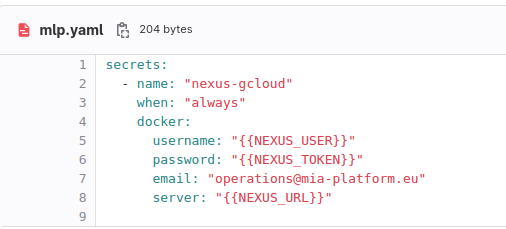
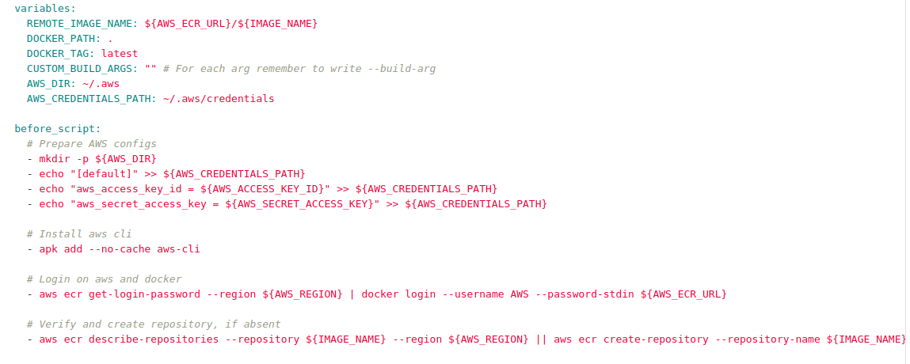

The Docker registry is a server side application that stores and lets you distribute your docker images.
In order to pull and push images and use them in different pipelines it is necessary to configure it properly.
To gain access to private registries it is necessary to create and configure your secrets.

### Step 1
Go in the setting interface of the console, on the Workload & Runtime section it is possible to add and modify a secret.
Add your secret that will be used to pull images from your docker registry

### Step 2
Once you have added the secret in the console, it has to be configured in order to be authenticated to the docker registry.
In the project repository you will find a `mlp.yaml` file which generates Kubernetes secretes using the mlp tool. For more information about the tool follow the link: [Mlp Tool](https://github.com/mia-platform/mlp)

Example of a mlp.yaml file:

### Step 3
The last step is to setup a pipeline. 
For detailed information follow this link [Pipeline setup](/development_suite/deploy/pipeline-configuration.md)

For building and pushing images to a private registry it can be created a docker job.

This is an example using aws docker registry:

