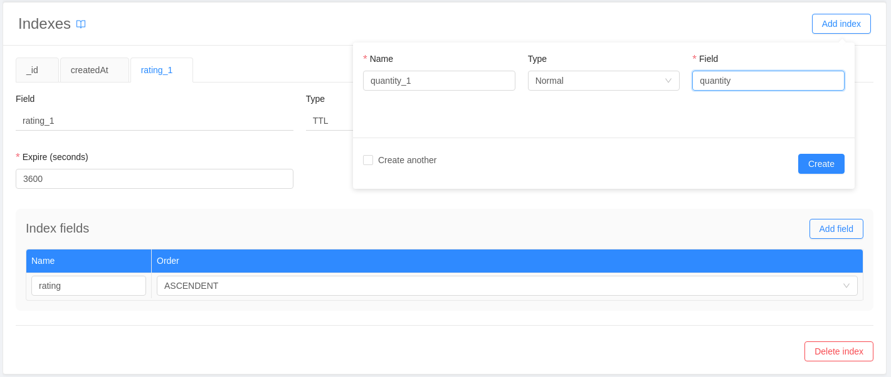

##Create a new CRUD

In order to create a new CRUD, go on the menu on the left where you see CRUD, select **Create new CRUD**, and name it filling in the blank space with the name of the collection in camelCase.

In our case, we will name the collection “Books”.

Press the button **Create** on the right and the template of your collection will be created.

As soon as you push **Create** a new page, "books" in our example, is created and you can enter a short and optional description of your collection: we wrote “Collection of books”.

In the section **Fields**, you can enter the properties of your collection. 
By default, there are fields that can not be changed, such as: id, creatorId, createdAt, updaterId, updatedAt, _STATE.

You can add new rows by selecting **Add new** and fill in the blank spaces with the value you need. 

We added a new field and we wrote “Title” and ticked the fields we need.

You can add the fields you need and select the appropriate properties:

* Enter the property **name** in camelCase; in our case we will insert "Title", "Author", "Year", "New", etc.

* Add properties with their **types**: *string* if it is a classic text string (or an image); *number* if it is a number; *date* if it is a date with dd / mm / yyyy; *boolean* if it can only be true or false; *Geopoint* if you want to save a specific place; *Array* if you want to save as an ordered set of properties; *Object* if you want to insert an object.

* If you select **required** the property is mandatory.

* If you select **crypted** the data will be encrypted in the database. We recommend that you adopt this practice for sensitive or confidential data.

* If you select **nullable**, you can make the value *null*.

* In the **description** field you can enter a short optional description.

To create the collection select **Create**.

Once the default line is created, you can automatically create another one, ticking the box "crea un altro".

Once you are done creating all the rows you need, press any other point on the screen to exit the "add line" section.

##How to create the fields of your CRUD by importing a JSON

If you want, you can upload your fields from file, selecting Import fields from File. Remember that the file must be a JSON with the followinf patterns: 

* Enter the property "name" in camelCase
* Add properties with their "types" spelling as follow: 
  + "string"
  + "Date"
  + "number"
  + "boolean"
  + "GeoPoint"
  + "RawObject"
  + "Array_string"
  + "Array_number"
* "required" must be "false" or "true"
* "crypted" must be "false" or "true"
* "nullable" must be "false" or "true"

Once you imported the JSON from files, it automatically appears in the table under the default fields. 

!!! Warning

    the collection **has not yet been saved** it is necessary to continue the process described below

If you want to delete a row, select red trash symbol on the right of the the table.

##Indexes
You can configure the indexes, a data structure designed to improve search (query) data.

To create a new index select **create new**.
Once you named the index you need to choose among: geo, hash or TTL. Then, you can choose whether to make the index unique by ticking "unique".

