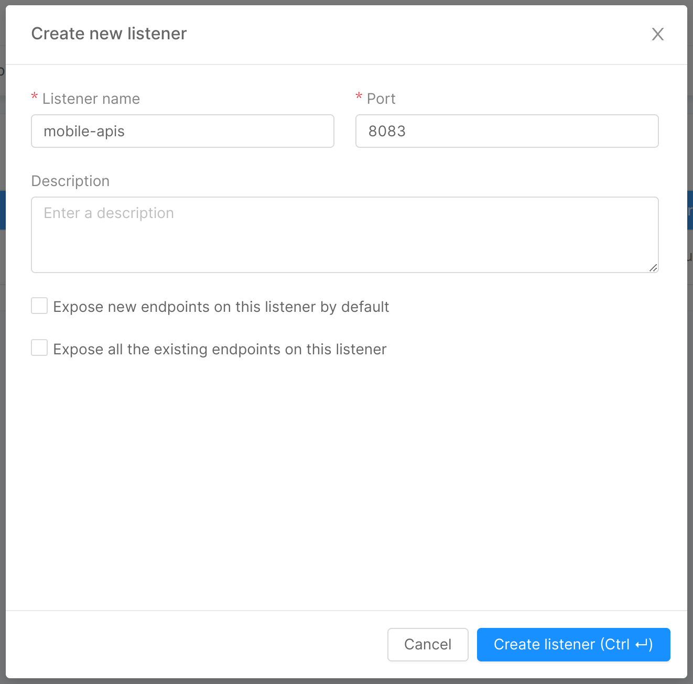
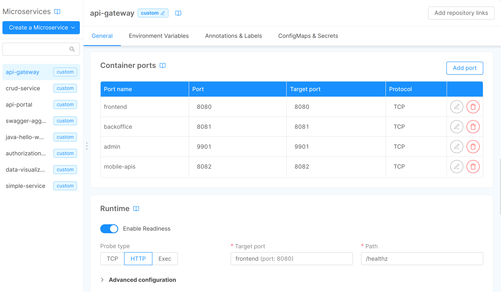

## What is a Listener

A Listener is a logical entity configured on your API Gateway that checks for incoming connection requests directed to your cluster.  
Each listener is mapped to a single port and defines rules to route incoming requests from external clients to a resource in your cluster, such as a specific microservice, exposed through endpoints.

This page describes the features of a Listener and how to configure these from the **Listeners** section of the [Design area](/development_suite/api-console/api-design/overview.md) of the Console.

:::info
Currently Listeners are available only to Projects configured to use an **Envoy API Gateway**.
:::

## Create a Listener

Follow this three steps in order to create the new Listener and make an Endpoint reachable from outside the Console:
- create the new Listener resource
- expose the Endpoint on the Listener
- define a new Traefik IngressRoute for the newly exposed API Gateway port

### Defining the Listener 

Creating a new Listener is as easy as clicking on the **Add listener** button and specifying its `name` and `port`. Both these two fields must be unique on your Project.  

Optionally, you can define whether to:
- **expose new endpoints on the listener** by deafult
- **expose all existing endpoints** on the listener



Creating a new Listener means opening the relative container port on the Api Gateway too. This step is automated and in fact you can find the new port under the Container Ports section of the API Gateway.  
Container Ports associated to Listeners cannot be deleted. To delete them firstly delete the Listener and then you can delete the port.

<!-- TODO: update image with disabled buttons -->


### Exposing an Endpoint on the Listener

Once the new Listener has been created you can select it from the [Listener Settings section](/development_suite/api-console/api-design/endpoints.md#listeners) of an Endpoint.

### Define the Kubernetes Ingress

In order to receive incoming requests from the newly exposed API Gateway port, it is required to define the [Traefik IngressRoute](https://doc.traefik.io/traefik/routing/providers/kubernetes-crd/#kind-ingressroute) for the same port too.  
To do this, on the git repository of your Project locate the correct `.ingressroute.yaml` file for your environment and extend it with the new route and defining a new `host`. The resulting file should look like this:

``` yaml
apiVersion: traefik.containo.us/v1alpha1
kind: IngressRoute
metadata: # your metadata here ...
spec:
  entrypoints: # your entrypoints config here ...
  routes:
  - # some already existing route here ...
  - match: Host(`<put-a-host-here>.<your-domain-here>`) # e.g.: Host(`mobile-apis.your-domain.com`)
    kind: Rule
    services:
      - name: api-gateway # the name of your API Gateway service
        port: 8082 # the port just exposed

```

At this point

## Delete a Listener

To delete a listener just click on the delete action.

:::warning
Be aware that if the Listener is the only one exposing some endpoints, these will be deleted as well.  
:::

