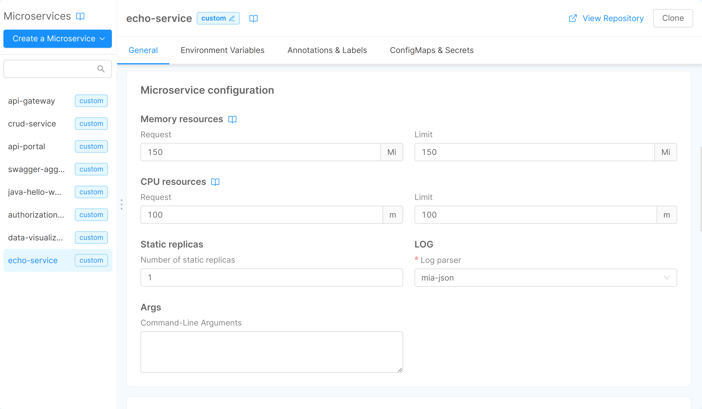

In the field CPU Resources, you have to specify the minimum number of 'thousandth of a core' (m) that the container needs and the maximum number of 'thousandth of a core' (m) that it can use.

CPU resources are measured in CPU units. One CPU, in Kubernetes, is equivalent to:

* 1 AWS vCPU;

* 1 GCP Core;

* 1 Azure vCore;

* 1 Hyperthread on a bare-metal Intel processor with Hyperthreading.

CPU Resources, which are measured in CPU units, can be expressed as an integer or a fractional value with one of these suffixes: m and milli.

The different suffixes, applied to different integers or fractional values, can express the same CPU Resource value. For example: 100m CPU, 100 milliCPU, and 0.1 CPU are all the same. 

It is not possible to be more precise than 1m and CPU is a always an absolute quantity. For example, 0.1 is the same amount of CPU on a single-core, dual-core, or 48-core machine.

!!! info
    
    In the microservice detail of Mia Platform DevOps Console, you can only express the CPU Resource value in m.

To learn more about Memory Resources, please visit [this page](https://kubernetes.io/docs/tasks/configure-pod-container/assign-cpu-resource/#cpu-units) of Kubernetes Docs.
