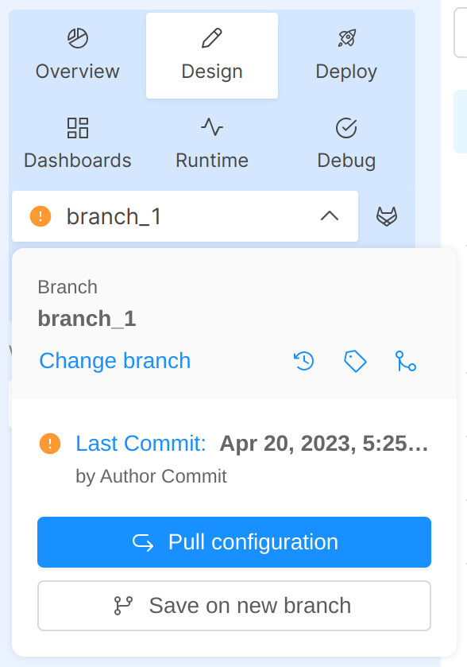

The Design section allows you to modify the configuration and architecture of your project by customizing the use of various resources such as CRUD, Microservices, Endpoints and much more.

Using the sidebar it is possible to navigate between the different sections of the Console, and design your project as you prefer.

## Manage your configuration

Mia-Platform Console allows you to manage the configuration of your project using Git branches or tags.  
Branches represent independent lines of development that can be originated starting from any commit. They are used to develop and test different configurations, as changes to one branch do not cause any changes to others, and any branch can be deployed.  

Tags are ref that point to specific commits in the Git history. Tagging is generally used to capture a point in history that is used for a specific release version. A tag is like a branch that does not change. Unlike branches, tags, after being created, have no further history of commits.

In the Design Area, you can see a branch management area on the top-right corner that allows you to perform different actions at the branch level:
- switch to a specific branch or tag 
- create a new branch from an existing branch
- create a new tag
- discard you local changes
- visit the commit history
- save your work

:::caution
Since tags should not change after being created, it is not possible to save changes made on a tag. Instead you have to create a new branch starting from the tag itself.
:::

### Branch status

When working on a branch, different statuses may appear, depending on different circumstances which are described here below.

#### Configuration up to date with remote

In this case, the branch icon presents a little green circle.
It means that you are up to date with remote, without having applied any changes on the configuration yet.

  
 

  

#### Unsaved local changes

In this case, a floppy icon appears next to the branch name to suggest to the user to save new local changes applied in the configuration.
If you want, you can choose to discard your local changes.

  
 

  

#### A remote commit has been performed

In this case, you have not applied any local changes yet, but someone else has already committed new ones on the same branch.

  
 

  

#### A remote commit has been performed and there are unsaved local changes

In this case, it will be necessary to start a merge process to manage diffs between the last remote configuration committed and your local work on the branch. To discover more in depth how the merge process works, please check the dedicated merge process documentation page.
If you do not want to perform the merging process, you can alternatively decide to save your changes on a new branch or to discard them and pull from the remote configuration.

  
 

  

#### Error in the retrieval of the configuration

In this case, an error message will be shown in the branch popover and you may need to reload the page or contact your Project Administrator.

  
 

  

### How to load a branch or tag

In order to switch to another branch or tag, you just need to click on its name to open the Load area. There you can select the new branch or tag to be loaded.

  
 

  

### How to save your configuration

Once the respective desired changes have been made, using the "Save Configuration" button in the branch action popover and fill the save configuration modal form.
