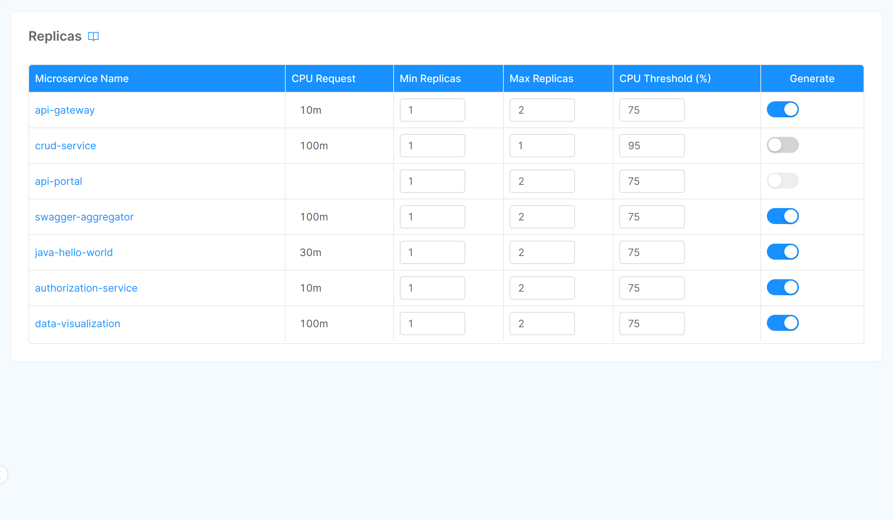

## What needs the Replicas for

Replicas allow you to set the number of replicas for your services in purpose to autoscaling them **CPU usage-based**.  
The feature is thought to generate the replicas **only for the productions environments** where the [Environment Variable](../.-/../../set-up-infrastructure/env-var.md) `ENABLE_HPA` is set to `true`.

:::info
This process is entrusted to the [Horizontal Pod Autoscaler](https://kubernetes.io/docs/tasks/run-application/horizontal-pod-autoscale/) Kubernetes resource  
:::

## Configure Replicas

Upon accessing the Console Design area and selecting the *Replicas* section in the left menu, you'll see the list of your services for which you can set Replicas.

:::caution
For supporting Replicas a service must have both the [minimum and the maximum of CPU limit set](microservices-cpu-resources.md)
:::

In the table rows, for each service, you can directly change the following parameters:

* **Min Replica**: the minimum number of replicas that must be running.
* **Max Replica**: the maximum number of replicas that can be concurrent running.
* **CPU Threshold**: this number it's a **percentage of the sum of the requests of all current replicas**. The request of each replica is its [CPU min limit](microservices-cpu-resources.md) of the service.
* **Generate**: enable this flag to actually creating the replicas while the next deploy.

## How it works

When the total current CPU utilization by the replicas set exceed the **CPU Threshold**, if the **Max Replica** number allows it, a new replica is run.  
If the total CPU usage drops below the **CPU Threshold**, after some time additional replicas are removed.

:::info
Specific details about scaling algorithm are available in [this Kubernetes docs page](https://kubernetes.io/docs/tasks/run-application/horizontal-pod-autoscale/#algorithm-details)
:::
