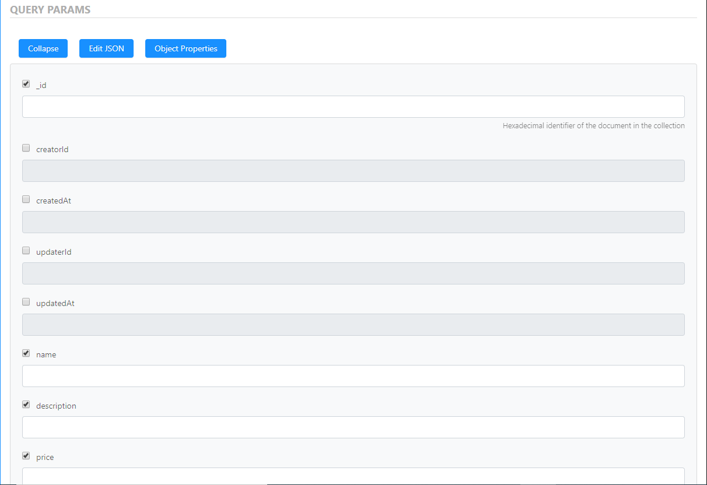
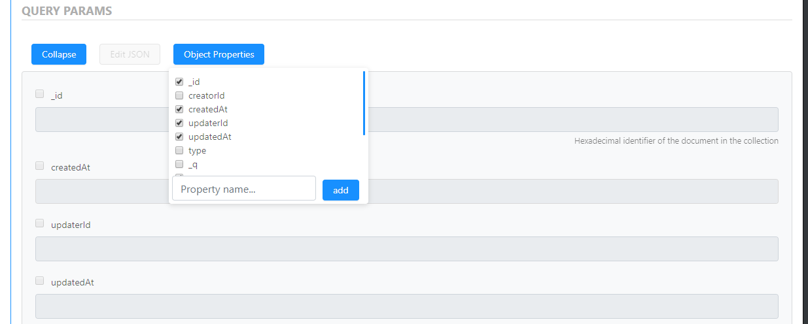
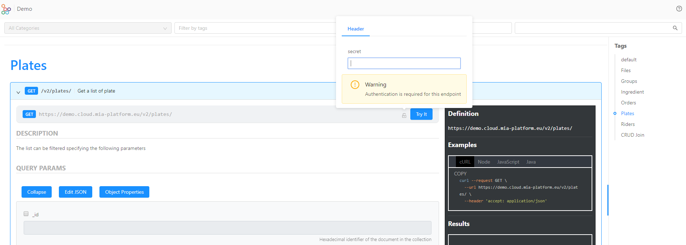
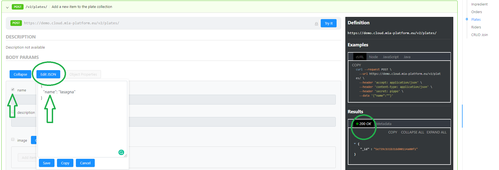
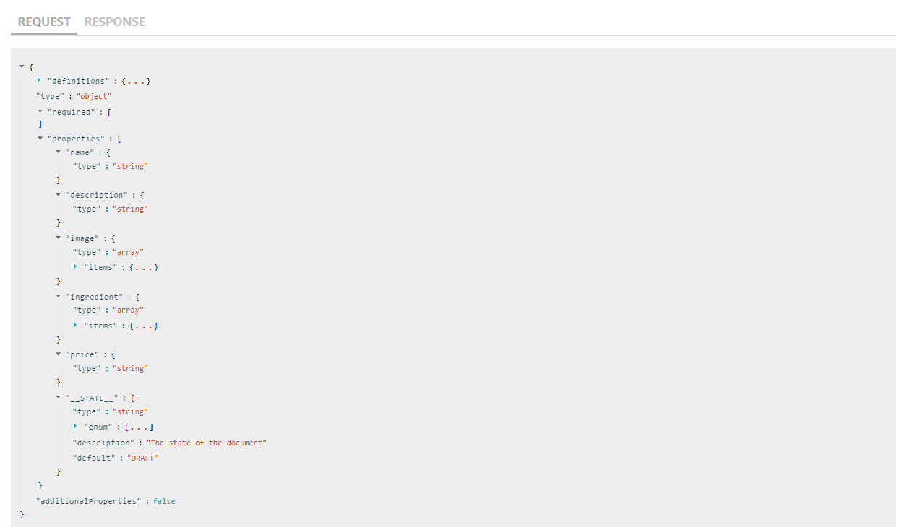
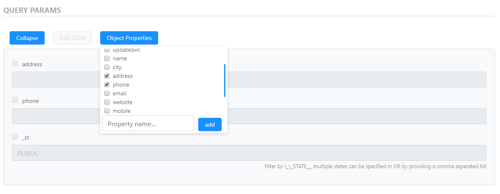
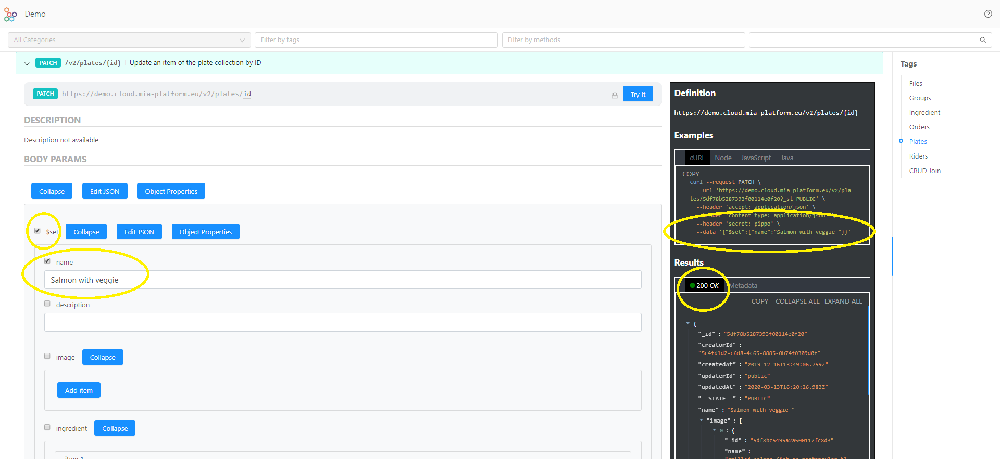

## The API Portal

Documentation is a vital part of any Restful API in order to drive consistency and discipline across your API development workflow.

In the **Documentation Sections**, you can find automatically generated and kept in sync documentation, that semantically describes the API in a readable structure text format.
The documentation let you know exactly how your API will work and behave, before integrating it into your code. It lists all the available REST-ends points and provides all detailed information: description, parameters, and schema.  

You can share API documentation within your company, externally to partners and suppliers.

In order to test the APIs, you can access your tags on the right side of the screen, where the APIs are grouped according to their tags: by clicking on one tag, you will visualize all the APIs that belong to that tag - in our case, we will select the Tag “Plates”.

The next sections will show you examples and information per request type: GET, POST, PATCH and DELETE.

The Console will show you a request example for each request type that you can use to easily test your Api. You just need to copy the request example, paste it in the Json editor and you will be ready to test your Api!

:::note
The available documentation is generated by [Swagger Aggregator](../../runtime_suite/swagger-aggregator.md).  
You can [apply custom configurations directly from the Console](../api-console/advanced-section/swagger-aggregator/configuration.md)
:::

:::tip
If you want to hide some endpoints of your API from the API Portal documentation you can do this in the [Management section](../api-console/api-design/endpoints.md#manage-the-visibility-of-your-endpoints) of the endpoint you want to hide
:::

## CRUD Documentation

After released a [CRUD](../api-design/../api-console/api-design/crud_advanced.md) you can find the relative APIs documentation in the API Portal.  
APIs are exposed automatically by the [CRUD Service](../../runtime_suite/crud-service/overview_and_usage), check out the [CRUD Endpoints section](../../runtime_suite/crud-service/overview_and_usage#crud-endpoints) to know all details of endpoints and how to perform CRUD operations.  
Below you can find some basic examples of CRUD operations you can do with API Portal.

### GET request

#### How to "Get a list of plates"

If you want to test the GET end-point, you need to click the row that will open it up.

In the Query Params section, you can filter and sort all the request configuration you need by ticking the boxes of the information you are looking for. For instance, we ticked id, name, description, and price. So, only these specific contents will be passed upon the GET request.

You can hide the visibility of the content of an entire section by pushing the button **Collapse**.

Then you can reactive it by clicking **Expand**

By opening the **Object Properties** you can hide the properties that you don't want to retrieve just by deselecting the boxes.
As you can see below, we deselected creatorId and type, as they don't appear in the list.

Now you have the ability to test the API request by pushing **Try it** - if the APIs are protected, you need to authenticate yourself by filling the Secret in, as shown below.

Once the single API is selected, in this area you can see the structure of the API and the data that are exposed.

Below you can see the screenshot of a successfull request to our running API, we can see 200 as OK success status response code and in the black box on the right, you can see the request, that can be seen as a cURL,in Node, in JavaScript, and in Java.
In the second box, you can see the response of the body with the list of the plates.

You can see all the Parameters Type: query, path, header, and body.

In addition, you can also edit it in JSON as shown below.

### POST request

#### How to "Add a new item to the plates collection"

If you want to test the POST end-point, you need to click the row that will open it up. Now you have the ability to test the API request by entering the information that you need.
In our case we added a plate of "onion rings" with its description and its price.
Then push **Try it** - if the APIs are protected, you need to authenticate yourself by filling the Secret in.

Below you can see the screenshot of a successfull request to our running API, we can see 200 as OK success status response code, a new ID was created and in the black box on the right, you can see the request, that can be seen as a cURL,in Node, in JavaScript, and in Java.

Visibility. Always remember the status, whether it is private, public, trash or deleted.

Otherwise, you can add a new item to the collection by directly writing the information you need in the Json Schema by clicking the **Edit Json** button.

In our example, we successfully added the plate Lasagna, as we can see 200 as OK success status response code.
Remember to tick all the boxes of the body params you want to add. In the example, you can see in the Json Schema we ticked "name" in the body params.

You can also see the complete Json Schema and all the type variables both for the request and response.

### DELETE request

#### How to "Delete a plate from the plates collection"

If you want to test the DELETE end-point, you need to click the row that will open it up. Now you have the ability to test the API request by putting the ID of the plate that you want to delete and then pushing **Try it** - if the APIs are protected, you need to authenticate yourself by filling the Secret in.

Below you can see the screenshot of a successfull request to our running API. You can see 204 as No content status response code and in the black box on the right, you can see the request, that can be seen as a cURL,in Node, in JavaScript, and in Java.

By opening the **Object Properties** you can hide the properties that you don't want to delete just by deselecting the boxes.

For instance, we deselected all the properties that we want to keep.
You can also look for a property in the search box and then push **add**

Visibility. Always remember the status, whether it is private, public, trash or deleted.

### PATCH request

#### How to "Update a plate of the collection by ID"

If you want to test the Patch end-point, you need to click the row that will open it up. Now you have the ability to test the API request by editing the fields you want.

In our case, we want to edit the name of a plate from "Salmon" to "Salmon with veggie". We retrieved the correct ID from the GET request and we entered it in the "path params". Since we want to change the name of the plate, we will tick the operator **$set** and **name**, and we will type the new name: Salmon with veggie.

Then, push **Try it** - if the APIs are protected, you need to authenticate yourself by filling the Secret in.

Below you can see the screenshot of a successfull request to our running API, we can see 200 as OK success status response code with the new name. In the black box on the right, you can see the request, that can be seen as a cURL,in Node, in JavaScript, and in Java.

#### Field Update Operators

In the following table you can find the modifiers of the Body Params:

| Name          | Description                                                               |
| ------------- |:-------------------------------------------------------------------------:|
| $set          |Sets the value of a field in a document                                    |
| $unset        |Removes the specified field from a document                                |
| $inc          |Increments the value of the field by the specified amount                  |
| $mul          |Multiplies the value of the field by the specified amount                  |
| $currentDate  |Sets the value of a field to current date, either as a Date or a Timestamp |
| $push         |Appends a specified value to an array                                      |

By opening the **Object Properties** you can hide the properties that you don't want to edit just by deselecting the boxes.  

Visibility. Always remember the status, whether it is private, public, trash or deleted
