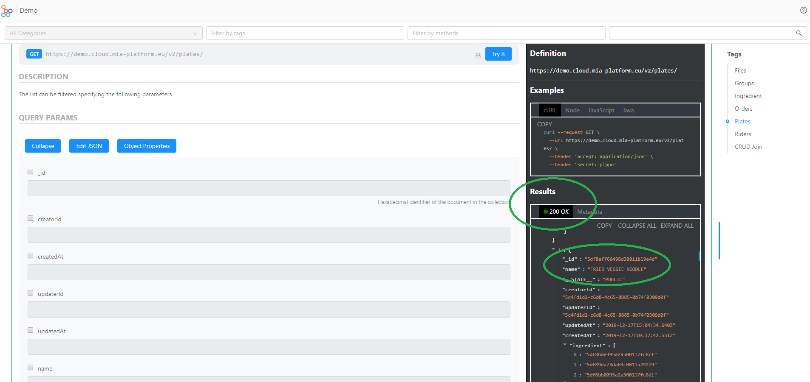

##API Portal

Documentation is a vital part of any Restful API in order to drive consistency and discipline across your API development workflow. 

In the **Documentation Sections**, you can find automatically generated and kept in sync documentation, that semantically describes the API in a readable structure text format. 
The documentation let you know exactly how your API will work and behave, before integrating it into your code. It lists all the available REST-ends points and provides all detailed information: description, parameters, and schema.  

You can share API documentation within your company, externally to partners and suppliers. 

In order to test the APIs, you can access your tags on the right side of the screen, where the APIs are grouped according to their tags: by clicking on one tag, you will visualize all the APIs that belong to that tag - in our case, we will select the Tag “Plates”.  

This section below will show you examples and information per request type: GET, POST, PATCH and DELETE.

GET request: how to "Get a list of plates"
If you want to test the GET end-point, you need to click the row that will open it up. Now you have the ability to test the API request by pushing **Try it** - if the APIs are protected, you need to authenticate yourself by filling the Secret in, as shown below.

Once the single API is selected, in this area you can see the structure of the API and the data that are exposed. 

Below you can see the screenshot of a successfull requesto to our running API, we can see 200 as OK success status response code and in the black box on the right, you can see the request, that can be seen as a cURL,in Node, in Javascript, and in Java. 
In the second box, you can see the response of the body with the list of the plates. 

You can see all the Paramters Type: query, path, header, and body. In addition, all the query params are listed and you can filter them. You can also edit it in JASON as shown below. 

POST request: how to "Add a new item to the plates collection" 

If you want to test the POST end-point, you need to click the row that will open it up. Now you have the ability to test the API request by pushing **Try it** - if the APIs are protected, you need to authenticate yourself by filling the Secret in.
Once the single API is selected, in this area you can see the structure of the API and the data that are exposed.

Below you can see the screenshot of a successfull requesto to our running API, we can see 200 as OK success status response code and in the black box on the right, you can see the request, that can be seen as a cURL,in Node, in Javascript, and in Java. 

There are other actions that you can diretcly take on the test window. 

DELETE request: how to ""Delete a plate from the plates collection" 

If you want to test the DELETE end-point, you need to click the row that will open it up. Now you have the ability to test the API request by pushing **Try it** - if the APIs are protected, you need to authenticate yourself by filling the Secret in.
Once the single API is selected, in this area you can see the structure of the API and the data that are exposed.

Below you can see the screenshot of a successfull requesto to our running API, we can see 200 as OK success status response code and in the black box on the right, you can see the request, that can be seen as a cURL,in Node, in Javascript, and in Java. 

There are other actions that you can diretcly take on the test window. 

PATCH request: how to "Update a plate of the collection by ID"

 
