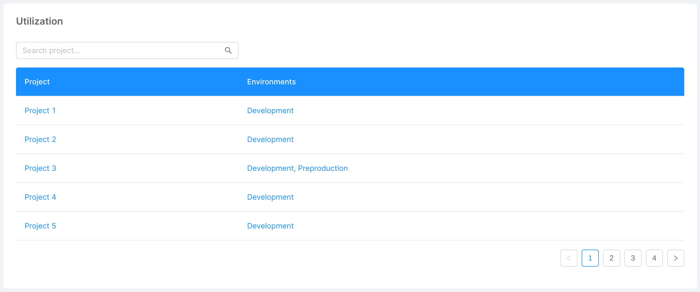
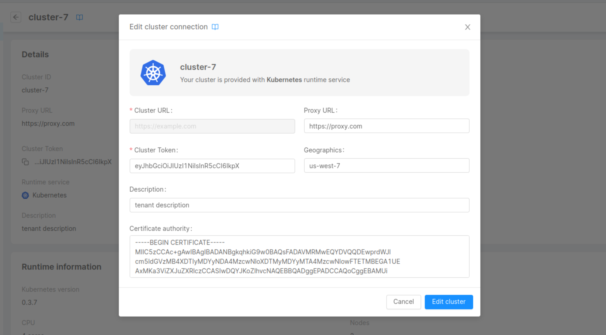

## Connect a Cluster

You can connect a cluster by clicking on the "Add cluster connection" button, located in the page's top right corner. A modal will show up, and, through a few steps, you will be asked to enter some information related to the cluster.

### Step 1: Runtime Service

In this step, you are required to choose the cluster's vendor and runtime service. You can do so by selecting a vendor tab and clicking on the card related to the runtime service you want to use. Further information on the supported vendors and runtime services can be found [here](/development_suite/clusters-management/vendors-runtime-services.md).

In case your vendor is not supported by the Console, don't worry! You can still select the "Other" tab and choose a runtime service.

### Step 2: Cluster Details

In this step, you can insert some general details about your cluster:

* **Cluster ID** (*required*): friendly identifier of the cluster, assigned by the user while connecting the cluster to the Console;
* **Geographics**: a label used to describe the location of the cluster;
* **Description**: a brief description of the cluster.

### Step 3: Connection

In this step, you can insert some information about the cluster connection:

* **Cluster URL** (*required*): URL used to connect to the cluster, which indicates where the cluster is exposed;
* **Proxy URL**: URL of the proxy used to connect to the cluster, usually needed when the cluster is exposed on a private network;
* **Cluster Token** (*required*): base64 decoded JWT token needed by the service account to perform operations on the cluster.  
  To extract it, refer to [this paragraph](/development_suite/clusters-management/clusters-overview-setup.md#ca-and-token);
* **Certificate authority**: base64 decoded CA certificate for the TLS connection with the cluster.  
  To extract it, refer to [this paragraph](/development_suite/clusters-management/clusters-overview-setup.md#ca-and-token).

By clicking on "Add cluster", the connection to the cluster will be set, and it will appear as a new entry in the table.

:::note
A syntactic check is performed at the moment of data entry, but the Console will verify their correctness on saving, contacting the cluster to establish the connection.  
Therefore, inserting a wrong URL, token, or certificate will result in a network error because the cluster will not be contacted successfully, and thus it will not be connected nor saved.
:::
:::danger
In case the service account is not configured on the specific cluster, upon creation of an environment associated with that cluster the Console will not be able to generate the token needed for deployment. More information on how to connect the service account can be found [here](/development_suite/clusters-management/clusters-overview-setup.md#configure-and-connect-the-service-account-to-the-cluster).
:::

## View Cluster Information

By clicking on the arrow button located in the rightmost column of a cluster entry in the table, a new page will show up, displaying information about the specific cluster through 3 cards:

* **Details**: this card shows the information inserted by the user when connecting the cluster to the Console, and allows to modify this information through the "Edit" button in the top right corner, as further explained [below](#edit-a-cluster-connection).

It is also possible to quickly copy the cluster token through a specific copy icon, while clicking on the "View certificate" button allows the user to visualize the base64 CA certificate in both human-readable and plain versions in a two-tabs modal. The "Expanded view" tab displays the human-readable version of the certificate, while the "Text view" tab shows its plain version, and a copy button in the modal footer allows the user to quickly copy the plain base64 CA certificate.

* **Runtime information**: this card shows the runtime information of the cluster, taken by aggregating data from the machines on which the cluster is hosted. More specifically:
  * **Kubernetes version**: Git version of the Kubernetes master node associated with the cluster;
  * **RAM**: the total amount of RAM used by the machines (in MiB);
  * **CPU**: the total amount of CPU used by the machines (in terms of number of cores);
  * **Nodes**: number of nodes associated with the cluster.

* **Utilization**: this card simply shows the environments installed on the cluster, and the projects associated with these environments. A search bar allows you to quickly find the project you are looking for, filtering the data in the table.

## Edit a Cluster Connection

As mentioned in the previous section, through the "Edit" button in the top right corner of the Details card, it is possible to modify (most of) the information inserted by the user while connecting the cluster to the Console. A click on the button opens a modal very similar to the one seen when connecting the cluster, with the difference that the Cluster ID and Cluster URL information can no longer be changed. By clicking on "Edit cluster", the connection to the cluster will be updated.

## Remove a Cluster Connection

In the bottom part of the page, there is a footer which allows you to remove the cluster connection from the Console. By clicking on the "Remove" button, a modal will be displayed, asking for confirmation of the removal.

After entering the name in the input field and clicking "Remove", a loading and finally a feedback of successful removal will be shown. Closing the modal will then redirect you to the clusters table. In case of errors, an informative feedback will be shown instead, and the "Close" button will not perform any redirection.

:::note
Removing a cluster connection is only possible if the cluster has no connected environment.
:::
