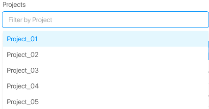

## What is the Endpoints Overview

The Endpoints Overview is a visualization tool accessible from the Projects Section of the console by selecting a specific tenant and clicking on the Overview button. This provides the user with a graphical cross-project overview of the configuration of all the selected tenant's projects. The graphical overview has a particular focus on the security of the projects' endpoints.  

Endpoints Overview collects data on the project configuration and creates a table presenting information on all the endpoints, where each row shows:
* *Project*: Project name.
* *Project owner*: Project owner name.
* *Endpoint/API*: Endpoint name.
* *Show in API Portal*: A label that shows if the endpoint appears in the API portal.
* *API-Key*: A label that shows if the endpoint is protected by an API-key.
* *Public*: A label that shows if the endpoint is public (the API is accessible even if the user is not logged in).
* *Group Expression*: A label that shows if the endpoint is protected by a group expression and the concerning expressions.
* *Decorator PRE*: A label that shows if a PRE decorator is configured for the endpoint and the concerning decorators.  

An example is in the following picture.

Through this tool, the government entity of the tenant can have a graphical overview of the global configuration and the security of all the projects and endpoints.

## Main functionalities

### Graphical features representation

The user can consult endpoints' status, represented by a painted circle and the label *true* or *false*. The meaning of the circle depends on its colour:

* Red: the absence of a security feature in the corresponding column.
* Green: the presence of a security feature in the corresponding column.
* Grey: the presence of a feature that does not direcly influence the security of the endpoint.
* Orange: the absence of a feature that does not direcly influence the security of the endpoint.

The *Group expression* column also displays the group expressions as labels.  

The *Decorator PRE* column also specifies the type of decorators as labels.  

  

### Sorting

The Endpoint Overview output can be sorted by each one of the features by clicking on the attributes presented in the first table row.

### Filtering

The Endpoints Overview results can be filtered by the project names and the categories within the columns using the drop-down menus. By doing so, only the Endpoints Overview's rows satisfying the chosen filters will be shown.

In the presented example, the Endpoint Overview result is filtered to display only the endpoints into *Project_01* or *Project_02* projects having both *API-Key* and *Group expression* features set to true.  
