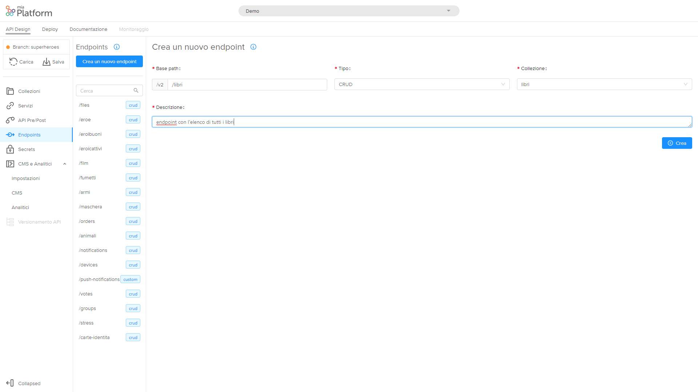

## Expose an API

To create an endpoint, select **Endpoints** and then **Create a new Endpoint**.

**Basepath**: is the prefix of the route. It can be set as the base address to which the API is served, relative to the host (name or ip) that supplies the endpoint. In our case, for example, we could insert "/books".

**Type**: The endpoint can be of different types:

* *Crud*: hook your endpoint directly to one of your collections.
* *External*: hook your endpoint to one of the external services registered in the services section.
* *Custom Microservices*: hook your endpoint to a service with logics entirely created by you.

In this section we will create a CRUD endpoint.

**Collection**: select the collection of which the endpoint is part. In our case "books"

**Description**: optional description of the endpoint

Then select *Create*.
At this point we have created our endpoint!

Now you can configure your endpoint by assigning permissions and changing security.
The parameters you can configure are the following:

### Name of the Endpoint
**Default Status**: With Default State you can choose whether the elements in the Collection will be made public on the applications as soon as they will be created and will therefore have Public status or if they will instead have Draft status and must therefore be made public by the CMS before being published.

**Collection**: the collection of which the endpoint belongs is displayed.

**Description**: short optional description

### Manage the security of your endpoints
If the route is **public**, you do not need to be logged in to be able to call it. If it is not public and is called by an unregistered user, it returns 401.
If it is **secreted** to be able to call it you need to set the Secret header with the correct value (you can see the secret in the homonymous screen)

**Groups of users that can access them**: It is a logical expression to determine which groups have permission to call a given route. It can also be set to 0 (none) or to 1 (all). If the expression is true, then the user can access the route.

###List of verbs
In this section you can view all the path that can be called of a CRUD endpoint. By selecting the different verbs in the management section it is possible to further detail on who has the permissions to do certain actions.

If **inherited** is active the field will inherit the behavior of the base endpoint, de-selecting it can set specific rules related to this route.

For example, we can set that the post can only be reserved for a specific group of users.
