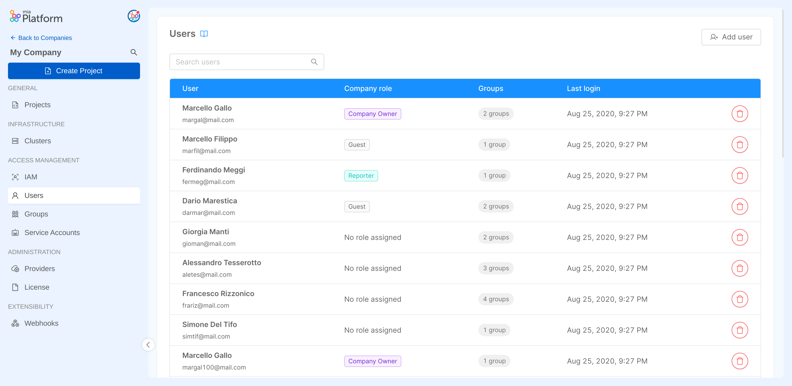
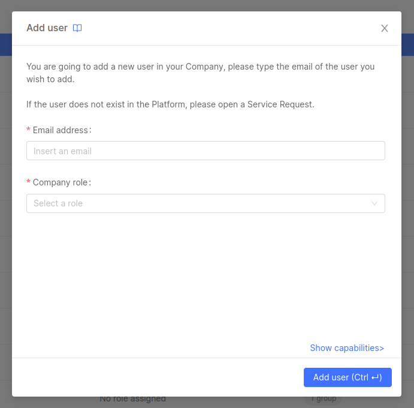

Mia-Platform Console allows the creation of user accounts, which are typically used as digital identities for human users who need to access resources with certain privileges and permissions.

User accounts can be assigned roles at Console, Company, Project or Runtime Environment levels, according to which they can perform different types of actions.

## Managing Company Users

Users inside the Console can be part of one or more Companies. From the **Users section** within the Company Overview, a Company Owner can view and manage all user accounts of a Company. From this section, new users can be added to the Company and existing ones can be removed from it completely.

### Adding a User

A Company Owner can add a new user by pressing the *Add user* button in the Users section. The User invitation process will require the invited user email to be provided.

  

  

The provided email will be searched throughout existing users and, if a match is found, the user will be invited to the Company with the specified role.

:::info
If the user does not exist in the Platform, please open a Service Request for it to be created.
:::

### Managing User Company role

User roles are managed from the Identities portal, which is specifically dedicated to the governance of roles and accesses to the resources of the Company. Find out how to edit a user's role in [the Identities documentation page](/development_suite/identity-and-access-management/manage-identities.md#editing-identity-roles-at-company-level)

  

  

### Managing User role at Project level

Users with access to a Company are shown in the [Identities portal](/development_suite/identity-and-access-management/overview.md#identities-portal) inside the Project Settings Area of a Project belonging to that specific Company.
You can change the role of a user in the Project or in any Project Runtime Environment. To do so, just open the editing dialog on the desired row and select the new role of the user for the Project itself and/or for Project Runtime Environments.

  

  

### Removing a User

A Company Owner can remove a user from the Company by pressing the delete user button of the desired row in the Users section. 

:::info 
The user will be revoked personal access to the Company and will also be kicked out of all groups they are part of.
:::

  

  

## How to best manage your Users

Are you wondering whether organizing your users through individual role assignments is the smartest and most effective way to manage the user access to your Company? Or whether the best solution would be to organize them into groups instead?
There is no right or wrong answer to this question: it depends on your organizational needs.  
Here below you can find some helpful hints that can help you find an answer that better suits your own requirements.

### Team composition

For example, if you need to provide the same access privileges to multiple users in your Company, for sure the simplest and most efficient way is to manage them through [groups](/development_suite/identity-and-access-management/manage-groups.md).  

On this purpose, imagine that you have to manage a team composed by a large number of developers. You can create a group (e.g., "My Company Developers"), add them all as group members, and assign the most appropriate role (e.g., `Developer` role) to the group. This will result in all your users becoming users of the Company with `Developer` role by virtue of being part of that group of developers.  
In this use case, the choice of managing your users through groups allows you to avoid having to manually assign the same role to each user, which may be a time-consuming and tedious activity, especially when you have to deal with a large number of users.  

Furthermore, having all of your users grouped within such a group allows you to have a quick comprehensive view of who the members of the group are (in our example, the developers) and what access permissions to the Company are assigned to them (`Developer` role in this case).

Alternatively, if the composition of your Company team is small and heterogeneous (e.g., there is a Project Manager, a Senior Developer, a Junior Developer, and a Designer), it might still be functional to manage those users through individual role assignment.  
For example, at Company level, you may assign the `Company Owner` role to the Project Manager, the `Project Administrator` role to the Senior Developer, the `Developer` role to the Junior Developer, and the `Reporter` role to the Designer. 

However, keep in mind that these different user management methods are not mutually exclusive! You can decide to apply them both, in order to find your specific needs. 

For instance – going on with the aforementioned example – imagine that your team has now expanded by welcoming new Junior Developers. At this point, it may be particularly useful to create an ad-hoc group of users (e.g., "My Company Developers") in which to include all the Junior Developers of your Company (the new ones plus the initial one).  
Now let us remember, however, that one of those Developers (the first one) was initially assigned the `Developer` role at individual level. This means that one Developer will have both an individual role and a role conferred by the group membership. You don’t have to worry about this, as roles in Console always add up and therefore it does not represent a problem of any kind.

### Extension and governance of user privileges

The dual management of users – through a combination of individual roles and group roles – also allows for more personalized governance of access to the resources of your Company: imagine, for example, that the initial Junior Developer (who has both an individual role and the role attributed by group membership) has now become a Developer Expert, having increased the responsibilities within some of the Projects of your Company. At that point, you might want to give that user additional privileges only on those specific Projects.  
You can do it by assigning, to that user, a role at Project level that expands the capabilities currently enabled by the `Developer` role assignment at Company level (e.g., being able to deploy on a specific Projects by assigning the `Maintainer` role to that user).

Nevertheless, once again, managing users through groups can be useful even in this case, especially when the number of users to which to assign roles on specific resources increases. As a matter of fact, thanks to groups, you can actually increase the capabilities on specific resources for a batch of users in your Company in an easier way.

More practically speaking, if you want – for instance – to extend privileges to all your Junior developers on a specific Project/Runtime Environment (e.g., by elevating that group's role to `Maintainer` on a specific Project, in order to provide them with Deploy trigger permission on that), thanks to groups you can extend with just one action that privilege to all of your Junior developers: you only have to assign to the "My Company Developers" group the `Maintainer` role specifically on the desired Project/Runtime Environment.

Otherwise, if they were not managed through groups, this action of assigning `Maintainer` role on that Project (or Project Runtime Environment) would have to be repeated for each of the members, which is – again – a time-consuming (and even error-prone) activity.  
Moreover, if you wanted to grant this privilege only for a limited period of time, then restoring the initial role setting would again have to be done manually for each of these members, highlighting this bottleneck even more.

By contrast, through groups, for instance, the `Maintainer` role disassignment from that specific Project (or Project Runtime Environment) – to restore the initial `Developer` role assigned at Company level – would have been a more effective and circumscribed activity, keeping access governance on that Project more organized and flexible.

To sum up, user management use cases are many, as well as the different organizational needs, and – in this landscape – Mia-Platform Console allows you to better structure access to resources as you prefer, giving you freedom in governing access levels of your Company users.