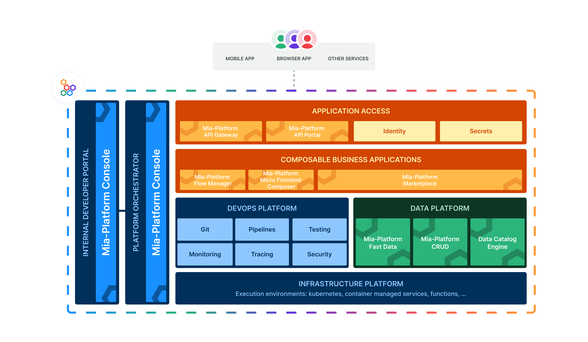

This page will give you a brief overview of **Mia-Platform Console**, explain **why it's important**, highlight the **advantages of adopting this internal platform solution** and provide a **brief description of its architecture**. 

## Product overview 

In an evolving, omnichannel market, successful enterprises must operate and innovate like tech companies by:

* Building and launching digital products **quickly**; for example, reducing the time-to-market for a new app from months to weeks.
* Viewing market changes as **opportunities**, such as rapidly adopting new technologies.
* Having the **flexibility** to quickly adjust to changes in demand by easily increasing or decreasing scaling system capacity in response to traffic fluctuations.
* **Integrating** with various tools, partners, and ecosystems.

Modern companies achieve this through an Internal Developer Platform (IDP). **Mia-Platform Console** is the tool that best fits this need, enabling you to quickly and easily build your own fully customized IDP. Mia-Platform Console also allow you to industrialize, manage, and simplify cloud-native development and operations such as connecting your cluster (even across multiple cloud providers), designing your application from services to APIs, orchestrating workflows and so on.

## Why Mia-Platform Console

Mia-Platform Console manages the entire software lifecycle seamlessly and unify your IT department under one integrated platform. Simplify cloud-native development while maintaining complete governance and control over your processes.

* **Clear Governance**: Establish streamlined, standardized pathways for software delivery and integrate governance rules directly into your development workflows, ensuring consistency, compliance, and efficiency throughout the entire development process. This can involve tracking the evolution of projects, identifying key characteristics of each project, and centrally visualizing resources. These practices help maintain transparency and facilitate effective management.
* **Self-service Approach**: Build and manage an Internal Developer Platform (IDP) that empowers development teams by providing the necessary tools and resources in a self-service mode. This enables them to develop efficiently and autonomously without dependency on other departments. For example, teams can create test environments independently, build microservices with standardized and pre-configured CI/CD pipelines, and access all necessary information, such as logging and monitoring, without having to request it from other teams or departments.
* **Lower cognitive load**: By abstracting underlying complexities, the tool simplifies tasks for developers, minimizing cognitive load and reducing the need for frequent context switching. It consolidates all necessary project information, from configuration to monitoring, into a single interface. This allows developers to focus more on creative problem-solving and efficient coding, ultimately enhancing productivity and innovation within development projects.

## Ease the digital platform development

Mia-Platform Console serves the whole team (Developer, Operations and Platform Engineering) involved in software development because it brings several advantages to the development of an Internal Developer Platform.

- **Governance & controls**: Manage runtime resources across hybrid and multi-cloud architectures, connect clusters, establish self-service environments and enforce RBAC policies, by creating 'paved roads'. You can also establish project templates that standardize developer tools and the ability to choose and connect your own provider such as Git.
Using a Software Catalog, each team owns one or a group of projects.

* **Productivity & quality**: Software can be built in a unified environment that offers secure, self-service capabilities. By leveraging the GitOps methodology, applications can be exposed and deployed seamlessly from a centralized setup.
Enhance your development speed with ready-to-use services or by directly uploading Docker images.

* **Resilience & Observability**: Ensure long-term system integrity through advanced observability tools, metrics, and alerting mechanisms.
Enhance services usability with a functional document portal and with API testing capabilities.

The use of Mia-Platform Console does not bind in any way to a specific technology stack. This product integrates various technologies, ranging from front-end development to deployment tools.

Leverage the **[Marketplace](/marketplace/overview_marketplace.md)** to accelerate development. Thanks to this self-service catalog you can find a set of curated, standardized, and reusable software components to easily integrate in your Internal Developer Portal (IDP). 

## Hierarchical Organization of Mia-Platform Console

Mia-Platform Console is organized into hierarchical levels to help users navigate its structure effectively. Starting from the highest level down to the most detailed, this section provides a quick guide for understanding the architecture.

- **Console:** The overarching workspace and management environment, serving as the primary gateway to the platform.
- **Company:** An organizational entity that acts as a container for projects. It can represent the entire organization or a specific operational unit.
- **Project:** A structured collection of microservices, configurations, and data. It might represent a full digital system or a specific component.
- **Project Sections:** Designated areas within a project that delineate and organize functionalities and tasks.

This structure ensures clear and scalable management of resources and activities within Mia-Platform Console.

Discover all the **features and capabilities** of Mia-Platform Console, by exploring the menu items on the left of this page, and the other products **[Mia-Platform Fast Data](/fast_data/what_is_fast_data.md)**, **[Mia-Platform Microfrontend Composer](/microfrontend-composer/what-is.md)** and **[Mia-Platform Marketplace](/marketplace/overview_marketplace.md)**.