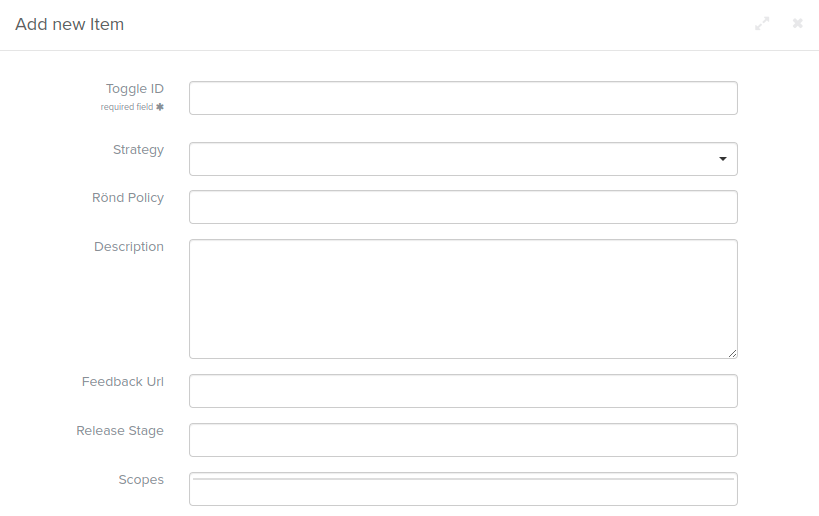

The console offers a section called [Feature Preview](/development_suite/user-settings/feature-preview.md) in the User section. The section allows to activate features that are still in preview by enabling a toggle.

## Add new feature

In order to create a new feature you need to enter the CMS (of the desired environment) and access the Features section in the Configuration sidebar group.

From here you can press on "Add new" and insert a new feature by filling in the fields:
- `Feature Toggle ID` (required) which represents the identifier of the toggle on which the feature is activated or deactivated.
- `Description`
- `Release Stage` which represents the release status of the feature.
- `Scope` which shows the list of scopes on which you want to activate the feature.

:::caution
You must be Console Super User and have the `console_cms` group.
:::

:::info
Feature toggle items can only be created and managed by people with access to the Mia-Platform Console CMS, therefore you may have to ask your Mia-Platform referent to to give you acess to the CMS and to add the logic for you new feature toggle.
:::

In the Scope field it is possible to choose between five values:
- `User` the feature will be activated for the user
- `Company` the feature will be activated for the company
- `Project` the feature will be activated only for the project
- `Environment` the feature will be activated only for the chosen environment
- `Console` the feature will be activated for the console

After creating the new feature, you can define its activation rules. In order to do this, on the same CMS where we created the feature, you need to access the Feature Activations section, still in the Configuration group. Press on "Add new" and insert a new activation rule by filling in the following fields:
- `Feature Toggle ID` (required) indicates the feature toggle to activate and therefore must coincide with the same value defined in the Toggle ID item when the feature was defined.
- `Scope Type` (required) which indicates the scope on which we want to activate the toggle. At the moment the toggle can be activated for anyone on the entire console by selecting the Console scope (Instance activation) or on specific scopes which are Company, Project, Environment and User and in this case it is also required to define the ID (in the field Scope ID).
- `Scope ID` required for all scope types (expect for Console); it must contain the id used to identify the scope (the _id of a user or a project; the tenantId of a tenant)

