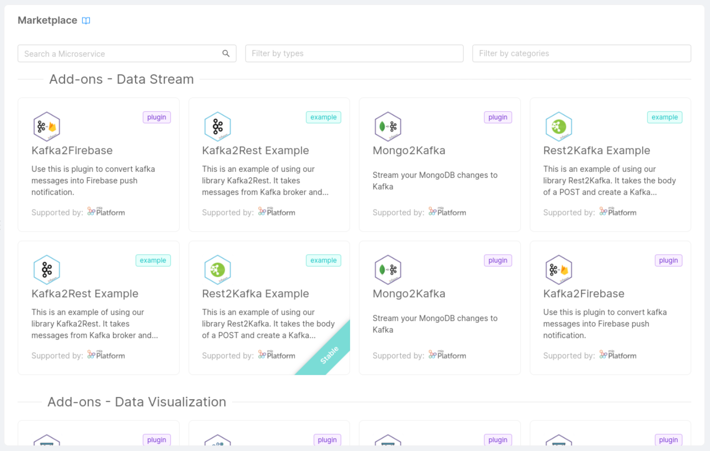

## Why always start from scratch

The Mia-Platform Marketplace contains several code resources which help you develop your architecture faster.

In the Marketplace, you will be able to choose from a set of components (mostly powered and supported by Mia-Platform) to easily set up a single microservice or a bundle of resources **with predefined and tested functionalities**.

Marketplace components you can start from include:

* **[Plugin](/runtime_suite/mia-platform-plugins.md)**: a ready-to-use Microservice.  

* **[Template](/marketplace/templates/mia_templates.md)**: a base repository from which you can start to create a new Microservice.  

* **[Example](/marketplace/examples/mia_examples.md)**: a specific use-case, a ready-to-use model to create your Microservice.

* **[Application](/marketplace/applications/mia_applications.md)**: a bundle of resources including Plugins, Templates, and Examples, but also Endpoints, Collections, and Public Variables.

* **Docker Image Name**: an existing Docker image of a Microservice (check out the [Create a service](/development_suite/api-console/api-design/services.md#how-to-create-a-microservice-from-a-docker-image) section for further information).

:::info
You can go deeper into the code of Templates and Examples by visiting the [Mia-Platform Marketplace GitHub page](https://github.com/mia-platform-marketplace).
:::

### Explore the Marketplace

You can access the Mia-Platform Marketplace from the *Design area* of the *Console*, either when you are [creating a new microservice](/development_suite/api-console/api-design/services.md#how-to-create-a-microservice-from-an-example-or-from-a-template) or creating a new application.

:::note
In the first case, you will be able to filter by one of the following component types: Plugins, Templates, and Examples. 

In the second case, you will only be able to see components of Application type. 
:::

In both cases, you will be able to filter components by **category**, a property reflecting the purpose, the field, or the use-case a component is associated with (e.g. Data visualization). 

The results of your search will always appear organized by category.

## Marketplace components lifecycle

Each Marketplace component has a predetermined **development lifecycle**:

The following are the expected stages along a Marketplace component lifecycle:

* **Coming soon**: implementation has just started, these components cannot be used yet (users can still be informed about the existence of a new component)

* **Preview**: first usable release, components may include bugs and be subject to undocumented breaking changes

* **Beta**: implementation is complete, these components won't be subject to any undocumented breaking change but may still include bugs (hence they must be used with caution)

* **Stable**: implementation is stable (bugs free). Consequently, this stage represents the period before the component's official release and its documentation in the release note.

