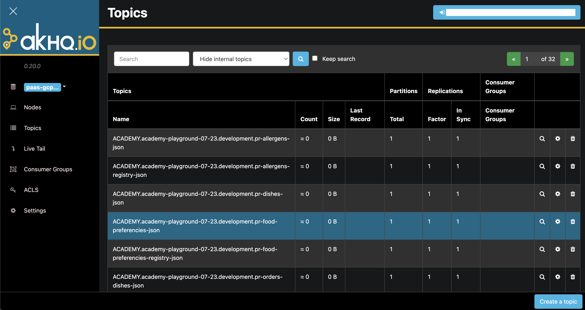

Mia-Platform PaaS offering provides you with a Apache Kafka managed cluster, simplifying real-time data streaming and event handling without the complexities of hosting and managing it yourself. With our Kafka offering, you can integrate Kafka into your applications and focus on building innovative solutions.  

We handle all the operational overhead of setting up, configuring, and maintaining Kafka infrastructure. From hardware provisioning to software updates and security patches, our team handles every aspect of cluster management, ensuring a reliable and secure Kafka environment.  

## AKHQ

In addition to our Apache Kafka managed cluster, we provide you with a AKHQ GUI to let you manage topics, topics data, consumers group, schema registry, connect and more.  

Accessing your AKHQ environment is simple, typically through a URL such as  `https://akhq.<your_customer_id>.kafka-<your_cloud_provider>.mia-platform.eu/ui/login`. If you haven't received your AKHQ link yet, kindly reach out to your designated Mia-Platform contact to obtain access.  



Use your Mia-Platform Console credentials to access your AKHQ environment. If you can't access, request access through our [Customer Portal](https://makeitapp.atlassian.net/servicedesk/customer/portal/21).  

## Create topics and ACL  

To facilitate the creation and modification of Kafka topics and ACLs, we offer an Ansible-based pipeline accessible within your dedicated Mia-Platform PaaS GitLab group.  

For efficient management of Kafka Topic/ACL configurations, we recommend a GitOps-based workflow by using our Ansible pipeline. This approach allows you to automate the process ensuring consistency and reducing manual intervention.  

To apply the desired Topic/ACL settings, you can manually trigger the pipeline under `CI/CD -> Pipelines -> Run pipeline` within GitLab. The following variables are required:

* **AWX_KAFKA_MANAGE**: Specify PRODUCTION or NOPROD depending on the target environment.
* **AWX_CUSTOM_JSON** (Optional): If needed, provide an alternative JSON containing the desired settings. The value should be a relative path to the data directory, for example noprod/custom.json.

:::info
By default, if AWX_CUSTOM_JSON is not provided, the following JSON files are applied:
* `noprod/kafka-objs.json` for NOPROD environment, and
* `production/kafka-objs.json` for PRODUCTION environment.
:::

### Understanding the kafka-objs.json format

This is an example of `kafka-objs.json` file:

```json
{
  "topics": [
    {
      "name": "test-topic1",
      "state": "present",
      "partitions": 1,
      "replica_factor": 1,
      "options": {
        "flush.ms": 12345,
        "retention.ms": 5678901
      }
    }
  ],
  "acl": [
    {
      "name": "test-topic1",
      "resourceType": "topic",
      "username": "username1",
      "operation": [
          "write",
          "read"
      ],
      "permission": "allow",
      "patternType": "literal",
      "state": "present"
    },
    {
        "name": "consumer-group-id",
        "resourceType": "group",
        "username": "username1",
        "operation": [
            "write",
            "read",
            "describe"
        ],
        "permission": "allow",
        "patternType": "literal",
        "state": "present"
    }
  ]
}
```

To provide you with a deeper understanding of the `kafka-objs.json` file, here are all the key details you need to know:

#### `topics` section:

This section defines the actions to be performed on Kafka topics in the cluster. Each entry consists of the following attributes:

* `name`: A string representing the name of the topic.
* `state`: Specifies whether the topic should be present or absent. With the `present` option, the topic will be created if it does not exist, and its attributes will be verified at each execution.
* `partitions`: An integer value indicating the number of partitions for the topic.
* `replica_factor`: An integer value representing the replica factor for the topic.
* `options`: An object that accepts parameters similar to those used in the kafka-topics.sh script.

#### `acl` section:

The `acl` section manages access control lists (ACLs) for Kafka topics and consumer groups. Each ACL entry includes the following attributes:

* `name`: A string representing the name of the ACL subject (either a topic or a consumer group).
* `resourceType`: Specifies whether the ACL applies to a topic or a consumer group.
* `username`: A string indicating the user to whom the ACL applies.
* `operation`: A list specifying the allowed operations on the resource. Possible values include `all,` `alter,` `alter_configs,` `cluster_action,` `create,` `delete,` `describe,` `describe_configs,` `idempotent_write,` `read,` and `write.` For a comprehensive list, please refer to [this table](https://docs.confluent.io/platform/current/kafka/authorization.html#operations).
* `permission`: Specifies whether the permissions are allowed or denied.
* `patternType`: Indicates whether the ACL applies to the specific topic or consumer group name (literal), or to a prefix (prefixed). Note that using `*` is unnecessary for the prefixed option.
* `state`: Specifies whether the ACL should be present or absent. With the `present` option, the ACL will be applied, and its existence will be checked at each execution.  

By understanding the structure and attributes of the `kafka-objs.json` file, you can properly manage Kafka topics and ACLs. For further assistance or to explore the list of allowed operations in detail, please reach out to your designated Mia-Platform contact or to our dedicated Mia-Platform PaaS support team.


