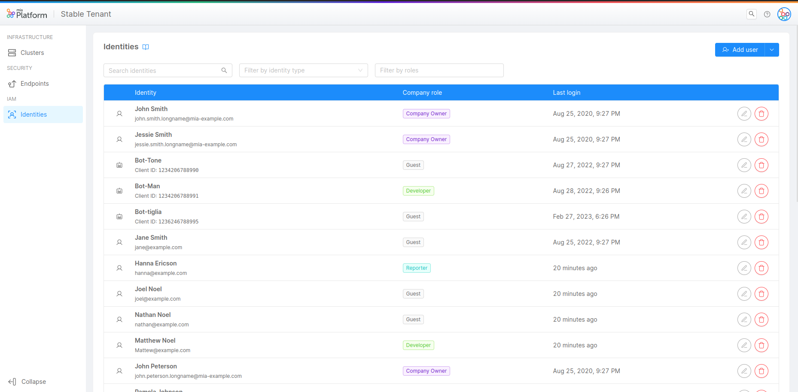

_March 30, 2023_

## Console

### New Features

#### Machine-to-Machine Authentication

From now on, thanks to Mia-Platform Console you can create and manage Service Account Users, a new type of identity in addition to traditional Users!

Service Accounts are non-human Users that can be used to implement automated processes with machine-to-machine communication, in order to improve the speed, reliability and scalability of your CI/CD workflows.

For instance, you can give a Service Account the permission to trigger automatic deploys, which can significantly streamline the process of deploying code changes to an application.    
As a matter of fact, the Service Account could use its credentials to access the appropriate deployment resources and automatically deploy new versions of the application, as soon as new code is pushed to the source code repository.

Furthermore, a Service Account can also be used to monitor and log Kubernetes resources, such as Pods, Deployments and Services. Once authorized, the Service Account can use logging and monitoring tools to collect and analyze data on resource usage, performance metrics and other important indicators.

Service Accounts can only be created by a Company Owner inside the Users portal section, which has now been renamed in "Identities".

Just like human Users, Service Accounts can be assigned Roles on Company, Project or Runtime Environment levels, based on which they will be able to perform different types of action.  

To discover more about how to manage them, just take a look at the [Manage Service Accounts](/development_suite/identity-and-access-management/service-account-management) documentation page.

#### Subscribing to console events

From today it will be possible to subscribe to some events on the console via HTTP webhooks. With this feature it will be possible to configure custom HTTP calls that will be triggered when the respective event takes place in Console.

The supported events are:
- Project Creation
- Service Creation

[Go to the documentation](/development_suite/..) page for more information.

### Improvements

### Bug Fix

## Fast Data

### New Features

#### Debezium CDC plugins

From now on, thanks to the integration of the Debezium CDC in our Marketplace, some pre-packaged plugins and templates can be used alongside with Fast Data with just few clicks! You can find a pre-configured plugin to be used with MySQL Databases and a pre-configured template to be used with Oracle Databases.

#### Debezium CDC support from the Real Time Updater

Since we now have the Debezium plugins in our marketplace, the Real Time Updater (v7.5.0) supports the ingestion of Debezium kafka messages. You can configure it from the console choosing the Debezium message adapter in the Fast Data - Real Time Updater configuration tab.

#### Kafka connect configurator plugins

Now you can find in the marketplace our new Kafka connect configurator template configurable with all the existing connectors in the market. We also released a plugin already pre-configured with MongoDB connector.

### Improvements

#### Design improvements for the Fast Data No Code Configuration for ER Schema

The Fast Data ER Schema No Code Configuration has been improved with design enhancements to display the ER Schema with a better appearance, larger buttons, and more useful descriptions to assist you in creating your ER Schema.

#### Single View Creators

The _Single View_ page has been updated with a new look for the Single View Creator section. This update features a clearer list of the microservices associated with the Single View, as well as a dedicated page for updating their configurations.

### Bug Fix

This version addressed a few bugs, here is a comprehensive list:
* A bug on the No Code configuration caused the Undo/Redo button to not be available when deleting a projection
* The condition panel in the No Code configuration is now scrollable
* In the ingestion storer (v1.3.2) the post-ingestion topics are optional when the forwarding of ingestion messages is disabled

## Marketplace

### Marketplace Updates

## Backoffice - 1.3.7

### New Features

#### `bk-antd-theme-manager` component

New component `bk-antd-theme-manager` is available, allowing micro-lc layout customization.

#### `bk-loading-animation` component

New component `bk-loading-animation` is availabe, allowing micro-lc layout customization, and bundled at `/dist/bk-loading-animation.esm.js`.

#### Support to http credentials
Components which perform http-calls (eg, `bk-crud-client`) have property `credentials`, which specifies credentials of http calls

### Bug Fix

#### Files are downloaded with correct name
Files are downloaded with correct name, instead of applying "_" at the beginning and end of it.

## How to update your Console

For on-premise Console installations, please contact your Mia Platform referent to know how to use the `Helm chart version ?.?.?`.
