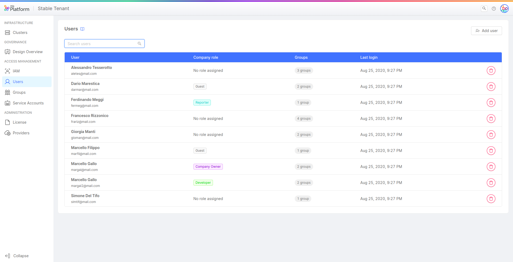

_June 8th, 2023_

## Console

### New Features

#### Users and Service Accounts portals

Analogously to what we have implemented for groups management, from now on even users and service accounts have proper management portals. These dedicated pages provide specific governance tools based on the nature of the identity, be it a user, a group or a service account.

**Users section** allows Company Owners to view all user accounts which have access to the Company, providing a way to add new ones or to completely remove access to the Company for existing ones.
For more information, [go to the documentation](/development_suite/identity-and-access-management/manage-users.md).

**Service Accounts section** allows Company Owners to view all service accounts of the Company, with the possibility to create new ones or permanently delete existing ones.
For more information, [go to the documentation](/development_suite/identity-and-access-management/manage-service-accounts.md).

:::note
As a result, Company Overview displays an entire section dedicated to **Access Management**, composed by three governance portals (one for each identity type - users, groups, service accounts -), and the Identities portal that from now on <u>has been renamed in **IAM portal**</u>.

The purpose of IAM portal is to allow Company Owners - _at Company level_ -, and Project Administrators - _solely at Project level_ -, to view and manage roles directly assigned to identities that grant them specific permissions.
:::

#### Delete a Provider

In the "Providers" section in "Company Overview" area, you can now remove a provider. 
This can only be done if it is not used in any project or if it is not set as the default of the respective company.

For more information, [go to the documentation](/development_suite/set-up-infrastructure/configure-provider.mdx).

### Improvements

#### Project creation and respective permission management 

If the user do not have the necessary permissions to create a Project in a respective Company, the user can not proceed to the step two of creation.

### Bug Fix

This version addressed a few bugs, here is a comprehensive list:

* 
* 

## Fast Data

### Bug fix

This version address a bug in the No Code ER Schema, that made impossible to create a rule between two fields with the same name.

#### Support for autogenerated Projection Updates in Real Time Updater v7.5.2
Real Time Updater supports the Projection Updates autogenerated by the console.

#### Ingestion Reloader can now handle very large amount of files
Fixed Ingestion Reloader way of downloading files preventing memory overflow. From version 1.3.1 the files are properly downloaded with streams to prevent memory problems.

#### Ingestion Reloader v1.3.1 invalid date throws an error
When starting a reingestion the Ingestion Reloader properly checks whether a date is valid or not and throws an error if needed.

### Improvements

## Marketplace

### Marketplace Updates

#### Dev Portal

Dev Portal and its core plugins are compatible with [micro-lc](https://micro-lc.io/docs) v2.

## Backoffice 1.3.13

### Fixed

#### `bk-button` correctly updated parents history
Property `selectedParents` of component `bk-button` is correctly updated when navigating nesting levels

#### `items` keyword is supported in data-schema
Keyword `items` is supported in data-schema for fields of type array of objects by components `bk-table`, `bk-breadcrumbs` and form components

### Added

#### URL-encoding of query params
Query parameters are url-encoded in http calls

#### `bk-crud-client` can send DELETE requests to `CRUD Service`
new event `http-delete` is listened to by `bk-crud-client`, allowing to send DELETE requests according to `CRUD Service` interface

#### `bk-table` allows to highlight rows
`bk-table` allows to highlight rows that match mongo-like queries through property `highlightedRows`

## How to update your Console

For on-premise installations, please contact your Mia-Platform referent and upgrade your _Console Helm Chart_ to `v9.X.X`.
