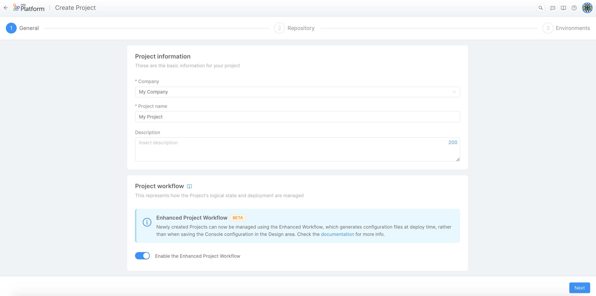
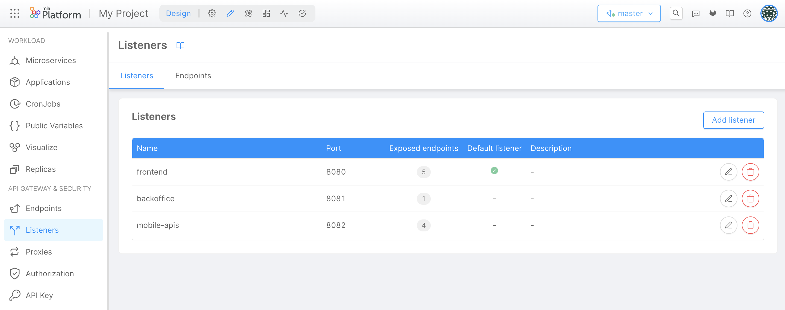
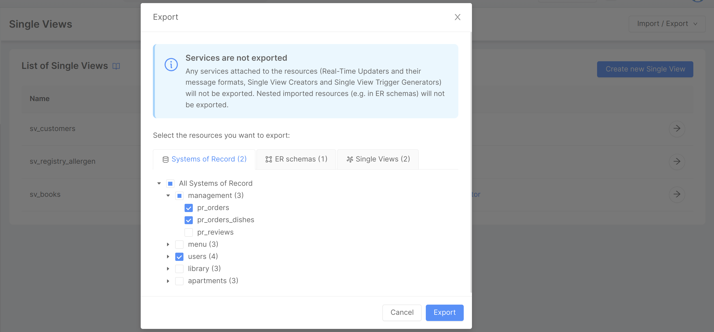
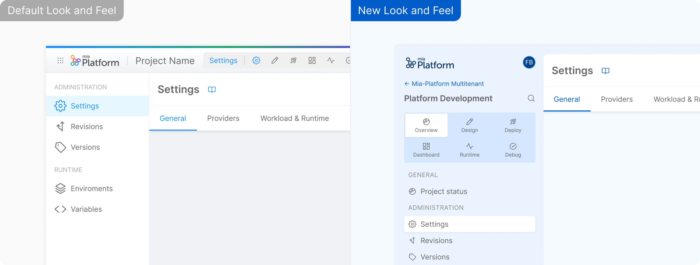
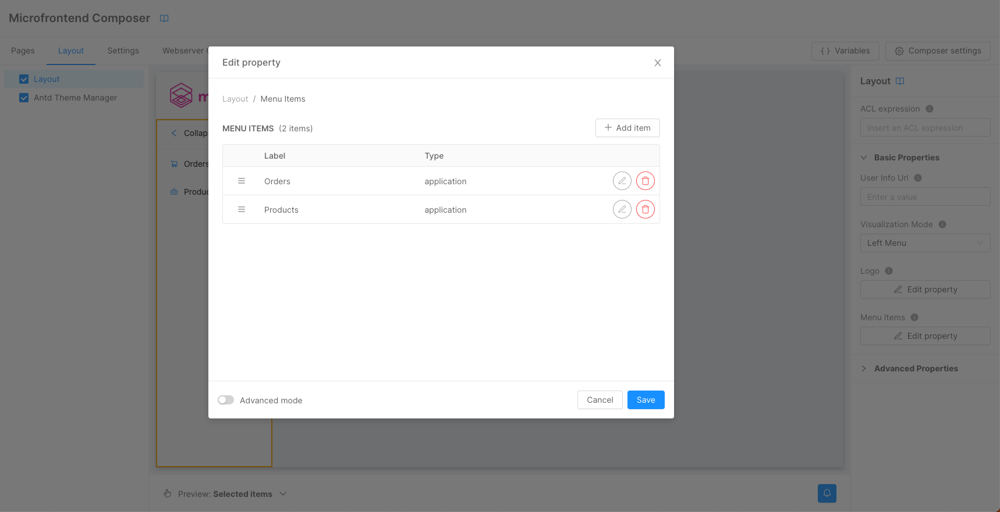

_November 16th, 2023_

**Welcome to Mia-Platform v12!**

:::info
Mia-Platform Console v12.0.0 is **now in Preview!**

Console SaaS users can now direct access to v12 Preview and can open a Service Request asking for the creation of a sandbox Company to try out our latest features in Preview!

For self-hosted installations, please read the [following guidelines](#how-to-update-your-console).
:::

## New Features

### Enhanced Project Workflow and GitOps support

The [Enhanced Project Workflow](/development_suite/set-up-infrastructure/enhanced-project-workflow.md) is a BETA feature that aims to improve the developer experience when working with the Console, as well as paving the way for the adoption of previously unavailable opportunities, such as the [GitOps deployment strategy](/development_suite/deploy/gitops-based/index.md).  
It comes with significant performance improvements on the main workflows in Design Area, thanks to the new configuration management strategy, and unlocks the possibility to adopt a **pull-based deployment strategy**.

In fact, when using the Enhanced Project Workflow, configurations are generated and committed to the Git repository only at deployment time. Consequently, it becomes possible to choose if adopting a [pipeline-based deployment strategy](/development_suite/deploy/pipeline-based/index.md) or a GitOps approach that facilitates the automated deployment and management of applications on Kubernetes clusters, making the deployment process more reliable, reproducible, and efficient, without the need to trigger any CI/CD pipelines.

Start creating your first Project with the Enhanced Workflow, and leave us [precious feedback](https://github.com/mia-platform/community/discussions/338)!

### Envoy API Gateway Listeners management

From now on you can choose to **expose your endpoints on different Listeners** to map them to different exposed domains.  
In the Listeners section of the Design area, you can map each Listener to a single port in order to route external client requests towards resources exposed on your namespace.  
Moreover, you can also see a general overview of which endpoints are exposed on which listeners, thanks to the dedicated Endpoints tab.

:::info
Listeners management support is only available for Projects using an **Envoy API Gateway**.
:::

To learn more about Listeners management, read the dedicated [documentation page](/development_suite/api-console/api-design/listeners.md).

### Import and Export of Fast Data resources between projects

It is now possible to export Fast Data resources (such as ER schemas, Single Views and Systems of Record) from a Project and import them inside another one by clicking the `Import / Export` button placed on the top right bar of the Systems of Record and Single Views pages.

The `Export` modal allows to select resources from the Project current configuration and export them inside a `.json` file. This file can be later used as an input for the `Import` modal, which allows to import data as a reference (creating a read-only copy of the resource) or as a resource (adding the resource to the Project configuration as if it was created inside the Project).

The new `Import / Export` feature can be useful to handle Fast Data resources split between Projects and to clone resources from one Project to another one, without having to recreate them from scratch.

:::tip
You might need to enable this feature inside the Feature Preview of your Project Settings in order to use it.
:::

:::info
To learn more about `Import / Export`, please visit the dedicated [documentation page](/fast_data/configuration/import_export.md).
:::

### New Look and Feel in Feature Preview (Only for SaaS users)

With Mia-Platform Console v12 it will be possible to activate the Console-wide new look and feel experience for navigation of resources by activating the respective Feature Preview (which can be activated from the User panel).

This new interface allows you to navigate through the sections more effectively and with a new look and feel: in particular the new side menu is visible from any screen, allowing you to move easily between sections including shortcuts for the different Console areas and other useful tools previously visible in the upper part of the user interface.

:::caution
This enhanced navigation is available only for SaaS users and it is not compatible with the Dynamic Sidebar.
:::

### Azure Key Vault as a secret manager on Console

Mia-Platform Console is now properly integrated to use Azure Key Vault as a secret manager.  
Therefore, it will now be possible to configure an "Azure Key Vault" provider from the respective section in a quick and easy way, so that all Projects can use this provider as a secret manager.

To learn more about how to configure Azure Key Vault as a secret manager on Console, visit the dedicated [documentation page](/console/project-configuration/manage-environment-variables/manage-environment-variables-with-akv.md).

### Manage Company Marketplace items through miactl

From now on, you can seamless manage the items of your Internal Company Marketplace through **miactl (Mia-Platform CLI)**.  
In this way, you do not need to rely on the CMS anymore, resulting in a less error-prone and more streamlined experience.  
For further details on how to better manage your Company’s Marketplace through miactl, refer to the related documentation available [here](/marketplace/add_to_marketplace/manage_marketplace_items.md#how-to-use-miactl-to-manage-the-marketplace), along with the list of new [miactl Marketplace commands](/cli/miactl/30_commands.md#marketplace).

### Extension Providers - Orchestrator Generator

From Providers section in Company Overview it is possible to connect a new Provider type: the [**Extension API**](/console/company-configuration/providers/extension-providers.md), useful to extend or replace some Console features.

Starting with v12, the first available Extension is the **Orchestrator Generator**, that allows to generate orchestrator files externally.

To learn more about the capability of the Orchestrator Generator Extension and how to connect it to your Project, visit the [dedicated documentation](/console/company-configuration/providers/extensions/orchestrator-generator.mdx).

:::info
The Orchestrator Generator extension can only be used when the [Enhanced Project Workflow](/development_suite/set-up-infrastructure/enhanced-project-workflow.md) is enabled.
:::

## Console

### Improvements

#### Visualization of service logs on miactl CLI

The ability to view service logs directly via CLI has been added. The feature also supports multiple service logs.

For more details, go to the [official miactl documentation](/cli/miactl/30_commands.md#logs).

#### Set up MongoDB connection from Secret in Authorization section

From now on, in Authorization section of the Design Area, for the MongoDB connection, you can decide whether to use variable interpolation or retrieve the value from a Secret; the second approach is much more secure and can be easily set up from the [RBAC Storage configuration page](/development_suite/api-console/api-design/authorization.md#rbac-storage).

#### Console User avatar with Gravatar

The management of user avatar in Console has been improved, since Mia-Platform Console now correctly relies exclusively on Gravatar for its editing.

### Bug Fix

This version addressed a few bugs, here is a comprehensive list:

* fixed a bug that caused a configuration error in the "Environment Variables" object when, in Project creation, a different provider than the company's default provider was used
* solved an issue that prevented the correct loading of Visualize section

## Fast Data

### Fast Data Configurator

#### Unique values for ingestion topics and pr-update topics

To further improve the automatic configuration of the Fast Data, from now on when configuring a Projection inside a System of Record it is possible to set only one _ingestion topic_ and only one _pr-update topic_, instead of a topic for each environment.

Every new projection created will automatically set the ingestion topic to the pattern `{tenantId}.{projectId}.{systemId}.{projectionId}.ingestion` and the pr-update topic with `{tenantId}.{projectId}.{systemId}.{projectionId}.pr-update`. These are editable and it is possible to use environment variables for the entire name or part of the name. This lets you differentiate topics for each environment leveraging on the usage of environment variables.

:::info
A migration will perform a check on the ingestion topic names of existing projections. If they share the same name among environments, this name will be used as the unique ingestion topic name. Otherwise, a public environment variable will be created with the values: its name will follow the pattern `FAST_DATA_{topicName}_INGESTION_TOPIC` and it will be also set in the projection configuration page. 

The same approach is used for the pr-update topics, and the eventual public variable generated will be called `FAST_DATA_{topicName}_PR_UPDATE_TOPIC`.

The environment variable(s) can be found in the _Public Variables_ section and they are editable. 

An empty commit is required to save these modifications.
:::

:::info
Because of these updates, the public variables of the invariant topic map (usually named `FAST_DATA_{realTimeUpdaterName}_INVARIANT_TOPIC_MAP`) are not used anymore by the Real-Time Updater services attached to a System of Record.

These variables are still available as set as editable. They can be deleted after verifying that they are not used any longer.
:::

#### Single View Trigger Generator services attachable to Single Views

The Single View Creator detail page, used to configure the config maps of the Single View Creator service, now includes a new tab that allow to attach also a [Single View Trigger Generator] to the service, and therefore to the Single View.

Attaching a Single View Trigger Generator will simplify the configuration of the service itself by automatically setting the same ER Schema config map used in the Single View Creator, and including a dedicated space where to configure the [Kafka Projection Updates](/fast_data/configuration/config_maps/kafka_projection_updates.md) and the [Projection Changes Schema](/fast_data/configuration/config_maps/projection_changes_schema.md) config map.

:::info
This configuration cannot be used in case the Kafka Projection Updates uses manual strategies.
:::

#### Upsert/Delete Strategy configuration page

The Single View Creator detail page includes another tab, allowing the user to simplify the configuration of the _Upsert strategy and the Delete strategy_:

Any update here will be reflected in the Single View Creator service after saving the configuration. For more information, [read more on the dedicated documentation page](/fast_data/configuration/single_view_creator/upsert_delete_strategies.md). 

#### Bug Fix

This version addressed a few bugs, here is a comprehensive list:

* solved an issue that causes to regenerate indexes and information of Projection Changes collections of Real-Time Updater attached to the System of Record
* solved an issue that caused the No Code ER Schema to stop working if the JSON was completely empty
* now it's not possible to create Projections and Single Views with names longer than 80 characters, complying with the MongoDB CRUD requirements

### Fast Data Services

#### Projection Storer

The version `v1.0.0` of the _Projection Storer_ is now available!

This is a new service that can be employed in Fast Data _event-driven_ architecture in place of
Real-Time Updater plugin.  
Similarly to the Real-Time Updater plugin, Projection Storer consumes change events as ingestion messages, transforms them into projection records, filters and validates each of their fields and eventually saves them onto the specified storage system, emitting a proper notification for downstream components.

For more information check out the service [documentation](/fast_data/projection_storer.md).

#### Single View Trigger Generator

The new version `v3.1.3` of the _Single View Trigger Generator_ is available!

##### Improvements

* introduce new property `singleViewName` in `sv-trigger` message to link the message value to a specific Single View

##### Bug Fix

This version addressed the following bug:

* typings of `__internal_kafka_info` metadata

For more information check out the service [changelog](/runtime_suite/single-view-trigger-generator/changelog.md).

#### Single View Creator

The new version `v6.2.2` of the _Single View Creator_ is available!

##### Improvements

* introduced compaction logic in Kafka Message Handler, which allows to treat trigger events regarding the same Single View
as a single one, so that SV is regenerated at most once per fetched batch of events
* review logic validating incoming trigger events

For more information check out the service [changelog](/runtime_suite/single-view-creator/changelog.md).

#### Ingestion Storer

The new version `v1.5.2` of the _Ingestion Storer_ is available!

##### Improvements

* introduce proper support to `snappy` compression for Kafka topics adopting it

For more information check out the service [changelog](/runtime_suite/ingestion-storer/changelog.md).

## Microfrontend Composer

:::info
The marketplace application "Backoffice On Prem" has been renamed to "Microfrontend Composer On Prem Tookit". If you already have the application deployed, to receive the updates you have to change the docker image of `micro-lc` service to `nexus.mia-platform.eu/back-kit/mfe-toolkit-on-prem`.
:::

### New Features

#### Added support for table visualization of components properties of type array

Components properties of type array now can be displayed with a tabular view.

### Bug Fix

This version addressed a few bugs, here is a comprehensive list:

* Editors in advanced sections correctly hint and validate content against schemas
* `aclExpression` property is now supported by editors schema validation

## Back-Kit Library

The new version `v1.4.7` of the back-kit library is available!

Refer to back-kit [changelog](/microfrontend-composer/back-kit/changelog.md) for finer-grained details of new versions.

### New Features

#### bk-crud-lookup-client has access to the URL

Component `bk-crud-lookup-client` provides access to url-mask facilities, allowing to extract data from the URL to be used in lookup queries.

### Improvements

#### Data is displayed without waiting for count

Component `bk-crud-client` emits `count-data` and `display-data` events separately, as soon as needed info is fetched from the backend.

#### Editor fields allow raw text

Form components allow visualizing and editing fields of format `editor` in raw HTML mode.

### Bug Fix

This version addressed a few bugs, here is a comprehensive list:

* Component `bk-pagination` handles case of element count being equal to 0
* `g` flag is not included in lookup searches based on the `$regex` operator
* Component `bk-layout` correctly renders in `leftMenu` mode

## Marketplace

### Marketplace Updates

#### CRUD Service

The new version `v6.9.2` of the CRUD Service is available!

##### Bug Fix

This version addressed a few bugs, here is a comprehensive list:

* add optional chaining to allow not to specify pipeline field in `$lookup` views when `enabledLookup` is set

For more information please check out the service [changelog](/runtime_suite/crud-service/changelog.md).

#### Flow Manager Service

The new version `v2.6.0` of the Flow Manager Service is available!

##### New Features

###### Added support for side effects fired alongside commands

For each state of the machine, it is now possible to specify an array of side effects commands to file alongside the main command in a fire-and-forget manner.

To learn more about this feature, check out the dedicated [documentation page](/runtime_suite/flow-manager-service/30_configuration.md#states-of-the-machine).

###### Added hook functions to build commands and side effects custom payload

Commands payload can now be generated through a custom function that takes as input the entire Saga entity and the message label of the command, and returns as output an object with the payload to use.

To learn more about this feature, check out the dedicated [documentation page](/runtime_suite/flow-manager-service/30_configuration.md#command-hook).

###### Added possibility to deep merge saga metadata upon events reception

Upon events reception, saga metadata can now be deep merged. Moreover, the service can be instructed to perform specific merging behaviors using an optional custom function.

To learn more about this feature, check out the dedicated [documentation page](/runtime_suite/flow-manager-service/30_configuration.md#settings).

#### Authentication Service

The new version `v3.7.0` of the Authentication Service is available!

##### New Features

* support to asymmetric key for token signing
* support to Redis sentinel mode
* by enabling metrics on the /-/metrics route, it is possible to expose Prometheus-compatible metrics about endpoint calls

To learn more about, check out the [documentation page](/runtime_suite/authentication-service/10_overview.md).

#### Dev Portal

The new version `v2.2.0` of the Dev Portal is available!

##### Support to ReadMe files

Dev Portal Marketplace correctly supports docs ReadMe files.  
Until now, only HTML files were supported.

To learn more about, check out the dedicated [documentation page](/runtime_suite_applications/dev_portal/marketplace_management.md).

#### Files Service

The new version `v2.9.3` of the Files Service is available!

##### Bug Fix

This version addressed a few bugs, here is a comprehensive list:

* the proxy of errors returned by the bucket that may contain sensitive information is no longer executed
* fixed a bug that prevented files from downloading correctly using Mondo GridFS

To learn more about, check out the dedicated [documentation page](/runtime_suite/files-service/configuration.mdx).

## How to update your Console

For self-hosted installations, please head to the [self hosted upgrade guide](/self_hosted/installation-chart/100_how_to_upgrade.md#v12---version-upgrades) or contact your Mia-Platform referent and upgrade to _Console Helm Chart_ `v11.0.2`.
