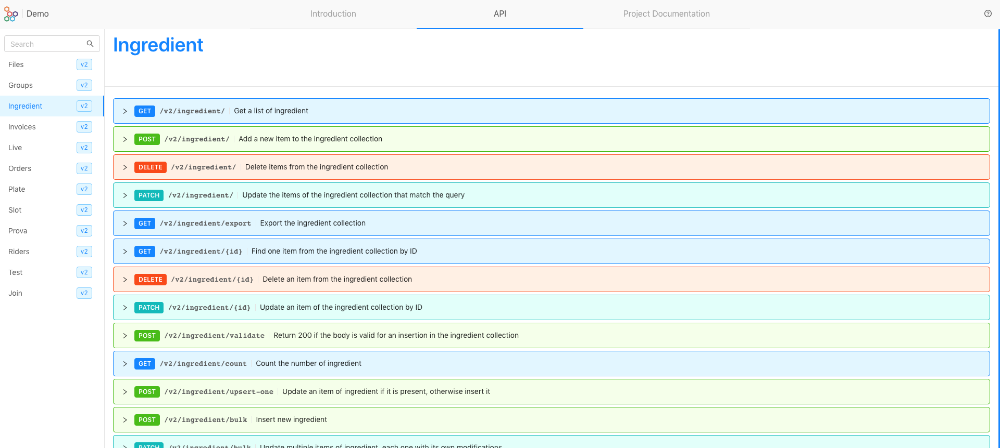
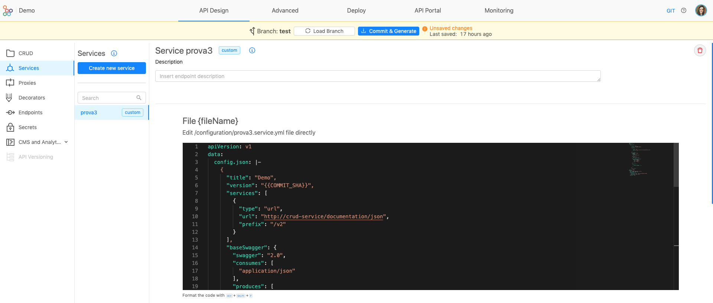
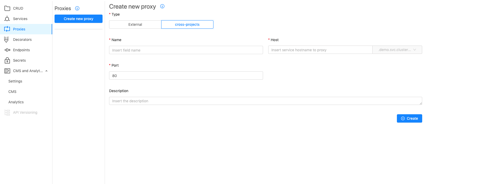

#Platform Release Note
##v4.20.0 (May 28, 2019)

**DEVELOPMENT SUITE**

**API Console v1.1.0**

This version must be used with backend v1.1.0

Added:

We have released the **new documentation portal**, called API Portal, created entirely by Mia-platform.
To support the new API Portal, each project must activate the api-portal among its services.



!!! warning
    Once the new api-portal is activated, it will no longer be possible to reach the old route /documentations/swagger
    The documentation will be available only from the new route: /documentations/api-portal/

**New service management**  
The service section were divided into two types: services and proxies

The services will no longer be managed using the Git URL and Git Revision, but using the name of the **docker image**.


Furthermore, if it is necessary to write advanced configurations it is possible to write the advanced service and deployment files directly from the API console and add all the necessary configmaps files.



**New type of proxies: cross-projects**

With the introduction of this new service it is possible to link to services created in another project, but present within our infrastructure.
For security reasons it will be possible to link to the namespaces to which you have access.



**Revision table**

We have restyled our table component, improving user experience and interactions with the component. It is more responsive, more compact, more readable, the delete is present on every single line, it is possible to resize the columns, and the addition of the elements has been moved downwards


**Various**

* we added the placeholders to all the empty sections
* In the CMS area the default delete is always active, which allows to delete an element from db from the CMS
* we added in the header the link to the project git
* we added the ability to add a series to an analytic being edited

Fixed:

* The configured lookups did not save the values
* The advanced section did not load the files correctly
* When creating a service, the recommended default name will no longer be the name of the group path, but the name of the namespace. To give an example before the name was: gruph-path/test-name now is: project/test-name.
* Various graphic fixes


**RUNTIME SUITE**

**Updating fo Core Microservices**

In all core microservices the routes of /healthz and /ready have been implemented.  
The microservices in node have been updated to version 2 of fastify.

The versions supported by the API console in v.1.1.0 are the following

```
acl-services: 1.0.2
cms-backend: 1.0.2
credential-service: 1.0.0
crud-service: 1.0.4
microservice-gateway: 5.0.3
mongodb-reader: 1.0.0
session manager: 4.2.2
swagger-aggregator: 1.0.5
user-service: 1.0.0
v1-adapter: 2.0.0
files-service: 1.0.2
mail-notification-service: 1.0.2
notifications-service: 1.0.0
token-service: 1.0.8
```

**NEW MICROSERVICES**

**MailChimp Plugin**  
This microservices allows to manage the users registration to Mailchimp lists.
It provides methods to get the groups and to get, add, update or delete the users from a specific list as a user or prospect.

**Notification Manager**  
This microservice allows to easily and safely set the status (read/unread) of one or more notifications belonging to the requesting user. It also allows to retrive the notifications of a user, hiding the information that relates to the notifications but not to the user (e.g. the list of users who has read a notification).

**V1 Adapter**

Fixed:

* We have fixed the fact that from the export of the CMS if I selected the label the id was exported anyway
* Error handling in export pipes  
The "error" event, launched by a pipe in the event of an error, was not handled.
we have created an error handler in exportsHttpInterface, which is passed to crudProxy and associated with the management of the error of got.stream

* Management of objects in the queryString  
In the case of objects within the query parameter of getExport, this was passed to got.stream (which makes a call to the crud) was not managed.


**Swagger Aggregator**

Fixed:

* The swagger service remains available even if one of the associated services collapses

**Mongo DB Reader**

Added:

* Added path parameter to format input function

###v4.19.3 (May 22, 2019)
**BUSINESS SUITE**

**CMS v9.0.2**

Fixed:

The export with filters was paginated and exported only the elements present on the first page, with this fix it will be possible to export correctly all the filtered elements.


###v4.19.2 (May 6,2019)

**DEVELOPMENT SUITE**

**API Console v1.0.2**

Fixed:

We have modified the limit of characters that could be inserted in the field **Name** of the table. Previously they were 32 now there are **no character limits.**


###v4.19.1 (May 3,2019)
**BUSINESS SUITE**

**CMS v9.0.1**

Fixed:

With the release of the new version of Google Chrome n.74 the scroll was broken. We quickly restored the correct display of the CMS

##v4.19.0 (April 18, 2019)
**DEVELOPMENT SUITE**

**API Console v1.0.0**

This version must be used with backend v1.0.0

 Breaking Change:

You should add two variables to enable push notifications for the new platform on v1Adapter or to use notification service:

```
NOTIFICATIONS_SERVICE_PATH={{NOTIFICATIONS_SERVICE_PATH}}
NOTIFICATIONS_COLLECTION_ROUTES={{NOTIFICATIONS_COLLECTION_ROUTES}}
```

You can value the variables above even with an empty string if you do not care about the functionality

!!! warning
    Note that if the configuration project among its scripts has one called prepare-envs.sh the variables must be added with a prefix
    MIA_ for all environments and DEV_ PREPROD_ or CLOUD_ for values ​​on a particular environment
    MIA_ is taken as a fallback value

 Added:

 * New Header! You can find a new style in our header.
Now you can view the photo of your user connected to Git and directly access the Mia-Platform Documentation and your Git project in the header.

* New Sub-header.  
We have improved the display of the save area. If you have some changes unsaved it's more visible. You can also see when it's done the last commit.

* If you click on your user, you can view your name, a new Info page and the logout section.

* On the Info page you can view the Mia-Platform version number and the list of all the Mia core services version number that you are using.

* In the Project Creation section it is now possible to select which core Mia services to activate.
We have also given the possibility to change the name of the gitlab project or to create a subgroup.

* In the Secret Section we have added the possibility to create random secret and copying them into your table.

* The Custom Java Plugin has been added to Mia's Plugins

* In the Custom Services it is now possible to configure the memory and CPU limits and set the probes

Fix:

* In the Git group drop-down menu you can now view all your paged groups

* In the Creation of the project we made some fixes to the Environment Tab

* We have fixed some particular cases in which the flags inside the endpoint section broke

* We added the multilookup in the interfacetype of the cms linked to an array

* we have fixed the validation of names on Custom Services

**RUNTIME SUITE**

* Mia has developed: [lc39](https://github.com/mia-platform/lc39), a Command line utility that will launch a Fastify instance configured for serving a Node.js service on Mia-Platform.  
With this lanucher all the Node.js service will expose two fixed routes for heltinessProbe and for readinessProbe. In addiction is integrated the fastify-swagger module for exposing the service documentation.  
This Service has been imported in: ACL Service, CMS Backend, Swagger Aggregator, CRUD Service, Session Manager and Mail Service.  
Soon will be implemented in all the Mia services.

* Swagger Aggregator v1.0.2: Swagger is now available with service down. The service down wiil not be shown.

* Notification Service v0.6.1: it is possible to send push notifications by tag (if there is a collection tag with the tags configured)

**BUSINESS SUITE**

**CMS v9.0.0**

Added:

* It is possible to send push notifications from CMS using the new notification service (without legacy baas below) and can send notifications by tag (if there is a collection tag with the tags configured)

Fixed:

* We have updated the dependencies of the project

* Escape of regexes in the search to search for special characters

* We have fixed the permanently delete from CMS


##v4.18.0 (March 11, 2019)
**API Console front-end - v0.16.0**

This version must be used with backend v0.18.x

Added:

* Advanced section where you can edit the configuration extension

Update:

* now interfaceType in cms section are conditioned by crud property type

* migrate route section in endpoint to new layout with antd

Fix:

* various fix in cms page

**API Console Back-end - v0.18.0**

Added:

* advanced file edit plugin

Updates:

* various changes in api-gateway configuration:

* debug mode, enabled with correct header sent, better route security (now query parameter are not matched in proxy name maps)


* api-gateway version set to v4.0.0
minor/patches updates to all services
improved app_dataentry proxy name mapping for better user flow
update LICENSE

Fix:

* increase max path for fastify

**CMS -v8.0.0**

Performance Improved:

To improve performance, on download the resources are cleared of properties field (set to empty array) and all resources are saved into an external object (file src/app/storage.js).
The retrieve of data from storage is cached with an lru to increase further the performance.


**CRUD - v0.21.2**

Fix:
In case of upsert, if the document is not found a new one is inserted on the database. This document did not correctly set the updaterId and the updatedAt

Now invoking /upsert-one on a document not present in the database, a document is inserted with the updaterId and the updatedAt not null

**Custom Plugin Node v0.7.0**
* The `getServiceProxy` and` getDirectServiceProxy` methods are also available on the `Service` instance and not just on the` Request` instance. This implies that it will be possible to use these methods not only in route handlers, but also in the asynchronous function in which plugins are generally registered in fastify.

* The `get`,` post`, `put`,` patch`, `delete` methods used to query the other endpoints of the platform, accept a new field in the` options` object. The name of the field is `allowedStatusCodes`; its value is an array of integers indicating the status codes allowed for the queried endpoint response. If the response status code is not included in the array values, the promise will be rejected by the custom plugin. If the field is omitted, all status codes will be accepted.

* At startup, the custom-plugin verifies that the format of Mia's five headers comply with the RFC format.

##v4.17.0 (Jan 16, 2019)
News:

* We have re-established the service area with **the introduction of the possibility to add custom templates**

* We **resitiate the deployment area** and **the header** of the application

* We have enabled the ability to write **complex queries** to filter the individual **properties in the CMS**


## v4.16.0 (Dec 18, 2018)
* Evolutions in the CMS configuration area:
* you can **highlight fields in the table by setting a query**, background color and text color. This will allow the user of the CMS to highlight the most significant data.
* we have also released the possibility of **configuring notifications in the cms menu**. Just activate the notifications and choose the query on the data you want to view. In this way a badge will appear next to the page where you have activated the notifications that will count the elements present in that collection based on your query.

* We have set **cancellation** of the deductions also as regards the cancellation of the decorators within the **Pre and Post Hook** areas.

* We have restyled the site's header to allow the user a better awareness of the project and of the branch in which he is working.

* you can start **creating a project from the home page**. Thanks to this new feature, a project will be created on empty GitLab and will be added to the API API DB.

**Evolution in the import of CMS. - v7.0.16**

From today, if a file with existing ids is imported, the data are not duplicated but updated.
If the id does not exist, a new data is created instead.

!!! info
    The Import Service works only with string and number.


## v4.15.0 (Nov 14, 2018)  
**Breaking change api-console-configuration v0.3.0**

We have released the following updates:

* **new version of api-console-configuration** that has changed from v0.2.0 to v0.3.0.
In this new configuration the following new features have been added:
* we support the **latest version of CRUD** with the addition of two new routes: PATCH / and POST / upsert-one;
* we have made it possible **to edit the name of the category and the page in the CMS**.

* we have also enabled the **cancellation of the analytics** and made a fix on the filters.

## v4.14.0 (Oct 31, 2018)

With version 0.14 we have released two updates:

* **conflict between two people working on the same branch has been resolved**. If two people work on the same branch, the second person trying to commit is now blocked. In fact, he receives an error message to commit. The developer can however in the save page change the branch to be released and create a branch from his commit. In this way he can view his configurations on a new branch.

* Two new interface types ** were created to support objects and arrays in the CMS section:
* rawobject
* rawarray
With these interfaces you can directly edit the object and the array in json format.

**CMS - v7.0.14**

We have released the following features:

* management of **new rawObject and rawArray interfaces**
* **change of labels** in Public and Delete actions
* fix to the management of the **icons**
* **ACL on groups** that can access the CMS. To this [link](https://docs.mia-platform.eu/configurator/conf_cms/#5-controllo-accessi-sui-gruppi-acl-sui-groups) is how to configure this extension of the CMS.

## v4.13.0 (Oct 23, 2018)

In this version we have released the **update to the session manager** and the new acl expression syntax and we have made fixes on the configuration of the analytics.

## v4.12.0 (Oct 10, 2018)  
**Analytics Configurations**

With version 0.12.0 it will be possible **to configure the analytics from API Console**.
To this [link](https://docs.mia-platform.eu/configurator/api_console_configanalytics/) the documentation on how you can configure them.

The possibility of setting up an acl for groups accessing the pages of the CMS has also been released. In this way, some pages can only be viewed by some user groups.

**CMS - v7.0.11**

In this version of the CMS you can select the **icons from font-awesome up to version v5.3.1**, which is the latest version supported (here is the [link] (https://fontawesome.com / icons? d = gallery) for the icons).

!!! warning
    If you choose icons that were already used in the previous version, you will continue to display the old icons in the CMS. This is because priority is given to backward compatibility.

## v4.11.0 (Sept 30, 2018)

**CMS v7.0.4**

In this version new CMS customizations have been released.

It will be possible to define the following css variables:

* color brand gradient 1 = allows you to customize the color of the **text in the menu sidebar**
* color badge - bg notification = allows you to customize **color background of notifications badges**
* color badge - text notification = allows you to customize the color of the **notification badge text**

Also from this version the CMS font will be in **Proxima-new**


**CMS v7.0.0 - Breaking Change (for Cards)**
With version 7, 3 important features have been released:

1) **new card structure** with the possibility of configuring different types of widgets and having a fully customizable structure. You can read the Documentation on how to configure the new cards [here] (https://docs.mia-platform.eu/configurator/conf_cms/#1-configurare-le-card).

2) the **highlight** function has evolved. With this version it is possible to highlight the CMS lines by writing a query and the user can also configure the colors to highlight the line (text and background color). To this [link](https://docs.mia-platform.eu/configurator/conf_cms/#3-configurare-gli-highlight) an example of a highlight.

3) the possibility of having **notifications** in the menu has been added. Read to this [link](https://docs.mia-platform.eu/configurator/conf_cms/#2-configurare-le-notifiche) the documentation to see an example.


**CMS v6.1.0**

With version 6.1.0 we have released new features in the CMS export area.
In fact, from this version it will be possible:

1. **Choose whether to export the label or id**: when you export a file you will see a case of your properties with the id in another with the label. This feature allows you to have more readable files if the ids are not clear.
2. **Choose the delimiter**: you can choose whether to export a file with delimiter la, or il; . This feature allows those who use excel to have an immediate conversion from .csv to excel
