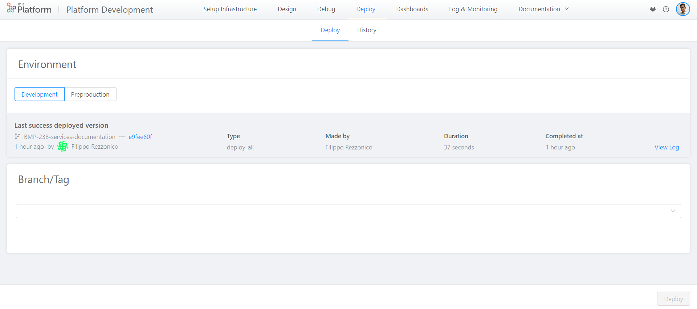
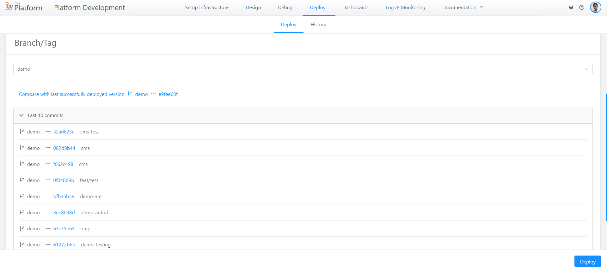
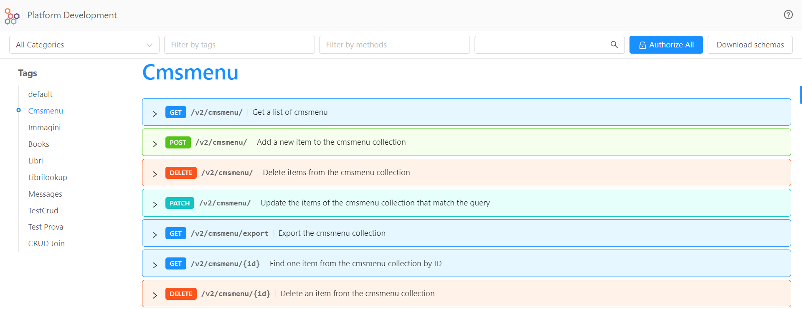
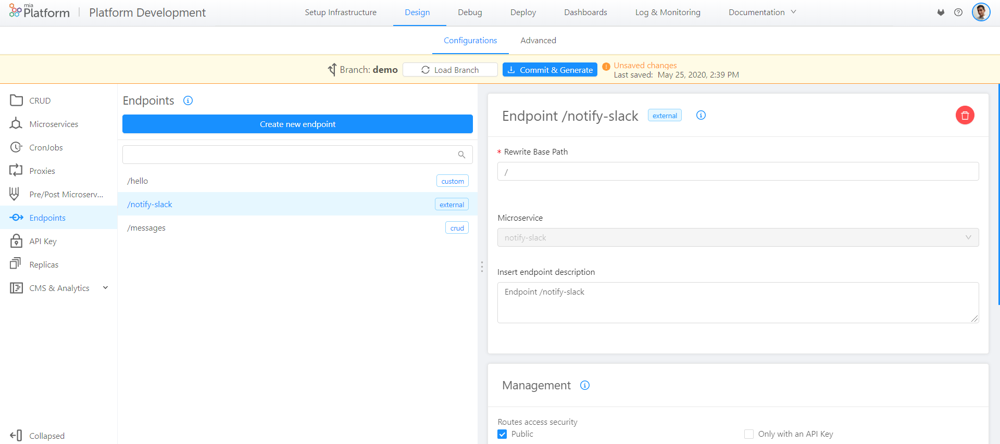

# v5.8.0 (June 19,2020)

## New capabilities

### Authentication process review

* **OIDC Client**    (da dire ?)
    **OIDC Client microservice is now integrated in the DevOps Console** to allow multi app and multi provider login and logout.

* **Authentication APIs**    (da dire ?)
    With the **new authentication APIs** you can do logout and login with scope website.

## New features

### New Deploy area version

* **Deploy - Running deployed version**        
    Now, when you select the environment in which you want to deploy, you can **visualize the running deployed version in the same environment** and its information (type, user that deployed, duration, time of deployment and logs).

    

* **Deploy - Branch and commits compare**        
    Now, when you select the branch to deploy, you can **visualize the last 10 commits done in the same branch** and the link that redirects you to the Git page, which shows **commits differences** in the choosen environment between the selected branch and the last deployed branch.

    

* **Deploy - Experience**      
    **New deployment experience**: when you push the "Deploy" button, a new modal appears to confirm you the success of the deployment.

    

### New API Portal version

* **API Portal - Endpoint call**        
    You can now call an Endpoint from DevOps Console **without specifying the headers**.

    

!!! info

    The exposed swagger is valid: so, you can download it and read it with programs like [Swagger Editor](https://editor.swagger.io/)

* **API Portal - Example section**        
    New section `Example` that **shows a response example** to a call with a specific route and method.

    

* **API Portal - Response Area expansion**       
    Now you can **expand the response area** over the whole width of the page with its specific button in the upper left corner. 

    

* **API Portal - Properties management improvement**        
    The **checkbox system of properties has been removed**: now you can simply write in a textbox if you want to pass the corresponding property. If you want to pass an empty value, you have to leave the property empty and check the corresponding property in the button `Properties`.

    

* **API Portal - Collapse and expansion management**        
    New you can **expand and collapse cards and properties through an arrow** near each copy: `Expand` and `Collapse` buttons have been removed.

    

* **API Portal - Menu**        
    API Portal menu has been moved from left to right to simplify UX.

    

## Improvements

* **DevOps Console configuration**       
    DevOps Console uses now the routes `healtz` and `ready` as defined by Mia Platform standard. Logs are now managed on LC-39.

* **Horizontal Launcher Menu**             
    You do not have anymore to open the hamburger menu to switch from an area to another: now the **Launcher Menu is horizontal and always visible** in each section of DevOps Console.

    

* **Design - Microservices**        
    In the microservice detail, Logs are parsed in a different way and could have now the following values: `mia-ngnix`, `mia-json` and `not parsed`.

* **Design - CRUD**        
    With the **new header and footer**, CRUD section has been aligned with Microservices, Proxies and Cronjobs sections: the `Delete` button is now at the footer of the page.

     

* **Design - CRUD**      
    Now you can **increase the VerticalMenu width** in the Design area.

    

## Fixes

* **Design - Microservices**              
    Now, when you are creating a microservice starting from Docker Image, you can **specify the port of the host** (e.g. `host:port/project/service:tag`) without being blocked by the validation of the field.

* **Design - CRUD**        
    **Alignment** of the `Required` checkbox position in the CRUD section.

* **Alignment of DevOps Console design and style** for all the Browsers (Chrome, Firefox, Safari, Edge and Explorer).

## How to update your DevOps Console?

In case of on-premise Console, to use these features, you have to update:

* Console Website @1.22.0 (`nexus.mia-platform.eu/api-console/website:1.22.0`)

* Console Backend @2.0.0 (`nexus.mia-platform.eu/api-console/backend:2.0.0`)

* Console Environment Variables @1.0.2 (`nexus.mia-platform.eu/console/environments-variables:1.0.2`)

* Kubernetes Service @1.4.1 (`nexus.mia-platform.eu/dev-portal/kubernetes-service:1.4.1`)

* Console Monitoring Dashboard @1.3.6 (`nexus.mia-platform.eu/console/monitoring-dashboard:1.3.6`)

* Console Deploy Website @1.2.0 (`nexus.mia-platform.eu/console/deploy-website:1.2.0`)

Moreover, in case of on-premise Console you have to remove the following authentication services:

* `auth-service`

* `session-manager`

and add the new service `authentication-service` with its configurations.

Moreover, in case of on-premise Console, to release the new version 5.8.0, you have to modify DevOps Console project configuration and execute manual cleaning operations on Cluster and MongoDB.

**DevOps Console project**

*Setup Infrastructure*

You have to remove the following environment variables:

* `AUTH_SERVICE_BASE_URL`

* `AUTH_CLIENT_ID`

* `AUTH_CLIENT_SECRET`

* `USER_PROPERTY_BASE_URL`

and add following environment variables:

* `MIA_JWT_TOKEN_SIGN_KEY`

* `PROVIDER_TOKEN_PASS_PHRASE`

and verify that the following environment variable is present in each environment:

* `API_CONSOLE_BASE_URL`

*Design - CRUD*

You have to add the collection `userinfo`

*Design - microservices*

You have to remove:

* `auth-service`

* `user-service`

* `session-manager`

and add:

* `authentication-service`

and migrate to managed service:

* `files-service` (moreover, all the old `files-service` configurations have to be removed manually from GitLab)

*Endpoint*

You have to add:

* `/api/authorize` → `authentication-service`

* `/api/oauth/token` → `authentication-service`

* `/api/refreshtoken` → `authentication-service`

* `/api/userinfo` → `authentication-service`

* `/api/logout` → `authentication-service`

* `/v2/users` → CRUD `userinfo`

**Manual operations**

*MongoDB*

You have to remove:

* `users`

* `user-properties`

and you have to empty the collection:

* `user-notifications`

*Cluster K8S*

You have to remove all the `deployment`, `service` and `configmap` from DevOps Console namespace. Moreover, `auth-service`, `user-service`, `session-manager` e `files-service` have to be removed manually.

!!! info

    Once the deployment has been completed, each DevOps Console user will lose all the active sections and will need to log-in again.

