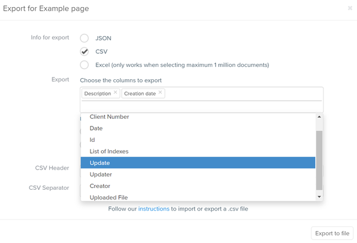
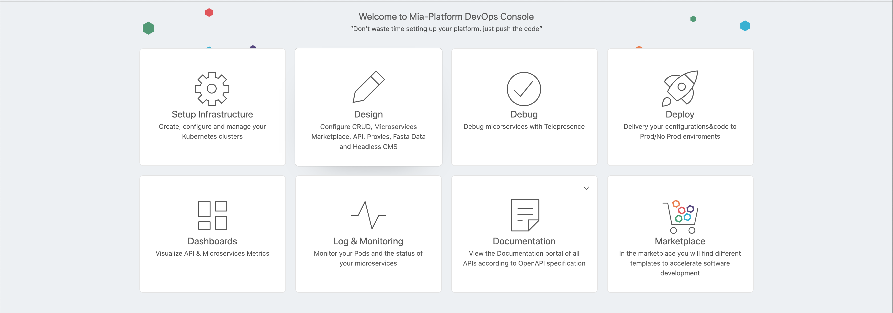

## v6.1.2

_October 26, 2020_

### New Features

#### Swagger aggregator

Allow a `prefix` field at the first level of the configuration. All the routes of all the services will be prefixed with this path.  

You can specify a custom prefix to be prepended to your APIs. 
For example if your services expose `/food` endpoint you can configure the swagger aggregator to prefix all your routes with `/marketplace` prefix and thus the API Portal will display `/marketplace/food`.  

#### Pipeline update to v3

A new version of the deploy platform pipelines for GitLab installations is available. Major benefits of the new version are:

* Access to all future features

* No need for escaping of special characters

* Bugs encountered in the management of secrets with values in multiple lines have been resolved

Contact your Mia-Platform technical representative for information about the configuration. 

#### New .NET Template

The new DotNet Microservice Template is now available.   
See more on [GitHub](https://github.com/mia-platform-marketplace/DotNet-Microservice-Template).

#### Custom plugin lib

The Mia service Node.js Library now accepts the following options:

* The possibility to add the timeout option to service builder to make requests

* The possibility to add agent option to service builder to make requests

See more on [GitHub](https://github.com/mia-platform/custom-plugin-lib).

#### New version of CMS

The v9.11.0 of CMS is now available, this version brings the following features and improvements:

* In the file manager section it is possible to copy the link of the image by clicking directly the new icon on the card.  

* You can customize the base URL for the copy link described above to differ from the CMS url.
See how to do it on the [CMS documentation page](https://docs.mia-platform.eu/docs/business_suite/conf_cms#9-configure-the-gallery).

* When exporting data from the CMS, the columns to be selected are named with the assigned labels and not with the id of the column 

#### New pipeline

It is now available a new pipeline to build services using .NET Core.
Contact your Mia-Platform technical representative for more information. 

### Fixed

#### CRUD Service

* In the automatic creation of the CRUD internal endpoint name, all underscores are now correctly transformed into dashes (in the previous version, in case of multiple underscores only the first occurence was replaced).

* The 32 characters limit to the properties name in the index section has been removed.

#### Requests traceability

The Crud service and Microservice Gateway now insert into logs the correct requestId that improves traceability of requests coming from CMS.

#### Auth0-Client login fix

The login flow with `grant_type` password now uses by default the scope `openid`, thus it aligns to other grant types.  

### Improvements

#### Authorization service v.2.0.1

The log level of the authorization service has been improved to reduce the amount of generated and collected logs. 

## UI improvements

The UI of the microservice repository clone action has been revised.  

### How to update your DevOps Console

For on-premise Console installations, you have to use the [Helm chart](https://git.tools.mia-platform.eu/platform/devops/console-helm-chart) version `3.0.4`.

## v6.1.1

_October 15, 2020_

### New Features

### Node microservices update with a new log format

The node microservices have been updated to the new [lc-39](https://github.com/mia-platform/lc39) version based on the new Mia-Platform guidelines released in v6.1.0.

### Bug fix

### HelloWorld example DotNet

The service is now working correctly. Additionally, the following bugs have been fixed:

- job 'test' pipeline has been fixed
- The API explorer was not exposing any of the endpoint’s routes. Now all the routes are exposed, even the status ones.
- The environment variable CRUD_PATH in the .NET library is no longer required.

### API Portal editor

The API Portal’s editor did not allow to re-open a collapsed patch property. The bug has now been fixed.

## Graphics improvements

* When managing the custom configuration of a microservice, some graphical changes have been done within the file section: new icons for Edit and Copy replaced the previous buttons.

* The bin icon in the “Delete” button has been removed

* The delete buttons within the tables have been ghosted

### How to update your DevOps Console

For on-premise Console installations, you have to use the [Helm chart](https://git.tools.mia-platform.eu/platform/devops/console-helm-chart) version `2.4.8`.

## v6.1.0

_October 12, 2020_

### New Features

### Marketplace categories

In the marketplace of the DevOps Console services are grouped by categories based on their functionality.
Services can be filtered by category as well as by service type.

:::info
It is possible for on-premise installations to add categories and assign them to your services from the CMS.
:::

### Text Plain log parser

A new log parser is available for plain text logs: `mia-plain`.

:::info
Available options are: `mia-json`, `mia-nginx`, `mia-plain`, `Not Collected`.
:::

### Project homepage cards revision

The cards in your project homepage have been revised, the Marketplace card has a new logo, while documentations cards have been collapsed in a single one.

### Extended support for mongo operators in CRUD

CRUD Service now supports `$inc`, `$set` and `$unset` for custom properties of fields with type `Object`.

### Supporting custom schemes for project hosts

Each project now allows to specify a custom scheme for the configured hosts (default scheme is `https`).

### Added warning for missing CPU and Memory limits

When trying to save the project configuration a new warning shows the user whether some of the custom microservices are missing CPU or Memory limits. It's still possible to save, however we strongly suggest to properly set resource limits.

### Bug fix

### Duplicate environment variables crash

Fixed a bug that caused an application crash when entering two duplicate environment variables for a custom microservice.

### Auth0 token refresh for password grant type

Fixed a bug preventing token refresh when using `grant_type` password.

### DevOps Console  crash on Endpoint without tags

Fixed a bug that caused application crash when an endpoint had no existing tag.

### Backoffice CRUD Rewrite

A bug affecting the CMS was preventing display and export of collections with rewrite between the exposed endpoint and the configured internal CRUD route.

### Library updates

### Logging update

Open source libraries [custom plugin lib](https://github.com/mia-platform/custom-plugin-lib), [lc39](https://github.com/mia-platform/lc39) and [glogger](https://github.com/mia-platform/glogger) received a major update.

The new versions feature new logging format based on [Mia-Platform guidelines](../development_suite/monitoring-dashboard/dev_ops_guide/log.md).

See library changelogs to find out more.

### Welcome .Net library! 🎉

A new service library for **.Net** has been released!

Checkout [Mia Service .Net Library](https://github.com/mia-platform/Mia-service-Net-Library) on GitHub.

### How to update your DevOps Console

For on-premise Console installations, you have to use the [Helm chart](https://git.tools.mia-platform.eu/platform/devops/console-helm-chart) version `2.4.5`.

:::note
The following _Feature Toggles_ have been removed:

* `FT_ENABLE_CRONJOB`
* `FT_ENABLE_CREATE_CONFIG_MAP_CUSTOM_SERVICE`
* `FT_ENABLE_MICROSERVICE_GATEWAY_SKIP`
* `FT_ENABLE_CREATE_PROJECT_ON_INFRASTRUCTURE_WEBSITE`
:::
