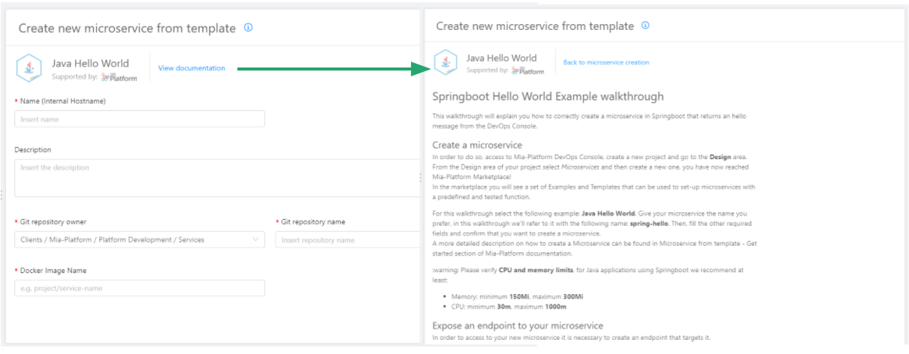
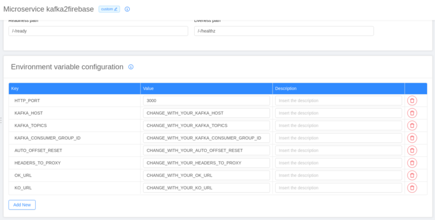

## v6.3.0

_December 10,2020_

### New features

#### Nested schemas in CRUD

When editing a field of type `Object` or `Array of Objects` within a collection, the lateral drawer allows you to edit its JSON Schema, enabling the creation of specific schema for custom objects.

To see how the feature works check out the documentation of the fields creation in the [configuration page](../development_suite/api-console/api-design/crud_advanced#how-to-create-the-fields-of-your-crud-by-importing-a-json).  

[Here](../runtime_suite/crud-service/overview_and_usage#rawobject-and-array_rawobject-with-schemas) you can read more about `RawObject` and `Array_RawObject` with schemas to understand what this feature enables you to do (and its limitations).

:::info
This is a beta feature! It has been tested on a limited subset of cases and hence it may be subject to breaking changes. You can still try it right away.
:::

#### Marketplace Examples documentation

All templates, examples and plugins in the marketplace will now display their documentation by clicking the _View documentation_ button during the microservice creation step.

#### Services Template Configuration

For on-premise console installations it is now possible to configure default variables regarding cpu and memory limits, liveness and readiness, log parser and documentation path for each marketplace service by using the dedicated Console CMS.

#### Update placeholders of templates, examples and plugins environment variables

All microservices generated with our marketplace templates, examples and plugins will now show more explicit placeholders for their environment variables. This has been done to help any user in identifying which of them should be modified with custom values. For example, for the service _Kafka2Firebase_, environment variable `KAFKA_HOST` placeholder value is now `CHANGE_WITH_YOUR_KAFKA_HOST`, in this case it is necessary to change the value with your own kafka host in order to make the plugin work properly. All placeholder values that start with `CHANGE_WITH_YOUR_` need to be changed with your custom values.  

#### Warning for services with a pre-release or `latest` tag

In the commit area, a warning message is going to be displayed before committing if the project contains one or more services with a pre-release or `latest` tag. The release of services with a pre-release or a `latest` tag versions is discouraged but not forbidden, hence the message does not disable the possibility to commit.

### Bug fix

#### Advanced Section

* Fixed save button behaviour in file editor. Now it gets correctly enabled on text changes and disabled when the configuration is saved.
* It is now possible to edit and save advanced configuration files multiple times without errors.

#### API Portal date example

Improved CRUD date examples for default fields in API Portal

#### CRUD configuration

* Unused CRUD configurations are now removed when deleting an unused CRUD base path. This holds true also for the cancellation of the internal endpoints.
* All already defined CRUD route base path are now readonly to prevent accidental edits.

#### CMS export with lookups

Fixed exports with lookups resolving on `ObjectId` properties. Now lookup strings referring to properties of type `ObjectId` are properly resolved when querying mongo database for data export from the CMS.

#### Cronjob creation

A bug preventing CronJob creation has been fixed.

#### CRUD Health check

Fixed a problem preventing the CRUD Service health check to work correctly, caused by the configuration of Kubernets probes.

#### Marketplace templates and examples

Fixed encoding problem for binary files of Angular, React, Rest2Kafka and Kafka2Rest templates and examples that prevented their correct microservice creation. Now, all binary files are correctly encoded when creating the repositories on GitHub and GitLab.

#### MLP support for manual delete

The manual delete of a service which had been deployed with MLP caused the failure of the service at the successive deploy. The problem has now been fixed.

### How to update your DevOps Console

For on-premise Console installations, please contact your Mia Platform referent to know how to use the `Helm chart version 3.0.11`.
