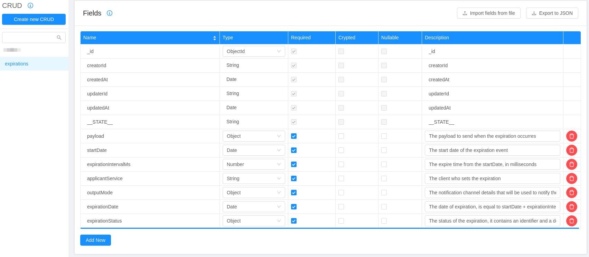
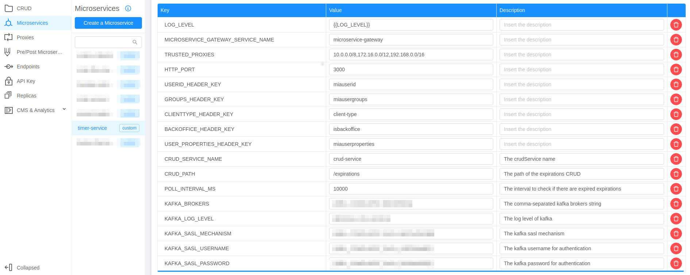

In this page will be explain how to configure the _Timer Service_ from zero to hero.

The configuration is split in two sections:

- [**Technical Configuration**](#technical-configuration) contains the configuration of the technical needs of the Service
- [**DevOps Console Configuration**](#dev-ops-console-configuration) contains the configuration from the Dev-Ops Console

## Technical Configuration

The _Timer Service_ is easy to configure, it just needs some environment variable and a dedicated CRUD with a specific structure.

### Environment Variables

The timer-service allows to do operations on timers just using REST APIs, but can do actions, when an expiration occurs, using REST or KAFKA (kafka is not required).

Following the environment variables needed by the Service:

- **CRUD_SERVICE_NAME**: the name of the crud Service (usually `crud-Service`)
- **CRUD_PATH**: the path to call on the CRUD (e.g. `/expirations`)
- **POLL_INTERVAL_MS**: the milliseconds to wait before do another poll; use case:
    1. the timer-service wakes
    2. the timer-service asks for pending timers
    3. the timer-service evaluates all timers to see if there are expirated timers
    4. the timer-service sleeps for a duration of *POLL_INTERVAL_MS*
- **KAFKA_BROKERS** (*optional*): the comma separated kafka brokers list; if missing, the outputMode of type `kafka` will not work and the timer will set in error state
- **KAFKA_LOG_LEVEL** (*optional*): the log level for kafka
- **KAFKA_SASL_MECHANISM** (*optional*): the SASL mechanism of kafka
- **KAFKA_SASL_USERNAME** (*optional*): the username for the kafka authentication
- **KAFKA_SASL_PASSWORD** (*optional*): the password for the kafka authentication
- **MAX_FAILURE_COUNT** (*optional*): if set, tracks on crud the failure count and implement the max retry logic

If the kafka brokers don't have authentication you can simply just pass the **KAFKA_BROKERS** environment variable.
The authentication properties created are compliance to [kafkaJs](https://kafka.js.org/).
Following an example of complete authentication properties:

```json
{
  "ssl": true,
  "sasl": {
    "mechanism": "plain",
    "username": "username",
    "password": "password"
  }
}
```

### Dedicated CRUD

Following the CRUD structure needed by the timer-service to work:

- **payload**: the payload that will be send when the timer expires as:
  - *body* if the `outputMode` is of type **rest**
  - *message value* if the `outputMode` is of type **kafka**
- **startDate**: the start date of the timer (type *date*)
- **expirationIntervalMs**: the milliseconds, from the startDate, of the timer duration (a timer expires at *startDate* + *expirationIntervalMs*)
- **applicantService**: a string that represent who set the timer (e.g. a microservice)
- **outputMode**: an *Object* with the data to send the action when the expiration occurs
- **expirationDate**: the date of the expiration, created by the Service (type *date*)
- **failureCount**: number for tracking the failure count (used only with **MAX_FAILURE_COUNT**)
- **expirationStatus**: an *Object* that represetns the status of an expirations and has the following structure:

    ```json
    {
      "id": 1,
      "description": "description: 0 -> pending; 1 -> expired; 2 -> aborted; 3 -> error"
    }
    ```

## Dev-Ops Console Configuration

To configure a _Timer Service_ on the Dev-Ops Console follow the instructions:

- open the Dev-Ops Console and choose the project
- create the dedicated CRUD by following the [instructions above](#dedicated-crud), the result will be as the following one:

    [](img/CRUD_expirations.png)

- create the microservice:
  - go to the microservices section
  - click on _Create a Microservice_
  - click on _Docker Image Name_

        [](img/Microservices_Docker_image_name.png)

  - set the name and description as you prefer
  - insert the timer Service image name into the _Docker Image Name_ field, or:

        `nexus.mia-platform.eu/helvetia/timer-service:0.1.1`

  - click on the _Create_ button
  - add the environment variables by following the [instructions above](#environment-variables); the result should be like the following:

        [](img/Microservices_environment_variables.png)
