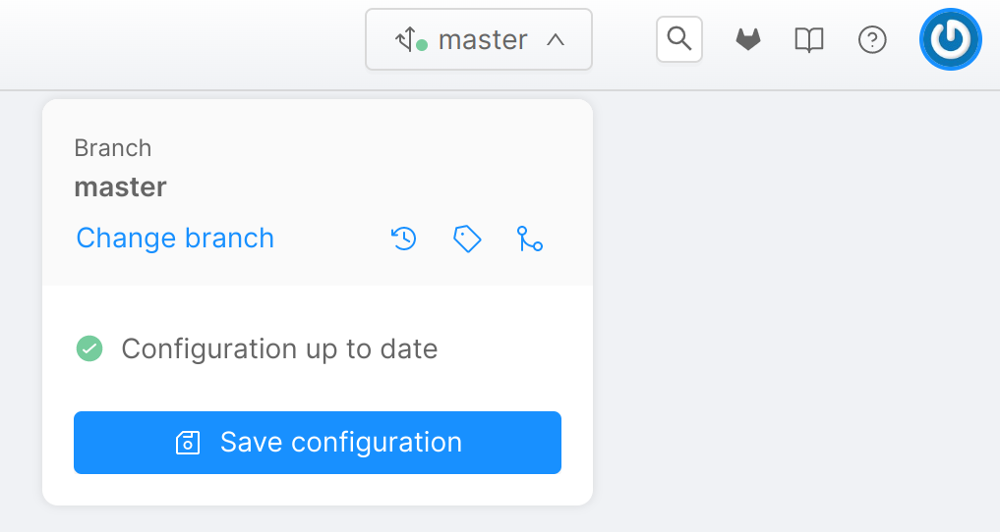
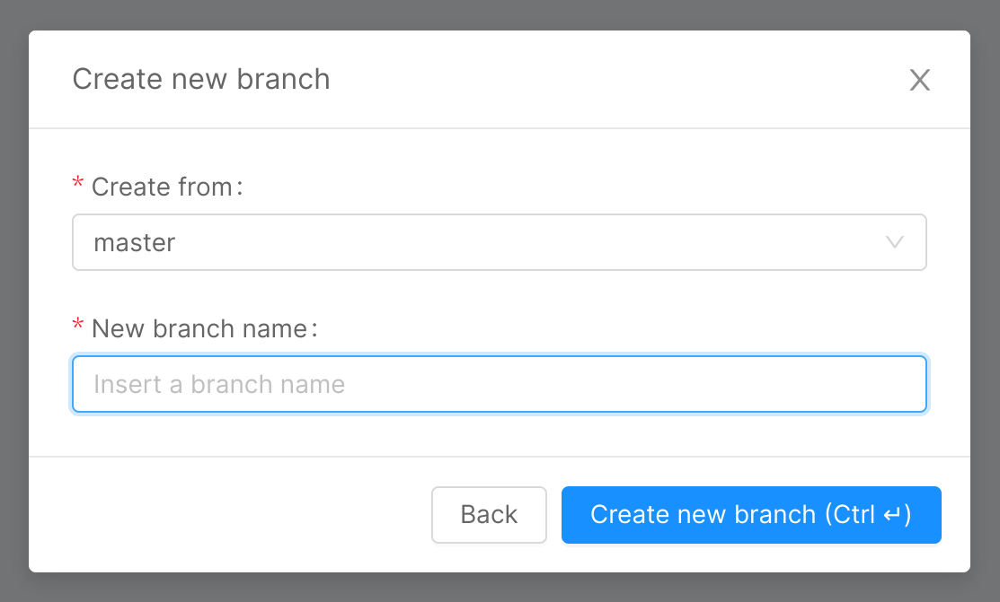
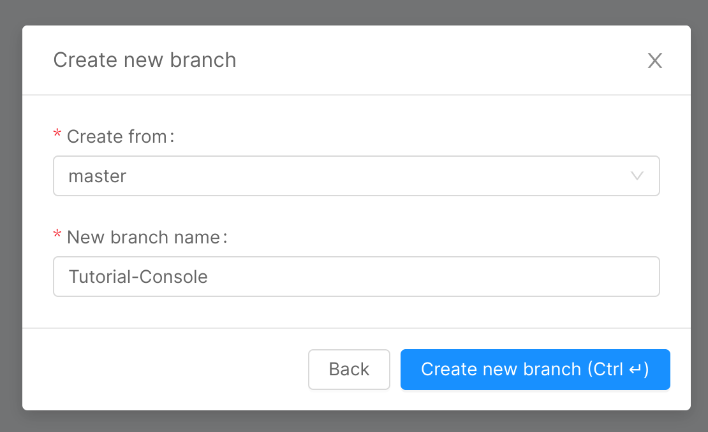
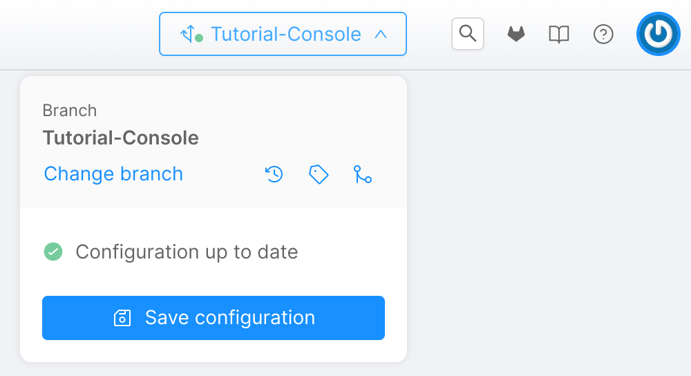

In this page we will see some common actions to perform on the Mia-Platform console.

For an overview of the console please see the [dedicated](/development_suite/overview-dev-suite.md) page.

## Create a new branch

This section explains how to create a new branch on the console.

The console internally uses git repositories to persist configuration changes you make. This action will create a new git branch on the Configurations repository of the project.

You must be in the Design section of the console to perform this action.

1. Click on the branch selection menu on top of the screen.

  
 

  
  

2. Click on _Change branch_. The _Select Branch or Tag_ form will appear.

  
 

  
  

3. Click on _Create new branch_. The _Create new branch_ form will appear.

  
 

  
  

4. You can select the source branch from which to start from the drop-down list on top. If a branch is already set, it will be proposed by default.
5. You can enter the new branch name.

  
 

  
  

6. Click _Create new branch_. The new branch will be created.

  
 

  
  

You can also create a new branch while saving your changes. See the next section.

## Save changes

This section explains how to save configuration changes you made on the console.

This action will create a new git commit on the Configurations repository of the project.

You must be in the Design section of the console to perform this action.

1. Click on the branch selection menu on top of the screen.
2. Click on _Save configuration_. The _Save configuration_ form will appear.
3. You must enter a title for the commit.
4. Optionally you can enter a commit description.
5. If you want to save your changes in a new branch you can set the _Save changes on new branch_ option and enter the new branch name.
6. Click _Save_ to save your changes.

:::warning
Always remember to save your changes in order to persist them. Unsaved versions are not visible to other users and you cannot deploy them. If you change branch without saving your current changes, they will be lost.
:::

## Deploy changes

This section explains how to deploy any changes you made into an environment.

You must be in the Deploy section of the console to perform this action.

1. You can select the changes to deploy from the _Select branch or tag_ drop-down list.
2. Optionally, you can view the list of last 10 commits made on the selected branch.
3. You can choose to enable or disable the _Smart deploy_ feature.
4. You can see the details of the deploy such as services name and versions, deploy outcome and other info in the table below.

--- Screenshot---

5. Click _Smart Deploy_ or _Deploy All_ button (the name changes if you enable the _Smart deploy_ feature).

This action will take some time depending on the amount of changes to deploy.

For more information on deploying please see the [dedicated](/development_suite/deploy/deploy.md) page.

## Monitor infrastructure

This section explains how to monitor your deployed services.

You must be in the Runtime section of the console to perform this action.

1. You can choose the environment to monitor from the drop-down list on top of the screen.
2. On the _Pods_ section you can see the list of Pods currently deployed on the environment. You can see information such as Pod status, name, application, etc.

--- Screenshot ---

3. You can click on a specific Pod name to view additional details.
4. In the _Overview_ page you can see a summary of the selected pod with information such as CPU and Memory usage, number of Containers Ready, Pods restarts, etc.
5. Click on _Logs_. From this page you can see the latest logs generated by the pod.
6. Click on _Describe_. From this page you can see a JSON description of the pod.
7. Click on _Events_. From this page you can see a list of events occurred in the pod.

For more information on monitoring the infrastructure please see the [dedicated](/development_suite/monitoring/monitoring.md) page.

## View repository

To view the Configurations repository of the project simply click on the Git provider icon (Gitlab in the image below) on the top-right of the screen.

--- Screenshot ---
