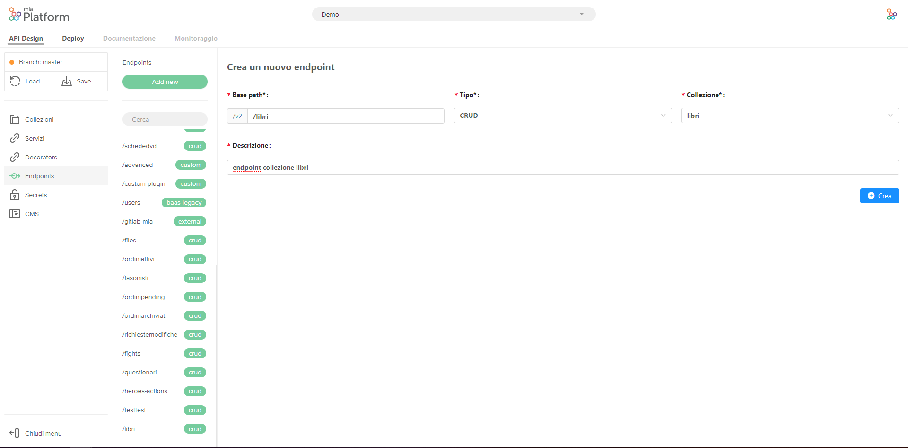
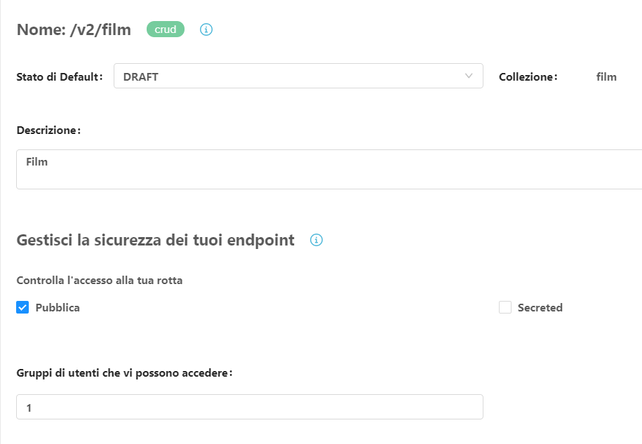

#**API Console  guida all'utilizzo**

Indice

[TOC]

##Registrarsi all'Api Console
Per registrarsi all'api console l'utente deve selezionare **Registrazione**, inserire un username, un indirizzo email, una password e il *gitlab user id*.

Per ottenere il *Gitlab user id* l'utente deve accedere a Gitlab, cliccare l'icona in alto a destra e aprire settings. Accanto al nome è presente l'user ID che dovrà essere copiato e incollato nel modulo di registrazione dell'Api console.

##Accedere all'Api Console
Per accedere all’API Console è sufficiente collegarsi da un normale Browser al seguente indirizzo [Link to Api Console](https://console.cloud.mia-platform.eu/login)

In questa schermata iniziale si deve inserire username e password.

Una volta effettuato il login si deve scegliere il progetto e il branch sul quale si vuole lavorare.

Il primo passaggio da fare subito dopo il login è il load per caricare evenutali altre modifiche apportate da altri utenti, per farlo premere **carica**.

!!! Warning
    Se si sta iniziando un **nuovo progetto** la prima cosa da fare è **creare una seceret** e verificare che ce ne sia una e **una sola attiva**. Per farlo vedi il capitolo *"Secret"*.

##Creare una nuova collezione
Immaginiamo di dover creare una nuova collezione che contenga i libri di una biblioteca e andiamo a capire quali sono i passaggi da svolgere.

Per creare una nuova collezione bisogna selezionare **Collezioni** sulla sinistra e selezionare **Add new**.

Per prima cosa è necessario inserire il nome della collezione in camelCase, nel nostro caso inseriremo "libri".

Di default ci sono dei campi che non possono essere modificati: _id, creatorId, createdAt, updaterId, updatedAt, _STATE_

L’utente potrà aggiungere una nuova riga selezionando **aggiungi riga**. Dopodichè dovrà completare i seguenti campi:

* **Nome**: inserire il nome della proprietà, in camelCase, nel nostro caso inseriremo “titolo”, "autore", "anno" etc.

* **Tipo**: le proprietà possono essere di diversi tipi: *string* se è una classica stringa di testo (oppure un immagine); *number* se è un numero; *date* se è una data con gg/mm/aaaa; *boolean* se può essere solo true o false;*Geopoint* se si desidera salvare un luogo preciso; *Array* se si desidera salvare come un insieme ordinato di proprietà; *Object* se si desidera inserire un oggetto.

* Se selezioni **required** la proprietà è obbligatoria.

* Se selezioni **crypted** il dato verrà criptato nel database. Consigliamo di adottare questa pratica per dati sensibili o riservati.

* Se selezioni **nullable** è possibile dare al dato il valore *null*.

* Nel campo **descrizione** è possibile inserire una breve descrizione facoltativa.

Per creare la collezione selezionare **crea**.

!!! Warning
    la collezione **non è ancora salvata** è necessario svolgere i passaggi descritti di seguito

Se si desidera eliminare una riga selezionare la riga e selezionare **cancella** (vicino ad "aggiungi riga").

Una volta creata la riga di default viene data la possibilità all'utente di crearne un'altra. Una volta finito di creare tutte le righe necessarie, è sufficente premere un qualsiasi altro punto dello schermo per uscire dalla sezione aggiungi riga.

Per **modificare una collezione** è sufficiente selezionare la collezione desiderata tra l’elenco in “collection” e modificare i campi nella schermata che viene visualizzata.

###Indici
Un indice (nel campo dei database) è una struttura dati realizzata per **migliorare i tempi di ricerca (query) dei dati**. Se una tabella non ha indici, ogni ricerca obbliga il sistema a leggere tutti i dati presenti in essa. L'indice consente invece di ridurre l'insieme dei dati da leggere per completare la ricerca.Tuttavia la creazione di un indice comporta una **riduzione  nelle performance di scrittura**.

Per creare un nuovo indice selezionare **crea un nuovo indice**.

Una volta inserito il nome dell'indice l'utente dovorà scegliere il tipo selezionando tra: *normal, geo e hash*. Dopodichè l'utente potrà scegliere se rendere unico l'indice selezionando **unique**.

##Servizi
In questa sezione l'utente può configurare i propri servizi.

I servizi possono essere di due tipi:

* servizi esterni che si vogliono integrare nella piattaforma
* servizi custom plugin configurati dall'utente su git.

**Servizi esterni**: L'utente ha la possibilità di chiamare servizi esterni come ad esempio Google Maps.
In questo caso l'utente dovrà inserire il nome del servizio, selezionare tipo *external services* e inserire l'URL del servizio esterno desiderato. Infine l'utente può inserire una descrizione facoltativa.

**Servizi custom**: I servizi custom sono di due tipi:

* *Already exist*: il servizio è già esistente e quindi l'utente dovrà chiamare il servizio indicando l'url da git.
* *Generate*: l'utente crea il suo servizio custom.

In entrambi i casi l'utente può configurare servizi di tipo:

* *Avanzato*: l'utente deve sempre inserire l'url di git e la revision, dopodichè deve assicurarsi che nella cartella configurazione ci siao due file: deployment.yml e services.yml. Oltre a questi opzionalmente ci può essere il file configmap.yml.
* *Non avanzato*:  l'utente deve specificare l'url di GIT e la revision. Dopodichè è necessario assicurarsi che dentro la cartella configurazione ci sia il file Docker image che contiente il nome dell'immagine docker del servizio.
Inoltre è possibile aggiungere delle variabili ambientali.

**Importante** il nome viene dato al servizio sull'api console deve essere uguale al "name" che c'è nel file deployment.yml.

In caso il servizio sia di tipo *Generate*, l'utente deve inserire il gruppo di Gitlab su cui vuole generare il progetto, il nome, il nome immagine docker. Selezionado *crea* viene creata realmente la cartella su git (viene infatti richiesta un ulteriore autorizzazione all'utente).

Per creare il servizio infine selezionare **crea**.

##Decorators
In questa sezione l'utente potrà configurare i **pre e post decorators**.

Per aggiungere un pre decorator, selezioanare **PRE** ed inserire il nome, il protocollo (http), il servizio (il nome del servizio definito nella sezione "servizi"), la porta a cui deve chiamare quel servizio, il path al quale risponde.
Se si seleziona *require request body* il decorator per funzionare richiede il body.
In caso di post decorator si può selezionare anche *require response body*.
Infine è possibile anche inserire una *descrizione* facoltativa.

##Creare un endpoint
In questa sezione potrai configurare i tuoi servizi e le tue collezioni in endpoint pubblicati all’esterno.

Per creare un endpoint selezionare **Endpoints** e quindi **Add new**.

**Basepath**: è il prefisso della rotta. Si può impostare come l'indirizzo base alla quale è servita l'Api, relativo all'host (nome o ip) che fornisce l'endpoint. Nel nostro caso ad esempio potremmo inserire “/libri”.

**Tipo**: L’endpoint può essere di diversi tipi:

* *Crud*: aggancia il tuo endpoint direttamente ad una delle tue collezioni.
* *External*: aggancia il tuo endpoint a uno dei servizi esterni censiti nella sezione servizi.
* *Custom  Microservices*: aggancia il tuo endpoint ad un servizio con logiche interamente create da te.
* *BaaS Legacy*: aggancia il tuo endpoint a un servizio presente nel BaaS legacy così da sfruttarlo sulla nuova piattaforma.

**Collezione**: selezionare la collezione di cui l'endpoint fa parte. Nel nostro caso "editori"

**Descrizione**: descrizione facoltativa dell’endpoint

Selezionare la collezione di riferimento, nel nostro caso potra essere "biblioteca".

Dopodichè selezionare *Crea*. Verrà visualizzata una schermata con le seguenti:

###Nome dell'Endpoint
**Stato di Default**: Con Default State potrai scegliere se gli elementi presenti nella Collezione saranno resi pubblici sugli applicativi appena verranno creati e avranno quindi status Public o se avranno invece come status Draft e dovranno quindi essere resi pubblici dal CMS prima di essere pubblicati.

**Collezione**: viene visualizzata la collezione di cui l'endpoint fa parte.

**Descrizione**: breve descrizione facoltativa

###Gestisci la sicurezza dei tuoi endpoint
Se la rotta è **pubblica**, non c’è bisogno di essere loggati per poterla chiamare. Se invece non è pubblica e viene chiamata da un utente non loggato, restituisce 401.
Se è **secreted** per poterla chiamare bisogna settare l’header Secret con il valore corretto (puoi vedere i secret nell’omonima schermata)

**Gruppi di utenti che vi possono accedere**: E’ un’espressione logica per determinare i gruppi che hanno i permessi di chiamare una determinata rotta. Può anche essere impostata a 0 (nessuno) oppure a 1 (tutti). Se l'espressione risulta vera, allora l'utente può accedere alla rotta.

###Elenco verbi
Selezionando i diversi verbi nella sezione management è possibile dettagliare ulteriormente chi ha i permessi di fare determinate azioni.

Se **inherited** è attivo il campo erediterà il comportamento dell’endpoint base, de-selezionandolo puoi impostare regole specifiche legate a questa rotta.

Per esempio possiamo impostare che la post può essere riservata solo ad un gruppo specifico di utenti.  

##Secret
Da questa pagina è possibile definire la "secret" per accedere al CMS dei diversi progetti.

La prima cosa che si deve fare quando si inizia un nuovo progetto è **creare una secret** e verificare che ce ne sia una e una sola **attiva**.

##CMS
Per configurare il CMS vai al seguente [link](https://docs.mia-platform.eu/configurator/api_console_configcms/).

##Deploy
L’API console permette di deployare direttamente senza più passare tramite Jenkins.

L'utente dovrà selezionare l'ambiente (produzione o preproduzione) e il branch.

##Documentazione
Questa sezione contiene il link a Swagger

##Monitoraggio
Questa sezione contiene il link a Kibana

!!! Warning
    Una volta effettuate le modifiche è NECESSARIO SALVARE
