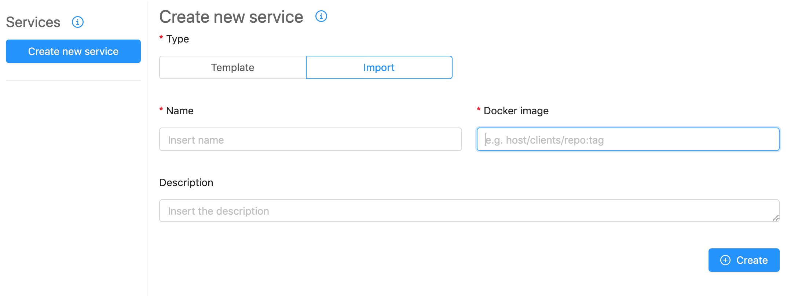
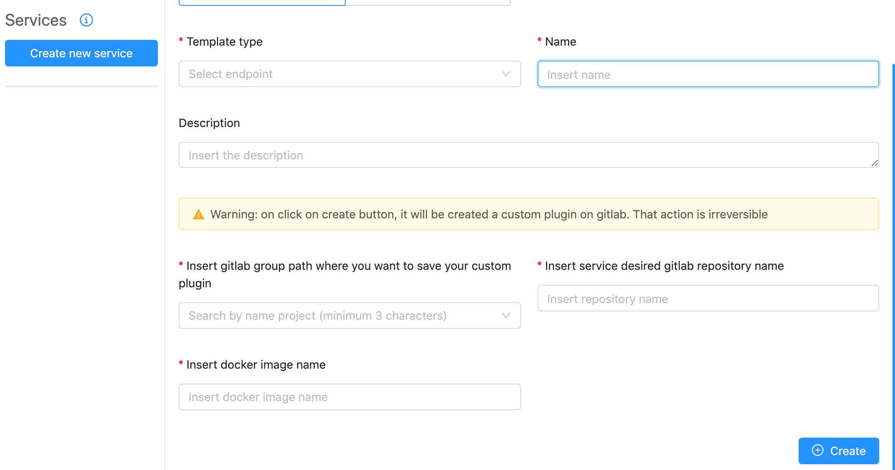

##Services
In this section the user can insert new services within the platform ecosystem.

More specifically, the user can:

* Import them;
* Create them starting from a Template.

### Import services

The only requirement to import an external service is that the Docker Image needs to be already built.
By clicking on the *Import* button, a new tab is opened. Here, the user need to specify some information:

* Name of the service (required);
* Path for the Docker Image (required);
* Description (optional).

Finally, to create the service select **create**.

### Services from Templates

The service can be create starting from some existing Templates:

* Node Template;
* Springboot Template;
* GraphQL Template;
* React Template.

Once the Template has been selected, the user needs to insert the following information:

* Name of the service (required);
* Description (optional);
* Gitlab Group path where the user wants to save the custom service;
* Name of the Gitlab repository for the custom service;
* Name of the Docker Image.

Finally, to create the service select **create**.

!!! warning
    Once that the service is created on Gitlab, the user will not be able to delete it anymore.

At the following [link](https://docs.mia-platform.eu/development_suite/api-console/api-design/custom_microservice_get_started/) the user can find a more detailed guide and overview about how to create new service starting from Templates.
