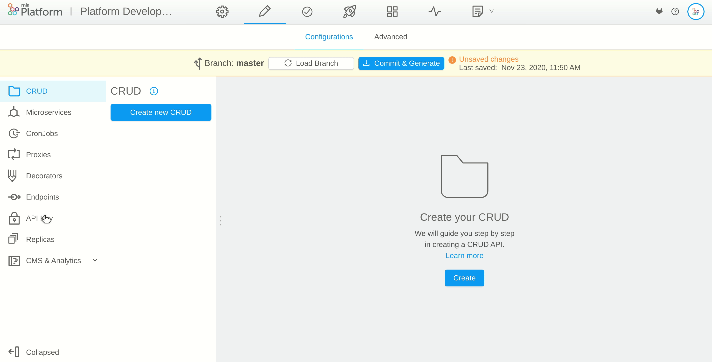

## What is an API Key

An API key allows you to protect your endpoints. You can create API keys for different clients and [manage the security of your endpoints](endpoints#manage-the-security-of-your-endpoints) to allow call them only passing an API Key belong to specific clients.

This feature is also useful to identify the client that has called the endpoint.

## Create a new API Key

In order to create a new API Key, open the dedicated section in the *Design area*, select `Add New` and enter the following information:

* **API Key**: the value of API Key. You can enter any string, it must not contain blank spaces. Before creating the API Key you can click on `Generate Random API Key` to get a random value.
* **ClientType**: the client associated with the API Key. You can enter any string, it must not contain blank spaces.
* **Active**: check the flag to activate the API Key, uncheck to deactivate.
* **Description**: optional description of the API Key.



## How to use an API Key

In the **Management section of the endpoint**, for each endpoint, you can specify if protect it with an API key and for which *ClientType* to authorize calls by using the `Only with an API Key` flag and the `User Group Permission` field.

You can call an endpoint using an API Key passing the value of the key by `secret`/`client-key` header:

```bash
curl --request GET 
  --url https://your-url/endpoint 
  --header 'accept: application/json' 
  --header 'secret: <API Key value>'
```

You can also use an API Key setting a `mia_client_key=<API Key value>` cookie:

```bash
curl --request GET 
  --url https://your-url/endpoint 
  --header 'accept: application/json' 
  --cookie 'mia_client_key=<API Key value>'
```

:::info
Check out the [manage the security of your endpoints section](endpoints#manage-the-security-of-your-endpoints) to know in detail how to write the user group expression
:::
